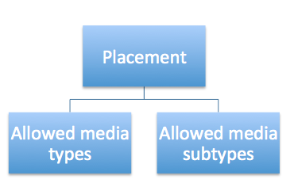
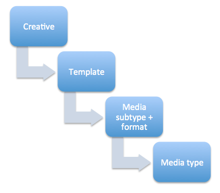

# Expandables and Rich Media


## Overview

Xandr provides expandable rich media support on
all supply from platform networks and
Xandr-enabled exchanges, including the Microsoft
Advertising Exchange.


## Creative Specification

We have assembled a Xandr expandable
specification based on the specs of our many supply sources. The goal is
to have an "upload once, run everywhere" spec.

Creatives that do not meet this spec will still be allowed to run on the
platform, but we expect publisher acceptance to be much lower.

**Allowed sizes and maximum expanded size**

<table class="table">
<thead class="thead">
<tr class="header row">
<th id="ID-000024c8__entry__1" class="entry">Base Size</th>
<th id="ID-000024c8__entry__2" class="entry">Maximum Expanded Size</th>
</tr>
</thead>
<tbody class="tbody">
<tr class="odd row">
<td class="entry" headers="ID-000024c8__entry__1">120 x 600</td>
<td class="entry" headers="ID-000024c8__entry__2">240 x 600</td>
</tr>
<tr class="even row">
<td class="entry" headers="ID-000024c8__entry__1">160 x 600</td>
<td class="entry" headers="ID-000024c8__entry__2">320 x 600</td>
</tr>
<tr class="odd row">
<td class="entry" headers="ID-000024c8__entry__1">300 x 250</td>
<td class="entry" headers="ID-000024c8__entry__2">500 x 300</td>
</tr>
<tr class="even row">
<td class="entry" headers="ID-000024c8__entry__1">468 x 60</td>
<td class="entry" headers="ID-000024c8__entry__2">468 x 210</td>
</tr>
<tr class="odd row">
<td class="entry" headers="ID-000024c8__entry__1">728 x 90</td>
<td class="entry" headers="ID-000024c8__entry__2">728 x 300</td>
</tr>
<tr class="even row">
<td class="entry" headers="ID-000024c8__entry__1">234 x 60</td>
<td class="entry" headers="ID-000024c8__entry__2">300 x 250</td>
</tr>
<tr class="odd row">
<td class="entry" headers="ID-000024c8__entry__1">120 x 60</td>
<td class="entry" headers="ID-000024c8__entry__2">120 x 240</td>
</tr>
<tr class="even row">
<td class="entry" headers="ID-000024c8__entry__1">180 x 150</td>
<td class="entry" headers="ID-000024c8__entry__2">300 x 300</td>
</tr>
<tr class="odd row">
<td class="entry" headers="ID-000024c8__entry__1">300 x 600</td>
<td class="entry" headers="ID-000024c8__entry__2">560 x 600</td>
</tr>
</tbody>
</table>


## Media Types


<b>Tip:</b> For mobile interstitials, register
creatives as standard banner and target interstitial sizes in the bid
request.


Expandables are implemented through a broader "media type" system in
Xandr. This system allows us to align placements
and creatives so that all technical requirements are met for proper
rendering.

Media types and subtypes are in a two-tiered hierarchy:

<table class="table">
<thead class="thead">
<tr class="header row">
<th id="ID-000024c8__entry__21" class="entry">Media Type</th>
<th id="ID-000024c8__entry__22" class="entry">ID</th>
<th id="ID-000024c8__entry__23" class="entry">Media Subtype</th>
<th id="ID-000024c8__entry__24" class="entry">ID</th>
</tr>
</thead>
<tbody class="tbody">
<tr class="odd row">
<td class="entry"
headers="ID-000024c8__entry__21"><strong>Banner</strong></td>
<td class="entry" headers="ID-000024c8__entry__22">1</td>
<td class="entry" headers="ID-000024c8__entry__23">Standard Banner</td>
<td class="entry" headers="ID-000024c8__entry__24">1</td>
</tr>
<tr class="even row">
<td class="entry" headers="ID-000024c8__entry__21"></td>
<td class="entry" headers="ID-000024c8__entry__22"></td>
<td class="entry" headers="ID-000024c8__entry__23">In-Banner Video</td>
<td class="entry" headers="ID-000024c8__entry__24">3</td>
</tr>
<tr class="odd row">
<td class="entry"
headers="ID-000024c8__entry__21"><strong>Text</strong></td>
<td class="entry" headers="ID-000024c8__entry__22">5</td>
<td class="entry" headers="ID-000024c8__entry__23">Text</td>
<td class="entry" headers="ID-000024c8__entry__24">9</td>
</tr>
<tr class="even row">
<td class="entry"
headers="ID-000024c8__entry__21"><strong>Expandable</strong></td>
<td class="entry" headers="ID-000024c8__entry__22">6</td>
<td class="entry" headers="ID-000024c8__entry__23">Other Expandable</td>
<td class="entry" headers="ID-000024c8__entry__24">10</td>
</tr>
<tr class="odd row">
<td class="entry" headers="ID-000024c8__entry__21"></td>
<td class="entry" headers="ID-000024c8__entry__22"></td>
<td class="entry" headers="ID-000024c8__entry__23">MediaMind</td>
<td class="entry" headers="ID-000024c8__entry__24">11</td>
</tr>
<tr class="even row">
<td class="entry" headers="ID-000024c8__entry__21"></td>
<td class="entry" headers="ID-000024c8__entry__22"></td>
<td class="entry" headers="ID-000024c8__entry__23">Pointroll</td>
<td class="entry" headers="ID-000024c8__entry__24">12</td>
</tr>
<tr class="odd row">
<td class="entry" headers="ID-000024c8__entry__21"></td>
<td class="entry" headers="ID-000024c8__entry__22"></td>
<td class="entry" headers="ID-000024c8__entry__23">EyeWonder</td>
<td class="entry" headers="ID-000024c8__entry__24">13</td>
</tr>
<tr class="even row">
<td class="entry" headers="ID-000024c8__entry__21"></td>
<td class="entry" headers="ID-000024c8__entry__22"></td>
<td class="entry" headers="ID-000024c8__entry__23">eyeReturn</td>
<td class="entry" headers="ID-000024c8__entry__24">14</td>
</tr>
<tr class="odd row">
<td class="entry" headers="ID-000024c8__entry__21"></td>
<td class="entry" headers="ID-000024c8__entry__22"></td>
<td class="entry" headers="ID-000024c8__entry__23">Pictela</td>
<td class="entry" headers="ID-000024c8__entry__24">15</td>
</tr>
<tr class="even row">
<td class="entry" headers="ID-000024c8__entry__21"></td>
<td class="entry" headers="ID-000024c8__entry__22"></td>
<td class="entry" headers="ID-000024c8__entry__23">Flashtalking</td>
<td class="entry" headers="ID-000024c8__entry__24">16</td>
</tr>
<tr class="odd row">
<td class="entry" headers="ID-000024c8__entry__21"></td>
<td class="entry" headers="ID-000024c8__entry__22"></td>
<td class="entry" headers="ID-000024c8__entry__23">Doubleclick</td>
<td class="entry" headers="ID-000024c8__entry__24">17</td>
</tr>
<tr class="even row">
<td class="entry" headers="ID-000024c8__entry__21"></td>
<td class="entry" headers="ID-000024c8__entry__22"></td>
<td class="entry" headers="ID-000024c8__entry__23">Unicast</td>
<td class="entry" headers="ID-000024c8__entry__24">18</td>
</tr>
<tr class="odd row">
<td class="entry" headers="ID-000024c8__entry__21"></td>
<td class="entry" headers="ID-000024c8__entry__22"></td>
<td class="entry" headers="ID-000024c8__entry__23">Spongecell</td>
<td class="entry" headers="ID-000024c8__entry__24">19</td>
</tr>
<tr class="even row">
<td class="entry" headers="ID-000024c8__entry__21"></td>
<td class="entry" headers="ID-000024c8__entry__22"></td>
<td class="entry" headers="ID-000024c8__entry__23">Adrime</td>
<td class="entry" headers="ID-000024c8__entry__24">20</td>
</tr>
<tr class="odd row">
<td class="entry" headers="ID-000024c8__entry__21"></td>
<td class="entry" headers="ID-000024c8__entry__22"></td>
<td class="entry" headers="ID-000024c8__entry__23">Oggifinogi</td>
<td class="entry" headers="ID-000024c8__entry__24">24</td>
</tr>
<tr class="even row">
<td class="entry"
headers="ID-000024c8__entry__21"><strong>Skin</strong></td>
<td class="entry" headers="ID-000024c8__entry__22">8</td>
<td class="entry" headers="ID-000024c8__entry__23">Hi-Media Skin</td>
<td class="entry" headers="ID-000024c8__entry__24">32</td>
</tr>
<tr class="odd row">
<td class="entry" headers="ID-000024c8__entry__21"></td>
<td class="entry" headers="ID-000024c8__entry__22"></td>
<td class="entry" headers="ID-000024c8__entry__23">IAB</td>
<td class="entry" headers="ID-000024c8__entry__24">48</td>
</tr>
<tr class="even row">
<td class="entry" headers="ID-000024c8__entry__21"></td>
<td class="entry" headers="ID-000024c8__entry__22"></td>
<td class="entry" headers="ID-000024c8__entry__23">Custom</td>
<td class="entry" headers="ID-000024c8__entry__24">49</td>
</tr>
<tr class="odd row">
<td class="entry" headers="ID-000024c8__entry__21"><strong>Image and
Text</strong></td>
<td class="entry" headers="ID-000024c8__entry__22">10</td>
<td class="entry" headers="ID-000024c8__entry__23">Outlook.com</td>
<td class="entry" headers="ID-000024c8__entry__24">52</td>
</tr>
<tr class="even row">
<td class="entry" headers="ID-000024c8__entry__21"><strong>High
Impact</strong></td>
<td class="entry" headers="ID-000024c8__entry__22">11</td>
<td class="entry" headers="ID-000024c8__entry__23">ReactX Left/
Right</td>
<td class="entry" headers="ID-000024c8__entry__24">53</td>
</tr>
<tr class="odd row">
<td class="entry" headers="ID-000024c8__entry__21"></td>
<td class="entry" headers="ID-000024c8__entry__22"></td>
<td class="entry" headers="ID-000024c8__entry__23">ReactX Top</td>
<td class="entry" headers="ID-000024c8__entry__24">54</td>
</tr>
<tr class="even row">
<td class="entry" headers="ID-000024c8__entry__21"></td>
<td class="entry" headers="ID-000024c8__entry__22"></td>
<td class="entry" headers="ID-000024c8__entry__23">ReactX Bottom</td>
<td class="entry" headers="ID-000024c8__entry__24">55</td>
</tr>
<tr class="odd row">
<td class="entry" headers="ID-000024c8__entry__21"></td>
<td class="entry" headers="ID-000024c8__entry__22"></td>
<td class="entry" headers="ID-000024c8__entry__23">ReactX Custom</td>
<td class="entry" headers="ID-000024c8__entry__24">56</td>
</tr>
<tr class="even row">
<td class="entry" headers="ID-000024c8__entry__21"></td>
<td class="entry" headers="ID-000024c8__entry__22"></td>
<td class="entry" headers="ID-000024c8__entry__23">ReactX Over</td>
<td class="entry" headers="ID-000024c8__entry__24">57</td>
</tr>
<tr class="odd row">
<td class="entry" headers="ID-000024c8__entry__21"></td>
<td class="entry" headers="ID-000024c8__entry__22"></td>
<td class="entry" headers="ID-000024c8__entry__23"> ReactX Native</td>
<td class="entry" headers="ID-000024c8__entry__24">58</td>
</tr>
<tr class="even row">
<td class="entry" headers="ID-000024c8__entry__21"></td>
<td class="entry" headers="ID-000024c8__entry__22"></td>
<td class="entry" headers="ID-000024c8__entry__23">Lightbox</td>
<td class="entry" headers="ID-000024c8__entry__24">59</td>
</tr>
<tr class="odd row">
<td class="entry" headers="ID-000024c8__entry__21"></td>
<td class="entry" headers="ID-000024c8__entry__22"></td>
<td class="entry" headers="ID-000024c8__entry__23">Foote</td>
<td class="entry" headers="ID-000024c8__entry__24">60</td>
</tr>
<tr class="even row">
<td class="entry" headers="ID-000024c8__entry__21"></td>
<td class="entry" headers="ID-000024c8__entry__22"></td>
<td class="entry" headers="ID-000024c8__entry__23"> Slide-in</td>
<td class="entry" headers="ID-000024c8__entry__24">61</td>
</tr>
<tr class="odd row">
<td class="entry" headers="ID-000024c8__entry__21"></td>
<td class="entry" headers="ID-000024c8__entry__22"></td>
<td class="entry"
headers="ID-000024c8__entry__23"> Peel                      </td>
<td class="entry" headers="ID-000024c8__entry__24">62</td>
</tr>
<tr class="even row">
<td class="entry" headers="ID-000024c8__entry__21"></td>
<td class="entry" headers="ID-000024c8__entry__22"></td>
<td class="entry"
headers="ID-000024c8__entry__23"> Custom                    </td>
<td class="entry" headers="ID-000024c8__entry__24">63</td>
</tr>
<tr class="odd row">
<td class="entry"
headers="ID-000024c8__entry__21"> <strong>Native</strong>         </td>
<td class="entry" headers="ID-000024c8__entry__22">12</td>
<td class="entry" headers="ID-000024c8__entry__23"> In-Feed
Standard          </td>
<td class="entry" headers="ID-000024c8__entry__24">65</td>
</tr>
<tr class="even row">
<td class="entry" headers="ID-000024c8__entry__21"></td>
<td class="entry" headers="ID-000024c8__entry__22"></td>
<td class="entry" headers="ID-000024c8__entry__23"> Content
Marketing         </td>
<td class="entry" headers="ID-000024c8__entry__24">66</td>
</tr>
<tr class="odd row">
<td class="entry"
headers="ID-000024c8__entry__21"> <strong>Audio</strong>          </td>
<td class="entry" headers="ID-000024c8__entry__22">13</td>
<td class="entry"
headers="ID-000024c8__entry__23"> 15-second                 </td>
<td class="entry" headers="ID-000024c8__entry__24">67</td>
</tr>
<tr class="even row">
<td class="entry" headers="ID-000024c8__entry__21"></td>
<td class="entry" headers="ID-000024c8__entry__22"></td>
<td class="entry"
headers="ID-000024c8__entry__23"> 30-second                 </td>
<td class="entry" headers="ID-000024c8__entry__24">68</td>
</tr>
<tr class="odd row">
<td class="entry" headers="ID-000024c8__entry__21"></td>
<td class="entry" headers="ID-000024c8__entry__22"></td>
<td class="entry"
headers="ID-000024c8__entry__23"> Other                     </td>
<td class="entry" headers="ID-000024c8__entry__24">69</td>
</tr>
<tr class="even row">
<td class="entry" headers="ID-000024c8__entry__21"></td>
<td class="entry" headers="ID-000024c8__entry__22"></td>
<td class="entry" headers="ID-000024c8__entry__23"> Standard
VAST             </td>
<td class="entry" headers="ID-000024c8__entry__24">70</td>
</tr>
<tr class="odd row">
<td class="entry"
headers="ID-000024c8__entry__21"> <strong>VAST</strong></td>
<td class="entry" headers="ID-000024c8__entry__22">4</td>
<td class="entry"
headers="ID-000024c8__entry__23"><strong>DEPRECATED</strong> 15-second
VAST</td>
<td class="entry" headers="ID-000024c8__entry__24">7</td>
</tr>
<tr class="even row">
<td class="entry" headers="ID-000024c8__entry__21"></td>
<td class="entry" headers="ID-000024c8__entry__22"></td>
<td class="entry"
headers="ID-000024c8__entry__23"><strong>DEPRECATED</strong> 30-second
VAST</td>
<td class="entry" headers="ID-000024c8__entry__24">8</td>
</tr>
<tr class="odd row">
<td class="entry" headers="ID-000024c8__entry__21"></td>
<td class="entry" headers="ID-000024c8__entry__22"></td>
<td class="entry"
headers="ID-000024c8__entry__23"><strong>DEPRECATED</strong> Other
VAST</td>
<td class="entry" headers="ID-000024c8__entry__24">23</td>
</tr>
<tr class="even row">
<td class="entry" headers="ID-000024c8__entry__21"></td>
<td class="entry" headers="ID-000024c8__entry__22"></td>
<td class="entry" headers="ID-000024c8__entry__23">Standard VAST</td>
<td class="entry" headers="ID-000024c8__entry__24">64</td>
</tr>
</tbody>
</table>

**Placements** may accept any combination of media types or subtypes. If
they accept a media type, they accept all subtypes under the media type.




**Templates** represent a media type and a creative format (Javascript,
HTML, etc). They can be used to customize the rendering of your
creatives, but in this case they simply specify the expandable vendor
being used.

**Creatives** have one template, which specifies the format of the
creative and the expandable vendor in use. A creative may serve only on
placements that accept the creative template's media subtype or its
parent media type.




## Integration

There are two touch points for our expandable integration: a change to
the RTB protocol, and a change to creative upload.

**RTB Protocol**

There will be two new fields in the bid request to indicate the
availability of expandables on an impression.

<table class="table">
<thead class="thead">
<tr class="header row">
<th id="ID-000024c8__entry__185" class="entry">Field</th>
<th id="ID-000024c8__entry__186" class="entry">Description</th>
<th id="ID-000024c8__entry__187" class="entry">Notes</th>
</tr>
</thead>
<tbody class="tbody">
<tr class="odd row">
<td class="entry"
headers="ID-000024c8__entry__185">allowed_media_types</td>
<td class="entry" headers="ID-000024c8__entry__186">Array of media type
ids</td>
<td class="entry" headers="ID-000024c8__entry__187">This field is
optional. If it appears, creatives of the specified media types may
serve on this impression.</td>
</tr>
<tr class="even row">
<td class="entry"
headers="ID-000024c8__entry__185">allowed_media_subtypes</td>
<td class="entry" headers="ID-000024c8__entry__186">Array of media
subtype ids</td>
<td class="entry" headers="ID-000024c8__entry__187">This field is
optional. If it appears, creatives of the specified media subtypes may
serve on this impression.</td>
</tr>
<tr class="odd row">
<td class="entry" headers="ID-000024c8__entry__185">media_subtypes</td>
<td class="entry" headers="ID-000024c8__entry__186">Array of media
subtype in string format</td>
<td class="entry" headers="ID-000024c8__entry__187">This field is
optional. If it appears, it will list the allowed media in string
format.</td>
</tr>
</tbody>
</table>


These fields will be on each "tag" object in the bid request:

``` pre
{
  "bid_request": {
    "tags": [
      {
        "allowed_media_types": [1,7,20],
        "allowed_media_subtypes": [5,23,40]
      }
    ]
  }
}
```


To determine if your expandable creative will serve:

- First, check if "allowed_media_types" contains the "Expandable" Media
  Type.
- If "Expandable" is not in "allowed_media_types", check if the
  media_subtype id is allowed in "allowed_media_subtypes".

**Creative Upload**

When expandable creatives are uploaded to the Creative Service, you will
need to denote the expandable ad server being used.

<table class="table">
<thead class="thead">
<tr class="header row">
<th id="ID-000024c8__entry__197" class="entry">Field</th>
<th id="ID-000024c8__entry__198" class="entry">Description</th>
<th id="ID-000024c8__entry__199" class="entry">Notes</th>
</tr>
</thead>
<tbody class="tbody">
<tr class="odd row">
<td class="entry" headers="ID-000024c8__entry__197">template</td>
<td class="entry" headers="ID-000024c8__entry__198">JSON object with the
ID of the associated template.</td>
<td class="entry" headers="ID-000024c8__entry__199">To denote an
expandable, select the template that corresponds to the expandable
vendor in use, and the creative format used by your bidder. If the
vendor in use is not listed, use "Other Expandable".</td>
</tr>
</tbody>
</table>

This field is **required** on expandable creatives.


**Example**:

``` pre
{
  "creative": {
    "content": "<script src=...></script>",
    "template": {"id": 1}
  }
}
```


<b>Note:</b>

- You are not required to set the template ID on standard creatives
  (non-expandable). Continue uploading those creatives as you did
  before.
- Traffic Skin creatives as a standard banner. We recommend using 1800 X
  1000 dimensions.
  - Use template ID **6** for HTML, and **5** for Javascript.


**Template IDs**


The following table lists the available templates and their associated
IDs.


<b>Tip:</b> Expandables for bidders will only
work with the templates listed below. Please do not use custom templates
for expandables.


<b>Warning:</b> Creatives that are of the
media type Expandable will not serve on external mobile supply. If it's
a mobile expandable creative, use a template with the banner media type
and non-iframe html format, and set up `alternative_landing_page_url` in
your creative.


<table class="table">
<thead class="thead">
<tr class="header row">
<th id="ID-000024c8__entry__203" class="entry">Expandable Media
Subtype</th>
<th id="ID-000024c8__entry__204" class="entry">Creative Format</th>
<th id="ID-000024c8__entry__205" class="entry">Template ID</th>
</tr>
</thead>
<tbody class="tbody">
<tr class="odd row">
<td class="entry" headers="ID-000024c8__entry__203">Adrime</td>
<td class="entry" headers="ID-000024c8__entry__204">raw-html</td>
<td class="entry" headers="ID-000024c8__entry__205">167</td>
</tr>
<tr class="even row">
<td class="entry" headers="ID-000024c8__entry__203">Adrime</td>
<td class="entry" headers="ID-000024c8__entry__204">raw-js</td>
<td class="entry" headers="ID-000024c8__entry__205">129</td>
</tr>
<tr class="odd row">
<td class="entry" headers="ID-000024c8__entry__203">Adrime</td>
<td class="entry" headers="ID-000024c8__entry__204">url-js</td>
<td class="entry" headers="ID-000024c8__entry__205">117</td>
</tr>
<tr class="even row">
<td class="entry" headers="ID-000024c8__entry__203">Doubleclick</td>
<td class="entry" headers="ID-000024c8__entry__204">raw-html</td>
<td class="entry" headers="ID-000024c8__entry__205">164</td>
</tr>
<tr class="odd row">
<td class="entry" headers="ID-000024c8__entry__203">Doubleclick</td>
<td class="entry" headers="ID-000024c8__entry__204">raw-js</td>
<td class="entry" headers="ID-000024c8__entry__205">126</td>
</tr>
<tr class="even row">
<td class="entry" headers="ID-000024c8__entry__203">Doubleclick</td>
<td class="entry" headers="ID-000024c8__entry__204">url-js</td>
<td class="entry" headers="ID-000024c8__entry__205">114</td>
</tr>
<tr class="odd row">
<td class="entry" headers="ID-000024c8__entry__203">EyeReturn</td>
<td class="entry" headers="ID-000024c8__entry__204">raw-html</td>
<td class="entry" headers="ID-000024c8__entry__205">161</td>
</tr>
<tr class="even row">
<td class="entry" headers="ID-000024c8__entry__203">EyeReturn</td>
<td class="entry" headers="ID-000024c8__entry__204">raw-js</td>
<td class="entry" headers="ID-000024c8__entry__205">123</td>
</tr>
<tr class="odd row">
<td class="entry" headers="ID-000024c8__entry__203">EyeReturn</td>
<td class="entry" headers="ID-000024c8__entry__204">url-js</td>
<td class="entry" headers="ID-000024c8__entry__205">111</td>
</tr>
<tr class="even row">
<td class="entry" headers="ID-000024c8__entry__203">EyeWonder</td>
<td class="entry" headers="ID-000024c8__entry__204">raw-html</td>
<td class="entry" headers="ID-000024c8__entry__205">160</td>
</tr>
<tr class="odd row">
<td class="entry" headers="ID-000024c8__entry__203">EyeWonder</td>
<td class="entry" headers="ID-000024c8__entry__204">raw-js</td>
<td class="entry" headers="ID-000024c8__entry__205">122</td>
</tr>
<tr class="even row">
<td class="entry" headers="ID-000024c8__entry__203">EyeWonder</td>
<td class="entry" headers="ID-000024c8__entry__204">url-js</td>
<td class="entry" headers="ID-000024c8__entry__205">110</td>
</tr>
<tr class="odd row">
<td class="entry" headers="ID-000024c8__entry__203">Flashtalking</td>
<td class="entry" headers="ID-000024c8__entry__204">raw-html</td>
<td class="entry" headers="ID-000024c8__entry__205">163</td>
</tr>
<tr class="even row">
<td class="entry" headers="ID-000024c8__entry__203">Flashtalking</td>
<td class="entry" headers="ID-000024c8__entry__204">raw-js</td>
<td class="entry" headers="ID-000024c8__entry__205">125</td>
</tr>
<tr class="odd row">
<td class="entry" headers="ID-000024c8__entry__203">Flashtalking</td>
<td class="entry" headers="ID-000024c8__entry__204">url-js</td>
<td class="entry" headers="ID-000024c8__entry__205">113</td>
</tr>
<tr class="even row">
<td class="entry" headers="ID-000024c8__entry__203">MediaMind</td>
<td class="entry" headers="ID-000024c8__entry__204">raw-html</td>
<td class="entry" headers="ID-000024c8__entry__205">158</td>
</tr>
<tr class="odd row">
<td class="entry" headers="ID-000024c8__entry__203">MediaMind</td>
<td class="entry" headers="ID-000024c8__entry__204">raw-js</td>
<td class="entry" headers="ID-000024c8__entry__205">120</td>
</tr>
<tr class="even row">
<td class="entry" headers="ID-000024c8__entry__203">MediaMind</td>
<td class="entry" headers="ID-000024c8__entry__204">url-js</td>
<td class="entry" headers="ID-000024c8__entry__205">108</td>
</tr>
<tr class="odd row">
<td class="entry" headers="ID-000024c8__entry__203">Oggifinogi</td>
<td class="entry" headers="ID-000024c8__entry__204">raw-html</td>
<td class="entry" headers="ID-000024c8__entry__205">168</td>
</tr>
<tr class="even row">
<td class="entry" headers="ID-000024c8__entry__203">Oggifinogi</td>
<td class="entry" headers="ID-000024c8__entry__204">raw-js</td>
<td class="entry" headers="ID-000024c8__entry__205">130</td>
</tr>
<tr class="odd row">
<td class="entry" headers="ID-000024c8__entry__203">Oggifinogi</td>
<td class="entry" headers="ID-000024c8__entry__204">url-js</td>
<td class="entry" headers="ID-000024c8__entry__205">118</td>
</tr>
<tr class="even row">
<td class="entry" headers="ID-000024c8__entry__203">Other
Expandable</td>
<td class="entry" headers="ID-000024c8__entry__204">raw-html</td>
<td class="entry" headers="ID-000024c8__entry__205">157</td>
</tr>
<tr class="odd row">
<td class="entry" headers="ID-000024c8__entry__203">Other
Expandable</td>
<td class="entry" headers="ID-000024c8__entry__204">raw-js</td>
<td class="entry" headers="ID-000024c8__entry__205">119</td>
</tr>
<tr class="even row">
<td class="entry" headers="ID-000024c8__entry__203">Other
Expandable</td>
<td class="entry" headers="ID-000024c8__entry__204">url-js</td>
<td class="entry" headers="ID-000024c8__entry__205">107</td>
</tr>
<tr class="odd row">
<td class="entry" headers="ID-000024c8__entry__203">Pictela</td>
<td class="entry" headers="ID-000024c8__entry__204">raw-html</td>
<td class="entry" headers="ID-000024c8__entry__205">162</td>
</tr>
<tr class="even row">
<td class="entry" headers="ID-000024c8__entry__203">Pictela</td>
<td class="entry" headers="ID-000024c8__entry__204">raw-js</td>
<td class="entry" headers="ID-000024c8__entry__205">124</td>
</tr>
<tr class="odd row">
<td class="entry" headers="ID-000024c8__entry__203">Pictela</td>
<td class="entry" headers="ID-000024c8__entry__204">url-js</td>
<td class="entry" headers="ID-000024c8__entry__205">112</td>
</tr>
<tr class="even row">
<td class="entry" headers="ID-000024c8__entry__203">Pointroll</td>
<td class="entry" headers="ID-000024c8__entry__204">raw-html</td>
<td class="entry" headers="ID-000024c8__entry__205">159</td>
</tr>
<tr class="odd row">
<td class="entry" headers="ID-000024c8__entry__203">Pointroll</td>
<td class="entry" headers="ID-000024c8__entry__204">raw-js</td>
<td class="entry" headers="ID-000024c8__entry__205">121</td>
</tr>
<tr class="even row">
<td class="entry" headers="ID-000024c8__entry__203">Pointroll</td>
<td class="entry" headers="ID-000024c8__entry__204">url-js</td>
<td class="entry" headers="ID-000024c8__entry__205">109</td>
</tr>
<tr class="odd row">
<td class="entry" headers="ID-000024c8__entry__203">Spongecell</td>
<td class="entry" headers="ID-000024c8__entry__204">raw-html</td>
<td class="entry" headers="ID-000024c8__entry__205">166</td>
</tr>
<tr class="even row">
<td class="entry" headers="ID-000024c8__entry__203">Spongecell</td>
<td class="entry" headers="ID-000024c8__entry__204">raw-js</td>
<td class="entry" headers="ID-000024c8__entry__205">128</td>
</tr>
<tr class="odd row">
<td class="entry" headers="ID-000024c8__entry__203">Spongecell</td>
<td class="entry" headers="ID-000024c8__entry__204">url-js</td>
<td class="entry" headers="ID-000024c8__entry__205">116</td>
</tr>
<tr class="even row">
<td class="entry" headers="ID-000024c8__entry__203">Unicast</td>
<td class="entry" headers="ID-000024c8__entry__204">raw-html</td>
<td class="entry" headers="ID-000024c8__entry__205">165</td>
</tr>
<tr class="odd row">
<td class="entry" headers="ID-000024c8__entry__203">Unicast</td>
<td class="entry" headers="ID-000024c8__entry__204">raw-js</td>
<td class="entry" headers="ID-000024c8__entry__205">127</td>
</tr>
<tr class="even row">
<td class="entry" headers="ID-000024c8__entry__203">Unicast</td>
<td class="entry" headers="ID-000024c8__entry__204">url-js</td>
<td class="entry" headers="ID-000024c8__entry__205">115</td>
</tr>
</tbody>
</table>


## Questions?

Please contact your Xandr
account representative with any questions about expandable or video
integration.


## Related Topics


- <a
  href="rich-media-creatives-on-mobile.md"
  class="xref" target="_blank">Rich Media Creatives on Mobile</a>
- <a
  href="creative-service.md"
  class="xref" target="_blank">Creative Service</a>
- <a
  href="creative-template-service.md"
  class="xref" target="_blank">Creative Template Service</a>


