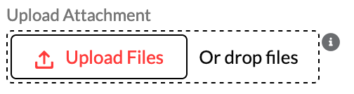

# Reporting Outages

Log in to the
<a href="https://help.xandr.com" class="xref" target="_blank">Customer
Support Portal</a> to access your full case history, knowledge base
articles, or request support.

An outage occurs when an essential production feature is broken with no
viable workaround. Examples include:

- Loss of ad serving or severe ad serving latency
- The UI is not accessible
- Persistent API time-outs
- Reporting is not accessible or reports are delayed for over six hours.

For more information,
see <a href="xcs-xandr-client-services.md" class="xref">Welcome to  Client Services</a>.

Outage alerts are displayed on the Customer Support Portal page when you
log in, as shown in the example below.

 

If you are experiencing an outage and don't see an alert, you can report
the outage to Product Support by following the directions below. This
will page an on-call team, who will respond immediately.

## Step 1. Log in and open a case.

Log in to the
<a href="https://help.xandr.com" class="xref" target="_blank">Customer
Support Portal</a> and click Contact
Support.

<b>Note:</b>

- Before you open a case, you may want to double-check that the contact
  information in
  <a href="xcs-updating-my-profile.md" class="xref">your profile</a>
  is accurate.
- Only logged in users can submit Outage type cases.

## Step 2. Select a Category

For **Category**, select "Product Support".

<b>Warning:</b> Product Support is the only
category with the severity option for an outage.

## Step 3. Select an issue

Select an issue from the What Can We Help With drop down menu.

## Step 4. Select a Severity

Select "This is an outage, wake everyone up!". This option will page the
on-call support team to respond to your request immediately. Please
ensure that your request requires immediate attention.

## Step 5. Add a subject and a description

Enter a brief summary of the case in the subject field and a detailed
account in the description field.

For the summary, be concise but specific. For example, "UI latency" is
more helpful than "UI not working".

In the description, try to include all the information necessary to
reproduce the problem. Typically, this includes:

- A description of the issue
- A summary of the impact on your immediate goals
- Steps to reproduce the issue, including test pages and URLs
- All relevant object IDs
- Product environment (if applicable)
- The browser and operating system affected, including version numbers
  (if applicable)

## Step 6. Select a Member ID (Optional)

Select the Member ID related to your request from the drop down menu.

## Step 7. Add cc email addresses (Optional)

You can add up to ten email addresses to be cc'd on case updates. These
users will be emailed the case details and any new comments added to the
case. Please be sure that the email addresses are correct, separated by
"," and that everyone you've cc'd would like to receive updates. You can
update the cc addresses after the case is opened or request that an
agent do so.

If anyone you've cc'd on a case would like a portal account, they can
visit
the <a href="https://help.xandr.com" class="xref" target="_blank">Login</a> page,
proceed as a Guest, and click Contact
Support.

## Step 8. Add attachments (Optional)

Click **Upload File** or drag and drop your file in the attachment
section to attach files that will help reproduce or troubleshoot the
case, for example, an error log, a creative that's causing problems, a
report that has helpful results, or a screenshot of the screen that's
not displaying properly.

 

## Step 8. Submit the case

Once you have completed all required fields, click
Submit. The **Case Submitted**
confirmation message will appear. The confirmation page will include the
subject, severity, and case number. A confirmation message will also be
emailed to the address in your profile. The message will include the
information you entered, as well as a link to the open case. The on-call
team will be paged to respond to your request immediately.

<a href="xcs-customer-support-portal-guide.md"
class="link">Customer Support Portal Guide</a>

