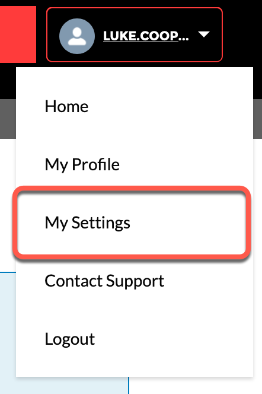

# Updating My Settings

Log in to the
<a href="https://help.xandr.com" class="xref" target="_blank">Customer
Support Portal</a> to access your full case history, knowledge base
articles, or request support.

You can update your contact information, password, set email
preferences, customize the language, locale, and time zone used for the
portal. Go to **Profile** \> **My Settings**, and select the appropriate
options from the drop-down menus.

 

## Contact Information

Under **My Settings **click the **Email Address** to edit your contact
information and **Save**.

Click Change Password to set up a new
password. 

 

Under Location set the language,
locale, and time zone and click Save.

 

## Receive email notifications

The Receive email notifications checkbox enables email notifications for
various features that are not currently enabled. It has no effect on
whether you receive comments for your cases or your cc cases, which will
always occur.

Although a number of settings are visible, these features are not
currently in use.

<a href="xcs-customer-support-portal-guide.md"
class="link">Customer Support Portal Guide</a>

