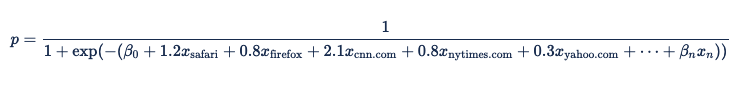

# Logistic Regression Models

To support our client's ability to predict user response to their
digital advertising Xandr provides custom models
based on decision trees. We developed an easy-to-use programming
language called
<a href="the-bonsai-language.md" class="xref">Bonsai</a> that enables
users to create decision trees to dynamically populate line item
parameters. 

Decision trees work well for simple discrete models that map into
traditional targeting-based forms of prediction but struggle to
effectively model what amounts to a sparse matrix of many dimensions and
large categorical features. Bonsai is easy to understand and easy to use
but not always sufficient for machines and data scientists as it doesn't
allow the efficient representation of the
relationships between features. For these more complex needs,
Xandr uses logistic regression models.

Logistic regression is the basic approach to predict the probability of
a binary response (click or don't click; buy or don't buy) from a
combination of multiple signals. By utilizing logistic regression data
scientists can run more expressive models that produce more accurate
predictions and that can be quickly trained at a high scale. By building
tailored algorithms, clients with sophisticated data science tools can
achieve better performance than the built-in optimization provided by
Xandr and can run complex offline models in
real-time. 

## The Formula for Logistic Regression

Logistic regression is a classification algorithm. It is used to predict
a binary outcome (such as will click, will not click) based on a set of
independent variables.

The formula for logistic regression is:

Where the probability (p) being modeled is that of a binary outcome:
event = 1 or event = 0. For online advertising, the event is a click, a
pixel fire, or another online action. The probability is conditional on
both the predictors x1 through xn and on an implicit set of variables
that represent the features in a bid request. The beta coefficients are
the weights that the model assigns to the different predictors.

We convert this probability of an event happening to an expected value
by multiplying the probability by the event's value (e.g., The eCPC goal
for a click prediction), adding an additive offset to the estimate, and
then applying min/max expected value limits to reduce the impact of
mispredictions. 

The formula for deriving an expected value for an impression from the
probability of an event happening is: 

The offset will usually be 0. However, a negative value may be useful as
a security factor to ensure performance at the expense of delivery on
low-performing inventory. That will ensure that the advertiser does not
bid instead of bidding very little and potentially incurring fixed
fees.  

**Example Using Categorical Features from Online Advertising**

Online advertising has many categorical features, that is, features that
can have many possible values. Some examples include browser, domain,
and day of the week. These features are usually represented with
"<a href="https://en.wikipedia.org/wiki/One-hot" class="xref"
target="_blank">one-hot</a>" encoding (using
"<a href="https://en.wikipedia.org/wiki/Dummy_variable_%28statistics%29"
class="xref" target="_blank">dummy variables</a>"), meaning that
x1 would be 1 if "browser = safari" and 0 if not, x2 would be 1 if
"browser = firefox", and so on.

If we put this into the logistic regression formula, we get:

Since browser is a categorical feature, we can express the coefficients
in a table:

<table class="table">
<thead class="thead">
<tr class="header row">
<th id="ID-00000750__entry__1"
class="entry align-left colsep-1 rowsep-1">Browser</th>
<th id="ID-00000750__entry__2"
class="entry align-left colsep-1 rowsep-1">Coefficient</th>
</tr>
</thead>
<tbody class="tbody">
<tr class="odd row">
<td class="entry align-left colsep-1 rowsep-1"
headers="ID-00000750__entry__1">safari</td>
<td class="entry align-left colsep-1 rowsep-1"
headers="ID-00000750__entry__2">1.2</td>
</tr>
<tr class="even row">
<td class="entry align-left colsep-1 rowsep-1"
headers="ID-00000750__entry__1">firefox</td>
<td class="entry align-left colsep-1 rowsep-1"
headers="ID-00000750__entry__2">0.8</td>
</tr>
</tbody>
</table>

  
Each row of this table is converted to a term in the logistic regression
formula, so  x1 = 1 if "browser = safari" and  β safari = 1.2 and x2 = 1
if "browser = firefox" and β firefox = 0.8. This makes the overall
equation:

Other categorical features can be expressed this way as well. Suppose we
assigned the following values as coefficients to the following domains:

<table class="table">
<thead class="thead">
<tr class="header row">
<th id="ID-00000750__entry__7"
class="entry align-left colsep-1 rowsep-1">Domain</th>
<th id="ID-00000750__entry__8"
class="entry align-left colsep-1 rowsep-1">Coefficient</th>
</tr>
</thead>
<tbody class="tbody">
<tr class="odd row">
<td class="entry align-left colsep-1 rowsep-1"
headers="ID-00000750__entry__7">cnn.com</td>
<td class="entry align-left colsep-1 rowsep-1"
headers="ID-00000750__entry__8">2.1</td>
</tr>
<tr class="even row">
<td class="entry align-left colsep-1 rowsep-1"
headers="ID-00000750__entry__7">nytimes.com</td>
<td class="entry align-left colsep-1 rowsep-1"
headers="ID-00000750__entry__8">0.8</td>
</tr>
<tr class="odd row">
<td class="entry align-left colsep-1 rowsep-1"
headers="ID-00000750__entry__7">yahoo.com</td>
<td class="entry align-left colsep-1 rowsep-1"
headers="ID-00000750__entry__8">0.3</td>
</tr>
</tbody>
</table>

These values then become incremental terms in the formula (x3 is 1 if
"domain = cnn.com" and β 3 is 2.1), making the overall equation:

When the ad impression is served, Xandr
identifies the browser as Safari and the domain as nytimes.com. The
corresponding variables for browser = Safari and domain =
nytimes.com are set to 1 and the other variables are set to 0, resulting
in the equation:

## Higher-Order Predictors

Xandr supports higher-order predictors
(combinations of features), allowing custom models to handle complex
interactions between predictors. Start with the previous example
calculating a value based on the categorical values of domain and
browser. Now imagine that domain and browser are not independent and
that you need to model the relationship between them. To do this, you
can create a two-way categorical feature with a coefficient for each
pair of features, using the values specified in the table below:

<table class="table">
<thead class="thead">
<tr class="header row">
<th id="ID-00000750__entry__15"
class="entry align-left colsep-1 rowsep-1">Browser</th>
<th id="ID-00000750__entry__16"
class="entry align-left colsep-1 rowsep-1">Domain</th>
<th id="ID-00000750__entry__17"
class="entry align-left colsep-1 rowsep-1">Coefficient</th>
</tr>
</thead>
<tbody class="tbody">
<tr class="odd row">
<td class="entry colsep-1 rowsep-1"
headers="ID-00000750__entry__15">Safari</td>
<td class="entry colsep-1 rowsep-1" headers="ID-00000750__entry__16"><a
href="https://cnn.com/" class="xref" target="_blank">cnn.com</a></td>
<td class="entry colsep-1 rowsep-1"
headers="ID-00000750__entry__17">1.1</td>
</tr>
<tr class="even row">
<td class="entry colsep-1 rowsep-1"
headers="ID-00000750__entry__15">Safari</td>
<td class="entry colsep-1 rowsep-1" headers="ID-00000750__entry__16"><a
href="https://nytimes.com/" class="xref"
target="_blank">nytimes.com</a></td>
<td class="entry colsep-1 rowsep-1"
headers="ID-00000750__entry__17">1.3</td>
</tr>
<tr class="odd row">
<td class="entry colsep-1 rowsep-1"
headers="ID-00000750__entry__15">Safari</td>
<td class="entry colsep-1 rowsep-1" headers="ID-00000750__entry__16"><a
href="https://yahoo.com/" class="xref"
target="_blank">yahoo.com</a></td>
<td class="entry colsep-1 rowsep-1"
headers="ID-00000750__entry__17">1.2</td>
</tr>
<tr class="even row">
<td class="entry colsep-1 rowsep-1"
headers="ID-00000750__entry__15">Firefox</td>
<td class="entry colsep-1 rowsep-1" headers="ID-00000750__entry__16"><a
href="https://cnn.com/" class="xref" target="_blank">cnn.com</a></td>
<td class="entry colsep-1 rowsep-1"
headers="ID-00000750__entry__17">3.3</td>
</tr>
<tr class="odd row">
<td class="entry colsep-1 rowsep-1"
headers="ID-00000750__entry__15">Firefox</td>
<td class="entry colsep-1 rowsep-1" headers="ID-00000750__entry__16"><a
href="https://nytimes.com/" class="xref"
target="_blank">nytimes.com</a></td>
<td class="entry colsep-1 rowsep-1"
headers="ID-00000750__entry__17">0.7</td>
</tr>
<tr class="even row">
<td class="entry colsep-1 rowsep-1"
headers="ID-00000750__entry__15">Firefox</td>
<td class="entry colsep-1 rowsep-1" headers="ID-00000750__entry__16"><a
href="https://yahoo.com/" class="xref"
target="_blank">yahoo.com</a></td>
<td class="entry colsep-1 rowsep-1"
headers="ID-00000750__entry__17">0.1</td>
</tr>
</tbody>
</table>

Each of these paired predictors becomes a term in the logistic
regression equation:

## Hashed Predictors

Combining multiple categorical predictors creates extremely large tables
that cannot be easily mapped into memory for a real-time system. Instead
of trying to pull values from such tables, you can hash the feature
combinations to create collisions – in effect, reducing the number of
combinations that need to be mapped into memory in real-time.

**Example of Hashed Predictors**

As a simple example, you can hash the browser-domain combinations from
the previous example using a 2-bit hash function:

<table class="table">
<thead class="thead">
<tr class="header row">
<th id="ID-00000750__entry__36"
class="entry align-left colsep-1 rowsep-1">Browser</th>
<th id="ID-00000750__entry__37"
class="entry align-left colsep-1 rowsep-1">Domain</th>
<th id="ID-00000750__entry__38"
class="entry align-left colsep-1 rowsep-1">Hash</th>
</tr>
</thead>
<tbody class="tbody">
<tr class="odd row">
<td class="entry colsep-1 rowsep-1"
headers="ID-00000750__entry__36">Safari</td>
<td class="entry colsep-1 rowsep-1" headers="ID-00000750__entry__37"><a
href="https://cnn.com/" class="xref" target="_blank">cnn.com</a></td>
<td class="entry colsep-1 rowsep-1"
headers="ID-00000750__entry__38">0</td>
</tr>
<tr class="even row">
<td class="entry colsep-1 rowsep-1"
headers="ID-00000750__entry__36">Safari</td>
<td class="entry colsep-1 rowsep-1" headers="ID-00000750__entry__37"><a
href="https://nytimes.com/" class="xref"
target="_blank">nytimes.com</a></td>
<td class="entry colsep-1 rowsep-1"
headers="ID-00000750__entry__38">1</td>
</tr>
<tr class="odd row">
<td class="entry colsep-1 rowsep-1"
headers="ID-00000750__entry__36">Safari</td>
<td class="entry colsep-1 rowsep-1" headers="ID-00000750__entry__37"><a
href="https://yahoo.com/" class="xref"
target="_blank">yahoo.com</a></td>
<td class="entry colsep-1 rowsep-1"
headers="ID-00000750__entry__38">3</td>
</tr>
<tr class="even row">
<td class="entry colsep-1 rowsep-1"
headers="ID-00000750__entry__36">Firefox</td>
<td class="entry colsep-1 rowsep-1" headers="ID-00000750__entry__37"><a
href="https://cnn.com/" class="xref" target="_blank">cnn.com</a></td>
<td class="entry colsep-1 rowsep-1"
headers="ID-00000750__entry__38">2</td>
</tr>
<tr class="odd row">
<td class="entry colsep-1 rowsep-1"
headers="ID-00000750__entry__36">Firefox</td>
<td class="entry colsep-1 rowsep-1" headers="ID-00000750__entry__37"><a
href="https://nytimes.com/" class="xref"
target="_blank">nytimes.com</a></td>
<td class="entry colsep-1 rowsep-1"
headers="ID-00000750__entry__38">0</td>
</tr>
<tr class="even row">
<td class="entry colsep-1 rowsep-1"
headers="ID-00000750__entry__36">Firefox</td>
<td class="entry colsep-1 rowsep-1" headers="ID-00000750__entry__37"><a
href="https://yahoo.com/" class="xref"
target="_blank">yahoo.com</a></td>
<td class="entry colsep-1 rowsep-1"
headers="ID-00000750__entry__38">1</td>
</tr>
</tbody>
</table>

Then compute a coefficient for each hash value. Note that there are
fewer features than in the previous example, potentially capturing some
of the cross-feature interaction without requiring as much memory.

<table class="table">
<thead class="thead">
<tr class="header row">
<th id="ID-00000750__entry__57"
class="entry align-left colsep-1 rowsep-1">Browser-Domain Hash</th>
<th id="ID-00000750__entry__58"
class="entry align-left colsep-1 rowsep-1">Coefficient</th>
</tr>
</thead>
<tbody class="tbody">
<tr class="odd row">
<td class="entry align-left colsep-1 rowsep-1"
headers="ID-00000750__entry__57">0</td>
<td class="entry align-left colsep-1 rowsep-1"
headers="ID-00000750__entry__58">1.3</td>
</tr>
<tr class="even row">
<td class="entry align-left colsep-1 rowsep-1"
headers="ID-00000750__entry__57">1</td>
<td class="entry align-left colsep-1 rowsep-1"
headers="ID-00000750__entry__58">0.7</td>
</tr>
<tr class="odd row">
<td class="entry align-left colsep-1 rowsep-1"
headers="ID-00000750__entry__57">2</td>
<td class="entry align-left colsep-1 rowsep-1"
headers="ID-00000750__entry__58">1.5</td>
</tr>
<tr class="even row">
<td class="entry align-left colsep-1 rowsep-1"
headers="ID-00000750__entry__57">3</td>
<td class="entry align-left colsep-1 rowsep-1"
headers="ID-00000750__entry__58">0.9</td>
</tr>
</tbody>
</table>

Once you replace the variables with these values, the logistic
regression equation becomes:

To predict the response on a particular impression,
Xandr hashes the detected features (using the
same hash function that is applied during feature engineering for both
training the models and online inference.) For some features, we use
hash functions to hash the raw feature values to the ones used in the
above formula and executes the prediction. If the browser is Safari and
the domain is nytimes.com (or any other browser-domain pair that hashes
to the same value), we hash these to find the value 1 and substitute
that into the logistic regression equation:

## Conversion from One-Hot Encoded and Weight Vectors to Tables 

The encoding for categorical features ensures that, for each categorical
feature, at most one variable will receive the value 1 and everything
else will receive a value of zero. The dot product of the browser
features' weight and the browser variables is thus a roundabout way to
activate the predetermined weight for the browser on the bid request.
The Digital Platform API uses the below equation, which is a standard
Sigmoid function:

If we had the following ad request:

If the browser type is Firefox then with one-hot encoding **x_firefox**
would be set to 1 and **x_safari** would be set to 0. The activated
weight for the Firefox type would be its predetermined weight of 0.8
multiplied by the encoded value of 1. So **x_firefox** would equal 0.8.
The activated weight for the Safari type would be 0, it's predetermined
weight, 1.2 multiplied by the **x_safari** setting of 0.

  
We would get an equation with the following weighting: 

In order to define the mapping from categorical feature to weight,
Xandr uses API calls to create and update lookup
tables. The logistic regression model itself will refer to these tables
and not to a vector of one-hot encoded variables. The model may also
directly refer to cardinal or real values, including segment age,
segment value, and frequency or recency information for an advertiser, a
creative, or a line item. 

## Sample Workflow

Let's use the information from above to create a sample workflow. 

Suppose you set up an exploratory campaign to gather training data with
a small budget. You wish to optimize a given retargeting line item to
minimize cost-per-click.  Each impression won generates a row in the <a
href="log-level-data/log-level-data-feeds.md"
class="xref" target="_blank">Log Level Data Feeds</a> with
the `is_click` column set to false. When a click is eventually
generated, an identical row is generated in the data feed with
the `is_click` column set to true. You partition the data between the
training, validation, and testing sets by looking at the last few bits
of `user_id_64`.  The user_id_64 determines which part the data will be
assigned to. You eventually determine that the key variables are:

- The user's browser (categorical)
- The user's country and day of the week (higher-order categorical)
- The combination of the publisher and the user's country (higher-order
  categorical)
- The amount of time since an ad for that advertiser was last showed to
  that user (advertiser recency, a cardinal value)

Since there aren't that many browsers, it's reasonable to have one
weight for each browser in your training set. The cross-product and
country and day of the week is also reasonably small. The combination of
publisher and country, however, has a high cardinality, so you
arbitrarily decide to train that with a hashed table of 4096 entries.
Finally, the line item's daily frequency is a cardinal value.

For each row in LLD, you first filter out rows that do not come from
your training campaign. Now that you have defined the events you're
interested in, you can extract the variables:

- browser id
- country id
- user's day of the week (by adding the timezone offset to the
  impression's timestamp and mapping that to a 7-day week)
- publisher id
- advertiser recency, with a max of one hour (if this is the first ad
  we're showing to this user, the recency defaults to one hour)

You reserve one feature ID for recency and 4096 IDs for the hashed
(publisher:country), and dynamically generate feature IDs for each
browser and (country:day of week) pair. The hashed feature needs one
more extra step: you take the two IDs (publisher and country), write
them out to a little endian vector of 8 32-bit integers, and find the
<a href="linear-log-bucketing.md" class="xref">bucket</a>
with MurmurHash3_x86_32(vector, 32, 0xC0FFEE) % 4096 (0xC0FFEE is an
arbitrary seed). That gives you a (sparse) vector of feature values for
each row, so you can count the number of impressions and the number of
clicks for each such vector.

After a day of slowly buying impressions, you try the logistic
regression model you trained on (a subset of) LLD. The sparse vector of
feature values is a one-hot encoding of the feature space. You must
convert back from this encoding to the more logical functions from
categorical value to weight (lookup tables). Todo this join the table of
feature to feature id and the vector of weights to get the following: 

<table class="table">
<thead class="thead">
<tr class="header row">
<th id="ID-00000750__entry__67"
class="entry align-left colsep-1 rowsep-1">Feature</th>
<th id="ID-00000750__entry__68"
class="entry align-left colsep-1 rowsep-1">Index</th>
<th id="ID-00000750__entry__69"
class="entry align-left colsep-1 rowsep-1">Weight</th>
</tr>
</thead>
<tbody class="tbody">
<tr class="odd row">
<td class="entry colsep-1 rowsep-1"
headers="ID-00000750__entry__67">Advertiser recency</td>
<td class="entry colsep-1 rowsep-1"
headers="ID-00000750__entry__68">0</td>
<td class="entry colsep-1 rowsep-1"
headers="ID-00000750__entry__69">-0.2</td>
</tr>
<tr class="even row">
<td class="entry colsep-1 rowsep-1"
headers="ID-00000750__entry__67">publisher:country-bucket 0 </td>
<td class="entry colsep-1 rowsep-1"
headers="ID-00000750__entry__68">1</td>
<td class="entry colsep-1 rowsep-1"
headers="ID-00000750__entry__69">1.4</td>
</tr>
<tr class="odd row">
<td class="entry colsep-1 rowsep-1"
headers="ID-00000750__entry__67">publisher:country-bucket 1</td>
<td class="entry colsep-1 rowsep-1"
headers="ID-00000750__entry__68">2</td>
<td class="entry colsep-1 rowsep-1"
headers="ID-00000750__entry__69">-2.1</td>
</tr>
<tr class="even row">
<td class="entry colsep-1 rowsep-1"
headers="ID-00000750__entry__67">...</td>
<td class="entry colsep-1 rowsep-1"
headers="ID-00000750__entry__68">...</td>
<td class="entry colsep-1 rowsep-1"
headers="ID-00000750__entry__69">...</td>
</tr>
<tr class="odd row">
<td class="entry colsep-1 rowsep-1"
headers="ID-00000750__entry__67">publisher:country-bucket 4095</td>
<td class="entry colsep-1 rowsep-1"
headers="ID-00000750__entry__68">4096</td>
<td class="entry colsep-1 rowsep-1"
headers="ID-00000750__entry__69">-0.5</td>
</tr>
<tr class="even row">
<td class="entry colsep-1 rowsep-1"
headers="ID-00000750__entry__67">browser=safari</td>
<td class="entry colsep-1 rowsep-1"
headers="ID-00000750__entry__68">4097</td>
<td class="entry colsep-1 rowsep-1"
headers="ID-00000750__entry__69">5.2</td>
</tr>
<tr class="odd row">
<td class="entry colsep-1 rowsep-1"
headers="ID-00000750__entry__67">country:day-of-week=US:monday</td>
<td class="entry colsep-1 rowsep-1"
headers="ID-00000750__entry__68">4098</td>
<td class="entry colsep-1 rowsep-1"
headers="ID-00000750__entry__69">0.7</td>
</tr>
<tr class="even row">
<td class="entry colsep-1 rowsep-1"
headers="ID-00000750__entry__67">...</td>
<td class="entry colsep-1 rowsep-1"
headers="ID-00000750__entry__68">...</td>
<td class="entry colsep-1 rowsep-1"
headers="ID-00000750__entry__69">...</td>
</tr>
</tbody>
</table>

You determine the weights for each feature:

- Advertiser-recency: You read the weight directly from the trained
  model.
- The hashed table: You read the weights for the 4096 features and put
  them in an array.
- Browser: You walk the dynamic map from feature to ID, the features are
  the keys and the ID the values, and build a lookup table from browser
  ID to non-zero weight (with zero as the default) to create a list of
  browser to weight mappings.
- Country:day of week: You walk the dynamic map from feature to ID and
  build a lookup table from browser ID to non-zero weight (with zero as
  the default) to create a list of browser to weight mappings.

This is all the data you need to call the
AppNexus API.

## What Happens at Auction Time

Once the line item passes targeting, Xandr uses
its logistic regression model to determine a bid price:

1.  For each lookup table in its description,
    Xandr extracts the field's (or fields')
    value(s) from the bid request, and looks for an entry in the table.
    If there is an entry, that value is added to the linear argument of
    the logistic function. Otherwise, the table's default value, which
    is usually 0, is used.
2.  The same is done for hashed tables, except that
    Xandr hashes the values to find a bucket,
    and then look for that bucket in the hashed table's list of
    bucket-\>value mappings. Again, the default value is used if the
    specified value does not appear in the table.
3.  Finally, Xandr looks for Bonsai features. We
    perform the lookup for each feature, multiply by the weight, and
    apply min/max limits.
4.  Xandr then sums the components and Beta0 and
    passes that to the logistic function to compute the estimated
    probability of a click. The estimated probability is multiplied by
    the goal value to obtain the expected value, which is then clamped
    between 1 and 100 CPM to curb any unrealistically high valuations.
5.  Xandr then uses the expected value and the
    amount of inventory available to compute a bid. The exact
    computations vary depending on the line item's setup, but the result
    is that Xandr will automatically scale down
    the expected value until the bids are just high enough that the line
    item spends its daily budget at the end of each day. For more
    information on this scaling, see "<a
    href="invest/adaptive-pacing.md"
    class="xref" target="_blank">Adaptive Pacing</a>" (log in required)
    in  documentation.

## Related Topics

- <a href="linear-log-bucketing.md" class="xref">Linear-Log
  Bucketing</a>
- <a href="logistic-regression-custom-model-service.md"
  class="xref">Logistic Regression Custom Model Service</a>

- **[Linear-Log Bucketing](linear-log-bucketing.md)**  

<a href="custom-models.md" class="link">Custom Models</a>

