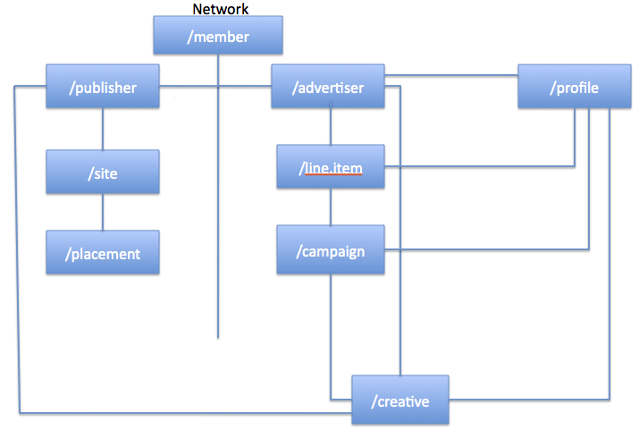

# Network Relationship Diagram

Below is a diagram outlining the relationships between some of the core
API services for Ad Networks. You'll note that this mimics the User
Interface setup with the exception of the profile object. On the back
end, campaigns are created through a combination of a profile object,
which includes targeting information, and a campaign object, which
includes start and end dates, budget, and associated creatives.

Details for each of the API services displayed above can be found on
their respective Wiki pages:

- <a
  href="member-service.md"
  class="xref" target="_blank">Member Service</a>
- <a
  href="publisher-service.md"
  class="xref" target="_blank">Publisher Service</a>
- <a href="site-service.md"
  class="xref" target="_blank">Site Service</a>
- <a
  href="placement-service.md"
  class="xref" target="_blank">Placement Service</a>
- <a
  href="advertiser-service.md"
  class="xref" target="_blank">Advertiser Service</a>
- <a
  href="line-item-service.md"
  class="xref" target="_blank">Line Item Service</a>
- <a
  href="campaign-service.md"
  class="xref" target="_blank">Campaign Service</a>
- <a
  href="profile-service.md"
  class="xref" target="_blank">Profile Service</a>
- <a
  href="creative-service.md"
  class="xref" target="_blank">Creative Service</a>

