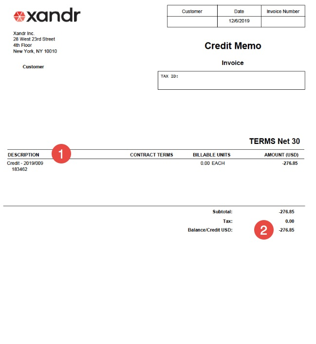

# Understanding Your Invoice

Annotated descriptions of the contents of your
Xandr invoices.

## Understanding Your Invoice

All members who buy inventory through one of the
Xandr Digital Platform UI products will receive
an invoice every month indicating the amount they have spent. There are
several types of invoices; this page explains each one.

Network users with the Financial Observer or DSP Billing role in our
Digital Platform UI products can access invoices and seller statements
directly within the app, including the pricing terms used when
calculating fees and charges on invoices.

## Invoice

Here's an example of what a typical invoice will look like (see
descriptions of annotations below):

<figure class="fig figborder">

</figure>

Your invoice lists the amount you have spent on
Xandr's platform; this is the amount you must
pay Xandr. You can reconcile some of these
amounts using reports in the UI. For more information see
<a href="reconciling-your-invoice-with-reporting.md"
class="xref">Reconciling Your Invoice with Reporting</a>.

1.  **Invoice Number** - The unique invoice number. Please include your
    invoice number when using the
    <a href="https://help.xandr.com" class="xref" target="_blank">Customer
    Service Portal</a> to contact the Client Finance group with
    questions. If it's your first time using the Customer Service
    Portal, select "Proceed as a Guest" to submit your case. Then, while
    we answer your first case, we'll also send you an email to setup an
    account.

2.  **Customer** - Your unique customer ID (member/network ID). Refer to
    your customer number in all correspondence with
    Xandr Client Finance.

3. 

    **Date** - The date the invoice was generated.
    

    <b>Note:</b> Xandr
    creates invoices within the first 5 business days of the month
    following the activity. For example, an invoice for activity in
    September 2018 would be prepared within the first 5 business days of
    October 2018.

    

    

4.  **Billing Period** - The month during which inventory was purchased
    on Xandr's platform (this is not the same as
    your Insertion Order billing period).

5.  **Bill To** - The name and address of the customer. To update this
    information, create a Client Finance case via the
    <a href="https://help.xandr.com" class="xref" target="_blank">Customer
    Service Portal</a>.

6.  **Payment Terms** - The number of days after the end of the relevant
    activity billing period when payment is due, as specified in the
    Payment Terms section of your Xandr Service
    Exhibit.

    

    

    <b>Note:</b> To avoid being charged
    finance fees on overdue balances, be sure to make payments on time.
    To review how Xandr calculates finance fees,
    see <a href="billing-faq.md" class="xref">Billing FAQ</a>. Your
    finance fee amount is specified in the Payments; Payment Obligations
    section of your Xandr Master Services
    Agreement

    

    

7.  **Billing Start / Billing End Date** - The start and end date of the
    activity period covered in this invoice (including time zone). The
    time zone reflects what you use to tie out to reporting.

8.  **Description of Charges** - An itemized list of the fees and
    charges for which you are being billed. This list may vary depending
    on your activity for the month. For information on how to reconcile
    these charges with your billing reports, see
    <a href="reconciling-your-invoice-with-reporting.md"
    class="xref">Reconciling Your Invoice with Reporting</a>. Below are
    examples of some of these charges with descriptions:
    1.  **Console Service Fee** - Monthly charge for access to our
        platform. This charge can be found in your Service Agreement.

    2.  **Cost of Media** - The amount you owe
        Xandr for inventory purchased during the
        billing period.

    3.  **Views/Completes** - The amount you owe
        Xandr for display impressions and/or
        video completes purchased via the Viewable Marketplace (e.g.,
        *Views - Standard Display*, *Completes - Standard Video*). For
        information on confirming invoice values associated with
        Viewable Marketplace activity, see
        <a href="reconciling-your-invoice-with-reporting.md"
        class="xref">Reconciling Your Invoice with Reporting</a>.

    4.  

        **Buyer Auction Service Fee** - Typically, the fee for
        impressions bought from third parties such as Google or Yahoo!.
        This fee is charged in addition to the media cost. The fee
        percentage is specified in the Summary of Standard
        Xandr Service Charges/Fees section of
        your Xandr Service Exhibit. For more
        information about buyer auction service charges, see
        <a href="buyer-auction-service-charge-mechanics.md" class="xref">Buyer
        Auction Service Charge</a>.
        

        <b>Note:</b> **Buyer Auction Service
        Deduction (BASC)** - For all other inventory purchases, many
        clients have the buyer auction service charge for other
        inventory purchases specified as a bid reduction in their
        contract. This may not appear as a separate charge on your
        invoice automatically unless your account is setup for disclosed
        invoicing. If the line item is not being displayed on your
        invoice you can view the deduction amount in the UI using the
        Buying Billing Report. To enable disclosed invoicing, create a
        Client Finance case in the Customer Support Portal. Your cost of
        media will appear on your invoice net the fees.

        

        

    5.  **Seller Auction Service Fee (SASC)** - This fee is only applied
        to selling activity and only if the seller has the SASC set as a
        Fee instead of a Deduction in their contract terms with
        Xandr. This fee is charged directly by
        Xandr for impressions sold. If you have
        questions about this charge on your seller invoice, contact your
        account representative.

    6.  **Ad Serving Fee** (only charged to Sellers) - The charge for
        kept, blank, default, and/or PSA impressions. This will appear
        as a separate line item on your invoice and can be tied out with
        the Selling Billing Report in the UI. These charges do not
        appear by default in that report. To view them in the report,
        you must select Filtered
        Requests (under
        Metrics).

    7.  **Priority/Creative Audit Fee** - The charge for each creative
        audit performed by Xandr (including both
        initial audits and re-audits). The creative audit fee, specified
        in the Summary of Standard Xandr Service
        Charges/Fees section of your Xandr
        Service Exhibit, is the standard audit rate with standard
        turnaround time. Priority audit, specified in the Ad Unit
        Auditing Fee section of your Xandr
        Service Exhibit, is a higher fee incurred when you request
        expedited turnaround time.

    8.  **Creative Overage Fee** - The charge for serving creatives that
        are over the maximum size specified in the Summary of Standard
        Xandr Service Charges/Fees section of
        your Xandr Service Exhibit. For each
        oversized creative, the difference between the maximum size (in
        your contract) and the size of the creative is multiplied by (1)
        the number of impressions where the creative served, and then
        by (2) the bandwidth charge in your contract. For example, let's
        say the maximum creative size in your contract is **10KB**, your
        bandwidth fee is **$1.00 per KB**, and you have a **20KB**
        creative that served 4 times. Your creative overage fee is
        **((10KB x 4) x $1.00) = $40**.

    9.  **Data Fees** – The charge for information purchased from a
        third party via the Xandr Data
        Marketplace. Unless you have a contractual direct clearing
        arrangement with the third party from whom you purchased the
        data, Xandr is responsible for the
        payment to the third party and your payments for this data
        should be sent to Xandr.

    10. **Video Creative Hosting** – The charge for video inventory that
        is purchased through Xandr's platform.

    11. Finance Fees – The incremental fee for any past due payments.
        Finance fees are never generated on outstanding finance fees
        (just the original amount due that has not been paid).

9.  Tax - The charge for any applicable local taxes.

10. **Total** - The total amount due to Xandr
    (e.g., all charges plus taxes).

11. **Payment Instructions** - Information to help you submit your
    payment via check or wire. To ensure your wire payment is applied
    correctly, submit it to the account listed on your statement. For
    more information, see
    <a href="payment-to-xandr.md" class="xref">Payment to Xandr.</a>

## Advertiser-specific, Insertion Order-specific, and Billing Period-specific Invoices

You have the option to receive advertiser-, insertion order-, or billing
period-specific invoices (e.g., to separate specific costs and fees for
an advertiser's billing department). To opt into receiving these more
specific invoices, contact your Xandr
representative.

If you opt into receiving **advertiser-specific invoices**, you will
receive two levels of invoices:

- **Advertiser Invoices:** Each invoice will contain Media Cost, Buyer
  Auction Service Charges, Creative Audit Fees, and Cost of Data
  attributable to a specific advertiser.
- **Member Invoices:** Each invoice will contain costs and fees not
  otherwise specifically attributable to specific advertisers, including
  log-level data fees, minimums, and fixed fees (e.g., onboarding fee).

If you opt into receiving **insertion order-specific invoices**, you
will receive three levels of invoices:

- **Insertion Order Invoices:** Each invoice will contain Media Cost and
  Buyer Auction Service Charges attributable to a specific insertion
  order.
- **Advertiser Invoices:** Each invoice will contain Creative Audit Fees
  or Cost of Data attributable to a specific advertiser (but not to
  specific insertion orders).
- **Member Invoices:** Each invoice will contain costs and fees not
  otherwise attributable to specific advertisers or insertion orders,
  including log-level data fees, minimums, and fixed fees (e.g.,
  onboarding fee).

If you opt into receiving **billing period-specific invoicing**, you
will receive three levels of invoices:

- **Billing Period Invoices:** Each invoice will contain Media Cost and
  Buyer Auction Service Charges attributable to a specific billing
  period.
- **Advertiser Invoices:** Each invoice will contain Creative Audit Fees
  or Cost of Data attributable to a specific advertiser (but not to
  specific billing period).
- **Member Invoices:** Each invoice will contain costs and fees not
  otherwise attributable to specific advertisers or insertion orders,
  including log-level data fees, minimums, and fixed fees (e.g.,
  onboarding fee).

<b>Note:</b> If you entered a value in the
**Billing Code** field of your Insertion Order, that value will appear
on your insertion order-specific invoices and/or your billing
period-specific invoices (depending on which you opted into).

<b>Warning:</b> Financial Obligations -
Receiving Advertiser-, Insertion Order, or Billing Period-specific
invoices does not change any of your financial or payment obligations to
Xandr. You are still responsible for paying all
invoices associated with any of your advertisers (including their
insertion orders) and their activity and buying.
Xandr does not bill advertisers for you.

<b>Note:</b> Billing Name/Address and Billing
Code

- To display the advertiser's address in the **Bill To** region of your
  Advertiser-, Insertion Order-, Billing Period-specific invoices, you
  must update the fields in the Billing
  Information section of the advertiser. If you leave these
  fields blank, your Advertiser-, Insertion Order-, or Billing
  Period-specific invoices will only show your member billing address.

- To include a billing code on your insertion order- or billing
  code-specific invoices, you must enter it in the
  Basic Details section of the
  insertion order.

## Invoice Consolidation ("Rollup")

If you have more than one member account, you can choose to receive a
consolidated invoice for the buying activity across of your member
accounts. For more details on this feature, contact your Account
Manager.

## Netting Statement

If you both buy and sell inventory with Xandr,
you can opt into having Xandr “net” this
activity rather than receiving both monthly invoices and payments from
Xandr. The netting statement document lists the
amount you have spent as a buyer and the amount of revenue you have
earned as a seller. Xandr then deducts the
amount that you owe as a buyer based on your buy-side payment terms from
the revenue you have earned based on your sell-side payment terms in
order to determine the net amount that you will owe or be paid by
Xandr. For more details, see
<a href="understanding-your-seller-statement.md"
class="xref">Understanding Your Seller Statement</a>.

## Credit Note

If Xandr issues you a credit or debit, you will
receive a credit memo listing the credit/debit amount. If a credited
amount can be applied to an outstanding balance, it will be applied. If
it is not clear where to apply this credit, the amount will be listed on
your account as a credit. Note that invoices will not be reissued when a
credit amount is agreed upon. Instead, you will receive a separate
credit memo once the credit is processed.

1.  **Description** - The list of items for which you are receiving a
    credit. The original invoice number for which the credit memo is
    being generated will also be shown. If that invoice is still open
    (i.e., not yet fully paid), the credit memo will be applied to that
    invoice. If the invoice is fully paid, Xandr
    can apply the amount of the credit to another invoice (after
    receiving your approval to do so).
2.  **Balance/Credit** - The amount that has been credited to your
    account.

<figure class="fig figborder">

</figure>

## Related Topics

- <a href="understanding-your-seller-statement.md"
  class="xref">Understanding Your Seller Statement</a>
- <a href="buyer-auction-service-charge-mechanics.md" class="xref">Buyer
  Auction Service Charge Mechanics</a>
- <a href="reconciling-your-invoice-with-reporting.md"
  class="xref">Reconciling Your Invoice with Reporting</a>

