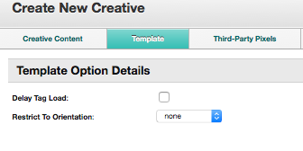

# Ad Ops - Set Up MRAID Full Screen Interstitials


This page has Ad Ops setup instructions for serving MRAID full screen
interstitials on our Xandr<a
href="xandr-mobile-sdks.md"
class="xref" target="_blank">Mobile SDKs</a>.

For developer-focused interstitial documentation, see <a
href="show-interstitials-ads-on-ios.md"
class="xref" target="_blank">Show Interstitials</a>..


## Creative Settings

To set up your MRAID creative, first create a creative and
then configure the settings listed below:

- Under **Creative Content**, choose the **Third-party** creative type.

- Choose a **Creative format** of **Third-party tag**. Make sure to
  uncheck **Serve in iFrame**.

- When entering the MRAID creative text in the
  Tag field, make sure to reference
  the `mraid.js` file in the first line of your creative:

  ``` pre
  <script src="mraid.js"></script>
  ```

- Choose a **Media Type** of **Interstitial: Interstitial**.

- In the Template field, choose
  **Xandr:
  Mobile SDK** (ID 38896).

Then, in the Template tab:

- Check the **Delay Tag Load** checkbox to delay third-party tags from
  loading until the WebView displaying the ad occupies the full screen.
  This may be necessary to prevent discrepancies, since some third-party
  tags don't load properly offscreen in a 1x1 pixel WebView.
- Use the **Restrict To Orientation** dropdown to control how the ad
  will be shown on the device's screen:
  - **none**: The ad can appear in either a landscape (horizontal) or
    portrait (vertical) orientation
  - **landscape**: The ad will only appear in a landscape (horizontal)
    orientation
  - **portrait**: The ad will only appear in a portrait (vertical)
    orientation
 


## Placement Settings

To set up your placement, first create a placement and then configure
the settings listed below:

- In the Allowed Media section, select
  the Other button and include the
  **Interstitial: Interstitial** media type.


## SDK Settings

Make sure the SDK is sending the 1x1 ad size on the ad call (it does
send this size by default).

If you have changed the allowed sizes for interstitials in your app from
the defaults, check to make sure you're sending the 1x1 ad size. For
instructions on sending ad sizes explicitly, see the
Using Custom Interstitial Sizes
section of <a
href="show-interstitials-ads-on-ios.md"
class="xref" target="_blank">Show Interstitials</a>.

You can use the following Xandr placement ID in
your app for testing: `8522131`.


## Related Topics

<a
href="ad-ops---set-up-static-image-full-screen-interstitials.md"
class="xref" target="_blank">Ad Ops - Set Up Static Image Full Screen
Interstitials</a>

<a
href="ad-ops---set-up-html-responsive-interstitials--non-mraid-.md"
class="xref" target="_blank">Ad Ops - Set Up HTML Responsive
Interstitials (non-MRAID)</a>


