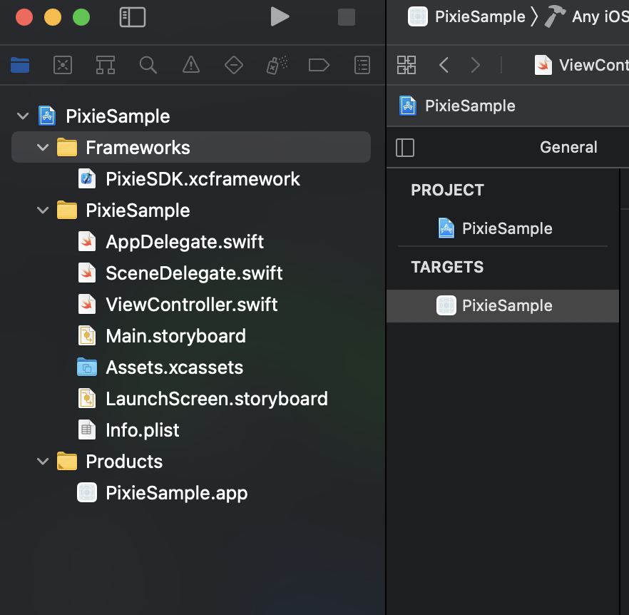
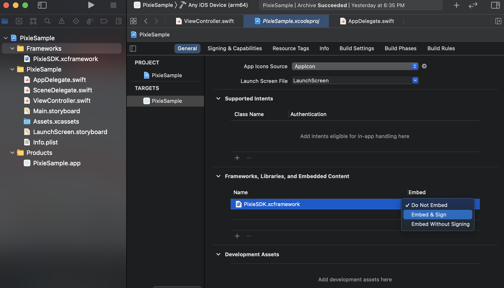

# Universal Pixel SDK for iOS


This document provides instructions on how publishers can integrate and
install the Universal Pixel SDK (Pixie SDK) for iOS.


## Integration

**Requirements**

This SDK requires 

- macOS Mojave 10.14.4+
- iOS 9+
- Swift 5+
- Xcode 11+

In order to use the Pixie SDK, you must have a valid
Xandr Unified Pixel ID. This is an alphanumeric
ID that represents a pixel in your app.

**Installation**

There are two ways to install the SDK:

**1: Use** <a href="https://cocoapods.org/" class="xref"
target="_blank">CocoaPods</a>

CocoaPods is a dependency manager for Cocoa projects. If you are
unfamiliar with CocoaPods review
their <a href="https://cocoapods.org/" class="xref"
target="_blank">installation and user guides</a>.  Once you have
CocoaPods installed: 

Using Terminal or your command line editor of choice, navigate to the
root directory of your project and create a podfile. 

``` pre
pod init
```

Using a text editor, open the newly created podfile. Set the platform
version to 9.0 and add pod 'PixieSDK' to the target.  

``` pre
# iOS: Podfile config to include our SDK
platform :ios, '9.0'
project 'SampleApp'
target 'SampleApp' do
  pod 'PixieSDK'
end
```

 Save your changes and return to Terminal and enter:  

``` pre
pod install
```

CocoaPods will download the Pixie SDK and create a workspace in the
project directory. If your project is currently open, close it and open
the workspace. 

**2: Use Xandr Unified Pixel SDK XCFramework**


<b>Note:</b> We are
distributing  PixieSDK.xcframework, which you can download <a
href="https://acdn.adnxs.com/mobile/pixiesdk/ios/1.1/PixieXCFramework.zip"
class="xref" target="_blank">here</a>. Download the file and add it to
the **Frameworks** folder.


- <figure class="fig fignone">
  <p><strong>Create Frameworks folder<br />
  <br />
  </strong></p>
  <p>Right click on your project in the project navigator (top-most entry)
  , and select “New Group”. Name the new group
  as <strong>"Frameworks"</strong>.<br />
  <br />
  
  <br />
  <br />
  </p>
  </figure>

- **Add `PixieSDK.xcframework` to Frameworks folder**

  Drag and drop `PixieSDK.xcframework` from Finder into the
  **Frameworks** folder. Make sure that the destination of drag is just
  under the **Frameworks**.   
  

  
  

    
  Make sure the options Copy items if
  needed and Create groups are
  checked and selected for adding files. Click
  Finish.  
  
  
    

  Once this step is completed, the result should look like below.
 
  

<!-- -->

- **Embed PixieSDK.xcframework in project’s target  
    
  **
  1.  Navigate to your project settings by clicking on it in the project
      navigator. 
  2.  Make sure that your target is selected and
      General tab is open.
  3.  Select Embed & Sign for your
      newly added XCFramework
      

      <figure id="ID-00003a16__fig_syd_xq4_mwb" class="fig fignone">
      
      <p><br />
      </p>
      </figure>

      


## Implementation

**Initializing the SDK**

**Initialize the SDK calling its initialize method within
the didFinishLaunchingWithOptions method within the app delegate's
file: **

``` pre
Pixie.initialize(pixelId:String)
```

**Track Event**

**Once the SDK is initialized events can be tracked and submitted using
fireEvent method. **


<b>Note:</b> Any events being tracked prior to
initialization will be rejected.


``` pre
Pixie.fireEvent(eventName : String, eventParams : PixieParams?)
```

**fireEvent method takes Event string and PixieParams(optional)  as it's
parameters.**

**eventName : String**

**Standard Event strings are defined within the Event class. See
the <a href="universal-pixel-sdk-for-ios.md#ID-00003a16__track"
class="xref">Standard Events</a>  section below for the
available Standard Event strings. You also have the option to define
Custom Event string(s) in Universal Pixel UI and use it in your app.**

**Custom Event String(s) should be preregistered using Universal Pixel
UI.**

**eventParams  : PixieParams**

**Event data is represented by the PixieParams class. All parameters are
optional.**


<b>Note:</b> If no params are passed a nil
object must still be sent if using Objective C.


<table class="table">
<thead class="thead">
<tr class="header row">
<th id="ID-00003a16__entry__1" class="entry colsep-1 rowsep-1">Name</th>
<th id="ID-00003a16__entry__2"
class="entry colsep-1 rowsep-1">Description</th>
</tr>
</thead>
<tbody class="tbody">
<tr class="odd row">
<td colspan="2" class="entry colsep-1 rowsep-1"
headers="ID-00003a16__entry__1 ID-00003a16__entry__2">Properties</td>
</tr>
<tr class="even row">
<td class="entry colsep-1 rowsep-1"
headers="ID-00003a16__entry__1">currency : String</td>
<td class="entry colsep-1 rowsep-1"
headers="ID-00003a16__entry__2">Currency for the `value` specified.</td>
</tr>
<tr class="odd row">
<td class="entry colsep-1 rowsep-1"
headers="ID-00003a16__entry__1">itemId : String</td>
<td class="entry colsep-1 rowsep-1" headers="ID-00003a16__entry__2">A
generic ID of the item represented. IDs can also be passed as an array
of comma separated items. Example "itemId1, itemId2"</td>
</tr>
<tr class="even row">
<td class="entry colsep-1 rowsep-1"
headers="ID-00003a16__entry__1">itemName : String</td>
<td class="entry colsep-1 rowsep-1" headers="ID-00003a16__entry__2">The
name of the item represented. Names can also be passed as an array of
comma separated items. Example "itemName1, itemName2"</td>
</tr>
<tr class="odd row">
<td class="entry colsep-1 rowsep-1"
headers="ID-00003a16__entry__1">itemType : String</td>
<td class="entry colsep-1 rowsep-1" headers="ID-00003a16__entry__2">A
generic type of the item represented. Types can also be passed as an
array of comma separated items. Example "itemType1, itemType2"</td>
</tr>
<tr class="even row">
<td class="entry colsep-1 rowsep-1"
headers="ID-00003a16__entry__1">value : String</td>
<td class="entry colsep-1 rowsep-1"
headers="ID-00003a16__entry__2">Value of a user performing this event to
the business.</td>
</tr>
<tr class="odd row">
<td colspan="2" class="entry colsep-1 rowsep-1"
headers="ID-00003a16__entry__1 ID-00003a16__entry__2">Function</td>
</tr>
<tr class="even row">
<td class="entry colsep-1 rowsep-1" headers="ID-00003a16__entry__1">put(
key : String, value : String)</td>
<td class="entry colsep-1 rowsep-1"
headers="ID-00003a16__entry__2">Arbitrary data defined by the publisher.
Enables the passing of custom event data through key/value pairs. Keys
should be preregistered using Universal Pixel UI. Values can be an array
separated by a comma. See the <a
href="universal-pixel-sdk-for-ios.md#ID-00003a16__custom"
class="xref">Custom Events</a> section below for more details</td>
</tr>
</tbody>
</table>


## Code Samples

**Initializing the SDK**

**Code sample: **

**Swift**

``` pre
import PixieSDK
func application(_ application: UIApplication, didFinishLaunchingWithOptions launchOptions: [UIApplication.LaunchOptionsKey: Any]?) -> Bool {
        Pixie.initialize("b63be84e-d95b-4c67-8242-d9c9c026ed30")
        return true
        } 
```

**Objective C**

``` pre
@import PixieSDK;
- (BOOL)application:(UIApplication *)application didFinishLaunchingWithOptions:(NSDictionary *)launchOptions {
    [Pixie initialize:@"b63be84e-d95b-4c67-8242-d9c9c026ed30"];
    return YES;
} 
```

**Track Standard Event**

**Page View**

``` pre
Event.PAGE_VIEW
```

**The specific page that was visited. **

**Code sample: **

**Swift**

``` pre
Pixie.fireEvent(Event.PAGE_VIEW)
```

**Objective C**

``` pre
[Pixie fireEvent:Event.PAGE_VIEW eventParams:nil];
```

  
**Landing Page**

``` pre
Event.LANDING_PAGE
```

**Track landing pages' views.**

 **Code sample: **

**Swift**

``` pre
let landingPageParams = PixieParams(value: "5.99", currency: "USD", itemId: "product_5,product_6", itemType: "apparel,accessory", itemName: "shirt,belt")
               Pixie.fireEvent(Event.LANDING_PAGE, eventParams:landingPageParams)
```

**Objective C**

``` pre
PixieParams *landingPageParams = [[PixieParams alloc] initWithValue:@"5.99" currency:@"USD" itemId:@"product_5,product_6" itemType:@"apparel,accessory" itemName:@"shirt,belt"];
[Pixie fireEvent:Event.LANDING_PAGE eventParams:landingPageParams];
```

**Item View**

``` pre
Event.ITEM_VIEW
```

**Track key page views (ex: product page, landing page, article).**

** Code sample: **

**Swift**

``` pre
let itemViewParams = PixieParams(value: "5.99", currency: "USD", itemId: "product_5,product_6", itemType: "apparel,accessory", itemName: "shirt,belt")
               Pixie.fireEvent(Event.ITEM_VIEW, eventParams:itemViewParams)
```

**Objective C**

``` pre
PixieParams *itemViewParams = [[PixieParams alloc] initWithValue:@"5.99" currency:@"USD" itemId:@"product_5,product_6" itemType:@"apparel,accessory" itemName:@"shirt,belt"];
[Pixie fireEvent:Event.ITEM_VIEW eventParams:itemViewParams];
```

**Add To Cart**

``` pre
Event.ADD_TO_CART
```

**Track when items are added to a shopping cart (ex: click, landing page
on Add to Cart button).**

** Code sample: **

**Swift**

``` pre
let addToCartParams = PixieParams(value: "5.99", currency: "USD", itemId: "product_5,product_6", itemType: "apparel,accessory", itemName: "shirt,belt")
               Pixie.fireEvent(Event.ADD_TO_CART, eventParams:addToCartParams)
```

**Objective C**

``` pre
PixieParams *addToCartParams = [[PixieParams alloc] initWithValue:@"5.99" currency:@"USD" itemId:@"product_5,product_6" itemType:@"apparel,accessory" itemName:@"shirt,belt"];
[Pixie fireEvent:Event.ADD_TO_CART eventParams:addToCartParams]; 
```

 **Initiate Checkout**

``` pre
Event.INITIATE_CHECKOUT
```

**Track when people enter the checkout flow (ex: click, landing page on
checkout button).**

** Code sample: **

**Swift**

``` pre
let initiateCheckOutParams = PixieParams(value: "5.99", currency: "USD", itemId: "product_5,product_6", itemType: "apparel,accessory", itemName: "shirt,belt")
               Pixie.fireEvent(Event.INITIATE_CHECKOUT, eventParams: initiateCheckOutParams)
```

**Objective C**

``` pre
PixieParams *initiateCheckOutParams = [[PixieParams alloc] initWithValue:@"5.99" currency:@"USD" itemId:@"product_5,product_6" itemType:@"apparel,accessory" itemName:@"shirt,belt"];
[Pixie fireEvent:Event.INITIATE_CHECKOUT eventParams:initiateCheckOutParams];
```

**Add Payment Info**

``` pre
Event.ADD_PAYMENT_INFO
```

Track when payment information is added in the checkout flow (ex: click,
landing page on billing info) 

**Code sample: **

**Swift**

``` pre
let addPaymentInfoParams = PixieParams(value: "5.99", currency: "USD", itemId: "product_5,product_6", itemType: "apparel,accessory", itemName: "shirt,belt")
               Pixie.fireEvent(Event.ADD_PAYMENT_INFO, eventParams: addPaymentInfoParams)
```

**Objective C**

``` pre
PixieParams *addPaymentInfo = [[PixieParams alloc] initWithValue:@"5.99" currency:@"USD" itemId:@"product_5,product_6" itemType:@"apparel,accessory" itemName:@"shirt,belt"];
[Pixie fireEvent:Event.ADD_PAYMENT_INFO eventParams:addPaymentInfo];
```

**Purchase**

``` pre
Event.PURCHASE
```

**Track purchases or checkout flow completions (ex: Landing on "Thank
You" or confirmation page).**

**Code sample: **

**Swift**

``` pre
let purchaseParams = PixieParams(value: "5.99", currency: "USD", itemId: "product_5,product_6", itemType: "apparel,accessory", itemName: "shirt,belt")
               Pixie.fireEvent(Event.PURCHASE, eventParams: purchaseParams)
```

**Objective C**

``` pre
PixieParams *purchaseParams = [[PixieParams alloc] initWithValue:@"5.99" currency:@"USD" itemId:@"product_5,product_6" itemType:@"apparel,accessory" itemName:@"shirt,belt"];
[Pixie fireEvent:Event.PURCHASE eventParams:purchaseParams]; 
```

**Lead **

``` pre
Event.LEAD
```

**Track when someone expresses interest in your offering (ex: form
submission, sign up for trial, registration).**

**Code sample: **

**Swift**

``` pre
let leadParams = PixieParams(value: "5.99", currency: "USD")
               Pixie.fireEvent(Event.LEAD, eventParams: leadParams)
```

**Objective C**

``` pre
PixieParams *leadParams = [[PixieParams alloc] init];
leadParams.value = @"5.99";
leadParams.currency = @"USD";
[Pixie fireEvent:Event.LEAD eventParams:leadParams];
```

**Track Custom Event**

**Custom Events enable publishers to create their own events to track
and submit. To create a custom event, initiate a PixelParams object with
the data to be submitted and pass that object, along with a string
identifier to the Pixie SDK fireEvent method. Custom event data can also
be sent in key-value pairs by using the put method of the PixelParams
object. **

**Code samples: **

**Swift**

``` pre
let customPixieParams = PixieParams()
customPixieParams.value = "5.99"
customPixieParams.itemName = "shirt,belt"
//passing key value pairs with the put method
customPixieParams.put("name", "Form Submission")
customPixieParams.put("email", "user@appnexus.com")
customPixieParams.put("type", "subscribe,newuser")
Pixie.fireEvent("TestCustomEvent", eventParams: customPixieParams) 
```

**Objective C**

``` pre
PixieParams *customPixieParams = [[PixieParams alloc] init];
customPixieParams.value = @"5.99";
customPixieParams.itemName = @"shirt,belt";
//passing key value pairs with the put method
[customPixieParams put:@"name" :@"Form Submission"];
[customPixieParams put:@"email" :@"user@appnexus.com"];
[customPixieParams put:@"type" :@"subscribe,newuser"];
[Pixie fireEvent:@"TestCustomEvent" eventParams:customPixieParams];
```


## **Enable Logging**

**Pixie SDK comes with a debug mode feature that enables logging during
development. This can be turned on by setting the debugMode variable to
true.  All logging will be disabled in the release build.**

**Swift**

``` pre
Pixie.shared.debugMode = true
```

**Objective C**

``` pre
Pixie.shared.debugMode = true;
```


