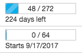

# Explore Global Line Items

The Global Line Item Management screen
shows you essential metrics about all line items across all advertisers
within your network, informs you of conditions preventing line items
from serving, provides quick access to each line item's details and
child campaigns, and offers bulk editing and reporting options.

This feature is currently available only to select Adserver customers.

The Global Line Item Management screen is where you'll go to manage
demand from your direct-sold advertisers, including standard and
guaranteed delivery line items.

Things you can do on this page include: - Use filters to quickly
identify line items with specific criteria, and save those filters for
future use - See delivery and performance metrics - See important line
item details and make changes quickly

Get to the Global Line Item Management Screen

To get to the line items screen:

- Select
  Advertisers
   \>  Line Items from
  the navigation menu at the top of the screen,

  or

- From the Advertisers screen, find
  the advertiser whose line items you want to see and click the button
  in the **Line Items** column.
  This will take you to the line items screen with the Advertiser filter
  applied for the selected advertiser.

  Publisher users can:

- Select Orders
   \>  Line Items from
  the navigation menu at the top of the screen

  or

- Click All Line Items in the left
  panel on the Line Items or Orders screens

Filter your Line Items

On the Global Line Item Management screen, you will see all of the line
items you're eligible to view, with a stack of filters in a sidebar on
the left. Use the filters to get to the exact line item view you need to
work with. Your last applied view will be automatically applied the next
time you access the Line Items screen.

The available filters are:

- **Advertiser Filter**: Show only the line items associated with the
  advertisers you select. Up to ten advertisers are displayed at a time.
  If you have more than ten advertisers, use the arrows or the page box
  to page through the list of advertisers. Click
  Select All to filter on all
  advertisers currently displayed in the filter box. This will not
  select all advertisers; if you have 200 advertisers and 10 are
  displayed in the **Advertiser Filter** box, clicking
  Select All will select only the 10
  advertisers currently displayed in the filter box. If all advertisers
  on a filter page are selected, you can click
  Deselect All to remove all those
  advertisers from your filtering.
- **Insertion Order Filter**: Show only the line items that are
  associated with certain IOs. The **Insertion Order Filter** box
  contains a Select All button. This
  button works the same as the Select
  All button for the **Advertiser Filter**.
- **Delivery Filter**: Drag the scrollbar buttons from either end to
  show only line items with delivery percentages in a given range. The
  Delivery filter uses pacing percentages from both impressions and
  revenue when calculating delivery percentage. The percentages are
  calculated like this:
  - Impression Pacing Percentage = impressions/(expectedPacing \* 100)

  - Revenue Pacing Percentage = revenue/(expectedPacing \* 100)

    The filter will return all line items with either an impression
    pacing percentage or a revenue pacing percentage that fall within
    the selected range.
- **Priority Filter**: Drag the scrollbar buttons from either end to
  show only line items with priorities in the given range.
- **Status Filter**: Check the box to show only those line items that
  have the given status. For more information about line item
  reservation statuses, see
  <a href="guaranteed-delivery.md" class="xref">Guaranteed Delivery</a>.
  Possible statuses:
  - Proposal: The line item is inactive, with start and end dates
    sometime in the future. It's not ready to serve yet.
  - Scheduled: The line item is not serving and is in one of the
    following states:
    - The line item and at least one campaign are active, with line item
      start and end dates in the future and campaign dates within the
      line item dates.
    - The line item and at least one campaign are active. The line item
      start date is in the past and the end date is in the future, but
      the campaign has a start date in the future.
    - <b>Note:</b> If the scheduled line item is a guaranteed line item it is
      reserving inventory.
  - Reserved: The line item is inactive, with start and end dates
    sometime in the future, and has a reservation.
  - Live: The line item is active, with a start date in the past and an
    end date in the future. In addition, at least one campaign under the
    line item is active, with a start date in the past and an end date
    in the future.
  - Paused: The line item is not serving and is in one of the following
    states:
    - The line item is inactive, with a start date in the past and an
      end date in the future
    - The line item is active, with a start date in the past and an end
      date in the future, but it has no active campaigns.
  - Canceled: The line item is inactive, with a start date in the past
    and an end date in the future. It had guaranteed delivery goals, but
    is no longer serving, and no longer has any inventory reserved for
    it.
  - Complete: The line item has either delivered its budget in full or
    has met its end date.
  - Ready: This status has been deprecated.
- **Trafficker Filter**: Enter the name of a trafficker to see only
  their line items. Note that the trafficker's name must be listed in
  the **Trafficker** label on the line item in order to match.
- **Salespeople Filter**: Enter the name of a salesperson to see only
  their line items. Note that the salesperson's name must be listed in
  the **Salesperson** label on the line item in order to match.
- **Flight Date Filter**: Enter ranges of start and end dates to show
  only the line items that start and end within that date range.
- **Unlikely to Deliver Filter**: Check the box to show only line items
  that our forecasting engine has determined are unlikely to meet their
  delivery goals.
- **Creative Filter**: There are two creative filters, **Missing
  Creatives** and **Has Creatives**. These filters return opposite data
  sets, which means that if you select both these filters no line items
  will be displayed.
  - **Missing Creatives**: Check this box to show only line items that
    are missing a creative. This is important because line items without
    creatives can't serve. This filter has the opposite functionality
    from the Has Creatives filter.
  - **Has Creatives**: Selecting this filter will show line items that
    meet either of the following criteria:
    - The line item has at least one creative associated with it.

    - All of the line item's associated campaigns have creatives.

      This filter has the opposite functionality from the Missing
      Creatives filter.

      Once you choose a filter, a **Filters** panel appears at the top
      of the page displaying all filters in each group that you have
      selected. Note that the filters aren't applied dynamically as you
      select them, they're simply added to the **Filters** list. You
      must click Apply All to apply
      the selected filters. You can quickly remove a filter by clicking
      the X next to the filter name, or remove all filters by clicking
      Remove All.
      

Save Views

Filtering provides you with a specific view of your line items. You can
save individual views for future use. At the top of the **Filters**
sidebar, above the filtering selections, are three options: - **All
Advertisers**. Click this option to return to the Advertisers screen. -
**All Orders**. Click this option to retrieve insertion orders. Your
last view of Insertion Orders will be reapplied, even if you didn't save
it. - **All Line Items**. Click this option to retrieve line items. Your
last view of Line Items will be reapplied, even if you didn't save it.

When you select filters (as described in the previous section), the
**Filters** panel will be displayed above the line items (or insertion
orders) showing all the currently selected filters along with an
Apply button and dropdown menu. The
menu contains the following options:

- **Apply**  
  Apply the selected filters to the current display. The filters are not
  saved.

- **Apply & Save**  
  Apply the selected filters to the current display and save those
  filters to the currently selected view.

- **Save**  
  Save changes to the currently-selected view. All filters showing in
  the Filters panel will be saved, even those that have not been
  applied.

- **Apply & Save As**  
  Apply the selected filters to the current display and save the view
  with a new name. The name can have a maximum of 99 characters,
  including spaces.

- **Save As**  
  Save the selected filters and assign a name to that view. The name can
  have a maximum of 99 characters, including spaces. This option saves
  all filters currently selected, even if they haven't been applied.

  When you save a view, the name will be displayed in the **Filters**
  sidebar under the **All Line Items** option (or **All Orders** if
  you're viewing Insertion Orders). Views are user-specific, so the
  views you create will be available only to you. This allows each user
  to create the set of views that is most useful to them.

  You can save up to 10 views for Line Items. (You can save up to 10
  more for Insertion Orders.) You can have as many filters within a view
  as you need.

  To display filtered content using a saved view, click the view name in
  the **Filters** sidebar.

  To delete a view, click the X to the right of the name in the Filters
  sidebar.

Search by Name/ID

You can use the search field at the top of the screen to find all line
items whose names or IDs include a specific string of characters or
numbers.

Find Inactive Line Items

Line items with the **Inactive** state are shown in italics.

View/Edit Line Item Details

In the line item list, you can see a full, detailed summary along with a
graphical view of delivery and performance by clicking the graph icon
that appears when you hover over the line item. This will take you to a
new screen with detailed information about the line item.

To view a summary of details about a line item, find the line item in
the list and click that line item's name. This will open a pane below
the list of line items that displays summary information about the
selected line item. You can edit some of this information directly from
this details pane. Information in any details pane section with a pencil
icon next to the heading can be edited.

To edit information in the given section, click the pencil icon in the
section heading. This will open a dialog box where you can quickly
update and save the information related to the settings in that section.

!li basic](media/li-basic-settings-quick-edit.png)

For more information about line item details, see
<a href="view-line-item-details.md" class="xref">View Line Item
Details</a>. For complete information on updating all areas of the line
item, see
<a href="update-line-items.md" class="xref">Update Line Items</a>.

View Metrics

The metrics on the Line Items screen
help you quickly assess the performance and delivery of your line items.
These metrics are faster and more readily accessible than standard
reporting data. This data is cached on a regular basis and shown
whenever you open the Line Items screen.

Note that the metrics shown here may not exactly match the data from
standard reporting. For more information, see
<a href="availability-of-reporting-data.md" class="xref">Availability
of Reporting Data</a>.

All data is in Eastern Time (EST).

<b>Tip:</b> To sort your line items by any
given metric, click on the column name, e.g., **Profit**.

Intervals

Use the drop-down at the top right of the screen to choose the interval
for quickstats. Available intervals include:

- **Today**  
  Current calendar day up to the last hour.
- **Yesterday**  
  Full 24-hour period of the previous calendar day.
- **Last 7 Days**  
  Full 7 days previous to the current calendar day, i.e., excluding
  today.
- **Lifetime**  
  Entire lifetime of each line item, including the current calendar day.

Export to CSV

Click the **Export to CSV** file to export your data to a
comma-separated values (CSV) file. All of your current filters will be
applied to the data that is exported. (All rows returned will be
exported, not only the rows currently showing on the screen.)

Currency Display

You can toggle between displaying currency for each line item in USD
(U.S. dollars) or local currency by clicking the $ (USD) and € (local
currency) toggle buttons. Local currency is determined by the currency
settings for each advertiser. Current exchange rates will be applied.
Exchange rates are updated hourly. See
<a href="currency-support.md" class="xref">Currency Support</a> for
more information on currencies.

The following fields will be displayed in local currency when the local
currency toggle is selected:

- Rev eCPM

- Rev eCPC

- Rev eCPA

- Rev

- Media Cost

- Profit

- Cost eCPM

- Cost eCPA

- Cost eCPC

  When you sort on any of the columns in the above list, the line items
  will be sorted according to the USD value. This means that if you've
  chosen to display in local currency, the values might look out of
  order because of the exchange rates.

  Any value that was added to the system prior to July 7, 2016 cannot be
  converted to local currency. In these cases, when you select to
  display line items with local currency values, no value will be
  retrieved and you'll see two dashes (--) in that field.

Columns

The following data is available for each line item. Note that the data
always reflects the currently selected interval. (You may not see all
columns by default. See "Show/Hide Columns" below for more information
on viewing columns.)

<table class="table">
<thead class="thead">
<tr class="header row">
<th id="ID-00001759__entry__1"
class="entry"><strong>Status</strong></th>
<th id="ID-00001759__entry__2" class="entry">The current status of the
line item. See descriptions of each status under Filter Your Line Items
above.</th>
</tr>
</thead>
<tbody class="tbody">
<tr class="odd row">
<td class="entry"
headers="ID-00001759__entry__1"><strong>Advertiser</strong></td>
<td class="entry" headers="ID-00001759__entry__2">The name of the
advertiser.</td>
</tr>
<tr class="even row">
<td class="entry"
headers="ID-00001759__entry__1"><strong>Order</strong></td>
<td class="entry" headers="ID-00001759__entry__2">The name of the
insertion order in which the current line item is contained.</td>
</tr>
<tr class="odd row">
<td class="entry"
headers="ID-00001759__entry__1"><strong>Priority</strong></td>
<td class="entry" headers="ID-00001759__entry__2">The priority contains
either the priority of a guaranteed delivery line item or the highest
priority of all the campaigns under a standard line item. Campaigns can
have a priority between 1 and 10, with 5 being the default. Guaranteed
delivery line items typically have priorities ranging from 11 - 20
depending on delivery type (14 is the default). See <a
href="guaranteed-delivery.md" class="xref">Guaranteed Delivery</a> for
more on line item priorities. See <a href="bidding-priority.md"
class="xref">Bidding Priority</a> for more on campaign priorities.</td>
</tr>
<tr class="even row">
<td class="entry" headers="ID-00001759__entry__1"><strong>Start
Date</strong></td>
<td class="entry" headers="ID-00001759__entry__2">The date the line item
starts. All campaigns within this line item must have date that fall
within the line item start and end dates.</td>
</tr>
<tr class="odd row">
<td class="entry" headers="ID-00001759__entry__1"><strong>End
Date</strong></td>
<td class="entry" headers="ID-00001759__entry__2">The date the line item
ends. All campaigns within the line item must end by this date.</td>
</tr>
<tr class="even row">
<td class="entry" headers="ID-00001759__entry__1"><strong>Expected
Delivery</strong></td>
<td class="entry" headers="ID-00001759__entry__2">Impression total that
this line item is expected to deliver, based on actual historical
delivery and forecasted remaining delivery

If the projected delivery is greater than the Lifetime Budget
impressions for the line item, this value will be the number of lifetime
budgeted impressions.

If projected delivery is less than or equal to the Lifetime Budget
impressions, <strong>Likely to Underdeliver</strong> will be displayed
in parentheses under the number of impressions.

Note that this number will refer to the number of viewable
impressions if the line item has the vCPM revenue type.
</td>
</tr>
<tr class="odd row">
<td class="entry"
headers="ID-00001759__entry__1"><strong>Issues</strong></td>
<td class="entry" headers="ID-00001759__entry__2">This field presents
you with a graphical representation of possible delivery issues with the
line item. Issues represented in this column will be related to the
<strong>State</strong> of the line item, the <strong>Flight</strong>
dates, issues with a <strong>Creative</strong>, or issues related to
<strong>Targeting</strong>. Hover over the issues to see a detailed
listing.

The issues are color-coded according to the type of issue (State,
Flight, Creative, or Targeting). One issue will be described below the
color bar, along with the number of additional issues that exist. All
issues will be outlined in the <strong>Issues</strong> box when you
hover over the field. See [Issue Types](#issues) below for a list of
possible issues that can be displayed and further description.
</td>
</tr>
<tr class="even row">
<td class="entry"
headers="ID-00001759__entry__1"><strong>Pulse</strong></td>
<td class="entry" headers="ID-00001759__entry__2">This field aggregates
impression, clicks, and revenue in real time to help determine pacing of
ad spend. This value is updated approximately every minute. The data is
reset at midnight in the line item's time zone.</td>
</tr>
<tr class="odd row">
<td class="entry"
headers="ID-00001759__entry__1"><strong>Imps</strong></td>
<td class="entry" headers="ID-00001759__entry__2">Number of impressions
for the line item (and any campaigns under the line item) during the
selected time period.</td>
</tr>
<tr class="even row">
<td class="entry" headers="ID-00001759__entry__1"><strong>Pace to
Date</strong></td>
<td class="entry" headers="ID-00001759__entry__2">This column displays
current delivery pacing and expected delivery for the line item. See
"Understanding Pacing Bars" below for details on the pacing information
in this column.</td>
</tr>
<tr class="odd row">
<td class="entry" headers="ID-00001759__entry__1"><strong>Revenue
Type</strong></td>
<td class="entry" headers="ID-00001759__entry__2">Based on the revenue
type and value chosen when the line item was created. Here is a list of
possible values and their corresponding revenue types:
<ul>
<li><strong>cpm</strong>: CPM and a revenue value specified</li>
<li><strong>est_cpm</strong>: CPM and no revenue value or margin
specified</li>
<li><strong>cpc</strong>: CPC</li>
<li><strong>cpa</strong>: CPA</li>
<li><strong>cost_plus_cpm</strong>: Cost Plus with a CPM revenue
value</li>
<li><strong>cost_plus_margin</strong>: Cost Plus with a Margin revenue
value</li>
<li><strong>flat_fee</strong>: Fixed Fee</li>
<li><strong>vcpm</strong>: Viewable CPM</li>
<li><strong>none</strong>: Do not track Revenue</li>
</ul></td>
</tr>
<tr class="even row">
<td class="entry" headers="ID-00001759__entry__1"><strong>Revenue
Value</strong></td>
<td class="entry" headers="ID-00001759__entry__2">The revenue value
specified under the revenue type when the line item was created.</td>
</tr>
<tr class="odd row">
<td class="entry" headers="ID-00001759__entry__1"><strong>Rev
eCPM</strong></td>
<td class="entry" headers="ID-00001759__entry__2">Money the advertiser
has paid or will pay your network per 1000 impressions.</td>
</tr>
<tr class="even row">
<td class="entry" headers="ID-00001759__entry__1"><strong>Lifetime
Budget</strong></td>
<td class="entry" headers="ID-00001759__entry__2">The Lifetime Budget
specified when the line item was created. This is the budget that the
advertiser has allocated for you to spend over the entire lifetime of
the line item. This value will be:
<ul>
<li>The monetary amount allocated</li>
<li>The number of impressions to buy</li>
<li>Unlimited</li>
</ul></td>
</tr>
<tr class="odd row">
<td class="entry" headers="ID-00001759__entry__1"><strong>Daily
Budget</strong></td>
<td class="entry" headers="ID-00001759__entry__2">If a custom Lifetime
Budget was specified, the Daily Budget will contain value specified when
the line item was created. This is the budget that the advertiser has
allocated for you to spend on any single day. This column will contain
one of the following for either impressons or revenue:
<ul>
<li>The amount to spend per day for this line item</li>
<li>The pacing lifetime budget along with the estimated spend per
day</li>
<li>Unlimited</li>
</ul></td>
</tr>
<tr class="even row">
<td class="entry"
headers="ID-00001759__entry__1"><strong>Clicks</strong></td>
<td class="entry" headers="ID-00001759__entry__2">Number of clicks for
all campaigns under the line item.</td>
</tr>
<tr class="odd row">
<td class="entry"
headers="ID-00001759__entry__1"><strong>CTR</strong></td>
<td class="entry" headers="ID-00001759__entry__2">The overall
click-through rate on this line item's creatives.</td>
</tr>
<tr class="even row">
<td class="entry"
headers="ID-00001759__entry__1"><strong>Conversions</strong></td>
<td class="entry" headers="ID-00001759__entry__2">Number of times
conversion pixels under the line item have loaded. Note that a
conversion pixel load does not necessarily mean that a conversion was
attributed to one of the advertiser's campaigns.</td>
</tr>
<tr class="odd row">
<td class="entry" headers="ID-00001759__entry__1"><strong>Media
Cost</strong></td>
<td class="entry" headers="ID-00001759__entry__2">Money your network has
spent buying media for campaigns under the line item.</td>
</tr>
<tr class="even row">
<td class="entry" headers="ID-00001759__entry__1"><strong>Remaining
Days</strong></td>
<td class="entry" headers="ID-00001759__entry__2">The number of days
between today and the end date for the line item.

The progress bar provides a visual representation of how far into the
flight the line item is.

<ul>
<li>The numbers inside the progress bar indicate: Number of days since
the flight started / Total number of days in the flight</li>
<li>Below the progress bar will be one of the following:
<ul>
<li>Number of days remaining in the flight</li>
<li>The start date of the flight if that date is in the future</li>
<li>
The end date of the flight if that date is in the past

If no end date has been set, you'll see a message saying "End date
not set" rather than a progress bar.
</li>
</ul></li>
</ul></td>
</tr>
<tr class="odd row">
<td class="entry"
headers="ID-00001759__entry__1"><strong>Profit</strong></td>
<td class="entry" headers="ID-00001759__entry__2">Money your network has
made from the advertiser as a result of campaigns under the line item.
This is revenue minus media cost.</td>
</tr>
<tr class="even row">
<td class="entry" headers="ID-00001759__entry__1"><strong>Cost
eCPM</strong></td>
<td class="entry" headers="ID-00001759__entry__2">Money your network has
spent buying media per 1000 impressions.</td>
</tr>
<tr class="odd row">
<td class="entry" headers="ID-00001759__entry__1"><strong>Rev
eCPC</strong></td>
<td class="entry" headers="ID-00001759__entry__2">Money the advertiser
has paid or will pay your network per 1000 click-throughs.</td>
</tr>
<tr class="even row">
<td class="entry" headers="ID-00001759__entry__1"><strong>Cost
eCPC</strong></td>
<td class="entry" headers="ID-00001759__entry__2">Money your network has
spent buying media per 1000 click-throughs.</td>
</tr>
<tr class="odd row">
<td class="entry" headers="ID-00001759__entry__1"><strong>Rev
eCPA</strong></td>
<td class="entry" headers="ID-00001759__entry__2">Money the advertiser
has paid or will pay your network per 1000 attributed conversions.</td>
</tr>
<tr class="even row">
<td class="entry"
headers="ID-00001759__entry__1"><strong>Campaigns</strong></td>
<td class="entry" headers="ID-00001759__entry__2">This column contains a
button displaying the number of campaigns associated with this line
item. Click the button to navigate to the Campaigns screen.</td>
</tr>
<tr class="odd row">
<td class="entry"
headers="ID-00001759__entry__1"><strong>Creatives</strong></td>
<td class="entry" headers="ID-00001759__entry__2">If creatives are
associated with this line item (or no creatives have been assigned) this
column contains a button showing the number of creatives assigned.
Clicking the button will open the <strong>Associated Creatives</strong>
dialog. If creatives were assigned at the campaign level, this column
will display <strong>Campaign Level</strong>.</td>
</tr>
<tr class="even row">
<td class="entry"
headers="ID-00001759__entry__1"><strong>Rev</strong></td>
<td class="entry" headers="ID-00001759__entry__2">Money the advertiser
has paid or will pay your network as a result of campaigns under the
line item.</td>
</tr>
<tr class="odd row">
<td class="entry" headers="ID-00001759__entry__1"><strong>Cost
eCPA</strong></td>
<td class="entry" headers="ID-00001759__entry__2">Money your network has
spent buying media per 1000 attributed conversions.</td>
</tr>
<tr class="even row">
<td class="entry" headers="ID-00001759__entry__1"><strong>Viewable
Imps</strong></td>
<td class="entry" headers="ID-00001759__entry__2">The number of measured
impressions that were viewable, per the IAB Viewability definition,
which states that an impression is viewable if 50% of the pixels are
in-view during 1 consecutive second.</td>
</tr>
<tr class="odd row">
<td class="entry" headers="ID-00001759__entry__1"><strong>View-Measured
Imps</strong></td>
<td class="entry" headers="ID-00001759__entry__2">The total number of
impressions that were measured for viewability.</td>
</tr>
<tr class="even row">
<td class="entry" headers="ID-00001759__entry__1"><strong>Viewability
Rate</strong></td>
<td class="entry" headers="ID-00001759__entry__2">The percentage of
impressions that were viewable out of the total number of impressions
measured for viewability. (Viewed Imps / View Measured Imps)</td>
</tr>
<tr class="odd row">
<td class="entry" headers="ID-00001759__entry__1"><strong>View
Measurement Rate</strong></td>
<td class="entry" headers="ID-00001759__entry__2">The percentage of
impressions measured for viewability out of the total number of
impressions. (View Measured Imps / Imps)</td>
</tr>
</tbody>
</table>

To get information about attributed conversions, rather than just
conversion pixel loads as shown in the
**Conversions** column, see
<a href="reporting-on-conversions.md" class="xref">Reporting on
Conversions</a>.

Issue Types

<table class="table">
<thead class="thead">
<tr class="header row">
<th id="ID-00001759__entry__69" class="entry">Issue Type</th>
<th id="ID-00001759__entry__70" class="entry">Message</th>
<th id="ID-00001759__entry__71" class="entry">Description</th>
</tr>
</thead>
<tbody class="tbody">
<tr class="odd row">
<td rowspan="4" class="entry"
headers="ID-00001759__entry__69"><strong>State</strong></td>
<td class="entry" headers="ID-00001759__entry__70">IO is inactive</td>
<td class="entry" headers="ID-00001759__entry__71">The insertion order
is set to inactive and isn't serving. See <a
href="update-insertion-orders.md" class="xref">Update Insertion
Orders</a> to activate your IO.</td>
</tr>
<tr class="even row">
<td class="entry" headers="ID-00001759__entry__70">LI is inactive</td>
<td class="entry" headers="ID-00001759__entry__71">The line item is set
to inactive and isn't serving. See <a href="update-line-items.md"
class="xref">Update Line Items</a> to activate your LI.</td>
</tr>
<tr class="odd row">
<td class="entry" headers="ID-00001759__entry__70">ADV is inactive</td>
<td class="entry" headers="ID-00001759__entry__71">The advertiser is set
to inactive and isn't serving. See <a
href="explore-and-manage-advertisers.md" class="xref">Explore and
Manage Advertisers</a> to activate your advertiser.</td>
</tr>
<tr class="even row">
<td class="entry" headers="ID-00001759__entry__70">ADV requires IOs;
this LI doesn’t have any</td>
<td class="entry" headers="ID-00001759__entry__71">The advertiser uses
insertion orders, but this line item is not associated with an IO.</td>
</tr>
<tr class="odd row">
<td rowspan="8" class="entry"
headers="ID-00001759__entry__69"><strong>Flight</strong></td>
<td class="entry" headers="ID-00001759__entry__70">IO flight date
expired</td>
<td class="entry" headers="ID-00001759__entry__71">The current date is
past the end date for the flight on this insertion order.</td>
</tr>
<tr class="even row">
<td class="entry" headers="ID-00001759__entry__70">IO is pre-flight</td>
<td class="entry" headers="ID-00001759__entry__71">This insertion order
has not yet reached its scheduled start date.</td>
</tr>
<tr class="odd row">
<td class="entry" headers="ID-00001759__entry__70">LI flight date
expired</td>
<td class="entry" headers="ID-00001759__entry__71">The current date is
past the end date for the flight on this line item .</td>
</tr>
<tr class="even row">
<td class="entry" headers="ID-00001759__entry__70">LI is pre-flight</td>
<td class="entry" headers="ID-00001759__entry__71">This line item has
not yet reached its scheduled start date.</td>
</tr>
<tr class="odd row">
<td class="entry" headers="ID-00001759__entry__70">IO requires billing
periods on the LI</td>
<td class="entry" headers="ID-00001759__entry__71">The insertion order
contains billing periods, but there are no billing periods on the line
item.</td>
</tr>
<tr class="even row">
<td class="entry" headers="ID-00001759__entry__70">LI is between billing
periods</td>
<td class="entry" headers="ID-00001759__entry__71">The line item isn't
serving because the previous billing period has ended but the next
billing period hasn't started yet.</td>
</tr>
<tr class="odd row">
<td class="entry" headers="ID-00001759__entry__70">LI billing periods
not yet started</td>
<td class="entry" headers="ID-00001759__entry__71">The start date for
the billing period for the line item is in the future.</td>
</tr>
<tr class="even row">
<td class="entry" headers="ID-00001759__entry__70">LI billing periods
have expired</td>
<td class="entry" headers="ID-00001759__entry__71">The end date for the
billing period for the line item has passed.</td>
</tr>
<tr class="odd row">
<td rowspan="12" class="entry"
headers="ID-00001759__entry__69"><strong>Creative</strong></td>
<td class="entry" headers="ID-00001759__entry__70">No eligible
creatives; associate an active creative to see delivery</td>
<td class="entry" headers="ID-00001759__entry__71">The line item has
been defined to manage creatives at the line item level, but there are
no creatives associated with the line item. See <a
href="create-a-standard-line-item.md" class="xref">Create a Standard
Line Item</a> for more information.</td>
</tr>
<tr class="even row">
<td class="entry" headers="ID-00001759__entry__70">Creatives 1, 2, 3
require landing page URLs</td>
<td class="entry" headers="ID-00001759__entry__71">The creative has been
defined to use a landing page URL for non-3rd party image and flash
creatives that is set at the line item level, but there is no URL
defined at the line item. See <a href="dynamic-landing-pages.md"
class="xref"
title="As an advertiser, you may wish to send users to different landing pages or compare the performance of different landing pages. To accomplish this, you can associate a landing page URL with a line item or campaign. This landing page will then be available for association with any creatives that are attached to that line item or campaign.">Dynamic
Landing Pages</a> for more information.</td>
</tr>
<tr class="odd row">
<td class="entry" headers="ID-00001759__entry__70">Creatives 1, 2, 3 are
malicious</td>
<td class="entry" headers="ID-00001759__entry__71">The creative has been
flagged as containing malware or loading domains placed on blocklists.
The creative will not serve.</td>
</tr>
<tr class="even row">
<td class="entry" headers="ID-00001759__entry__70">Creatives 1, 2, 3
size not approved for Outlook</td>
<td class="entry" headers="ID-00001759__entry__71">The line item (in the
line item, insertion order, or advertiser profile) is targeting
outlook.com inventory. Outlook.com requires creatives to be either
100x72 or 160x600, but there are no creatives of that size associated
with this line item.</td>
</tr>
<tr class="odd row">
<td class="entry" headers="ID-00001759__entry__70">SSL audit is required
to serve on Outlook</td>
<td class="entry" headers="ID-00001759__entry__71">The line item (in the
line item, insertion order, or advertiser profile) is targeting
outlook.com inventory. This line item has not passed the SSL audit
required by outlook.com.</td>
</tr>
<tr class="even row">
<td class="entry" headers="ID-00001759__entry__70">Creatives 1, 2, 3
target gambling in [country]</td>
<td class="entry" headers="ID-00001759__entry__71">Your network must be
specifically placed in an allowlist to serve gambling ads in certain
countries. If you're not placed in an allowlist, the specified creatives
will not serve. Contact <a href="https://help.xandr.com" class="xref"
target="_blank">customer support</a> to inquire about being placed in an
allowlist.</td>
</tr>
<tr class="odd row">
<td class="entry" headers="ID-00001759__entry__70">Creatives 1, 2, 3
failed audit</td>
<td class="entry" headers="ID-00001759__entry__71">The line item
inventory type has been defined as either "real-time" or "both" and the
creative has failed the audit.</td>
</tr>
<tr class="even row">
<td class="entry" headers="ID-00001759__entry__70">Creatives 1, 2, 3 not
audited, limiting inventory</td>
<td class="entry" headers="ID-00001759__entry__71">The line item
inventory type has been defined as either "real-time" or "both" and the
creative has not been audited. (Audit could still be pending.)</td>
</tr>
<tr class="odd row">
<td class="entry" headers="ID-00001759__entry__70">Creatives 1, 2, 3 are
expandable; verify targeted inventory</td>
<td class="entry" headers="ID-00001759__entry__71">The specified
creatives are expandable. To ensure that these creatives will be able to
serve, verify that you're targeting placements that support expandable
creatives.</td>
</tr>
<tr class="even row">
<td class="entry" headers="ID-00001759__entry__70">Creative(s) 1, 2, 3
failed AdX audit</td>
<td class="entry" headers="ID-00001759__entry__71">The line item
inventory type has been defined as either "real-time" or "both" and the
specified creatives are targeting Google Ad Manager inventory but have
failed the Google Ad Manager audit. See <a
href="adx-creative-audit-process.md" class="xref"
title="For your creative to serve on Google Ad Manager inventory, it must pass both the Xandr and Google Ad Manager creative audit.">Google
Ad Manager Creative Audit Process</a> for more information.</td>
</tr>
<tr class="odd row">
<td class="entry" headers="ID-00001759__entry__70">LI needs a goal
pixel</td>
<td class="entry" headers="ID-00001759__entry__71">You must define a
goal pixel (conversion pixel) for line items with a revenue type of
CPA.</td>
</tr>
<tr class="even row">
<td class="entry" headers="ID-00001759__entry__70">Pixel IDs 1, 2, 3
have no recorded conversions</td>
<td class="entry" headers="ID-00001759__entry__71">The line item has a
revenue type of CPA but the specified conversion pixels have no recorded
conversions.</td>
</tr>
<tr class="odd row">
<td rowspan="7" class="entry"
headers="ID-00001759__entry__69"><strong>Targeting</strong> 
 
 
 
 
 
</td>
<td class="entry" headers="ID-00001759__entry__70">Demographic targeting
is limiting delivery</td>
<td class="entry" headers="ID-00001759__entry__71">The line item is
targeting a specific age range or gender, and does not allow for users
where no age or gender is specified. This could limit your delivery to
target customers because their age or gender is unknown. See <a
href="demography-targeting.md" class="xref">Demography Targeting</a>
for more information.</td>
</tr>
<tr class="even row">
<td class="entry" headers="ID-00001759__entry__70">Position targeting is
limiting delivery</td>
<td class="entry" headers="ID-00001759__entry__71">The line item is
targeting a specific position (above or below the fold), and does not
allow for impressions where no position is specified. This could limit
your delivery because some positions are unknown. See <a
href="page-properties-targeting.md" class="xref"
title="Through page properties targeting, you can target impressions based on the position of the creative tag on the page or based on values passed in the query string of the ad call.">Page
Properties Targeting</a> for more information.</td>
</tr>
<tr class="odd row">
<td class="entry" headers="ID-00001759__entry__70">Targeting only
reviewed inventory, but not allowing any sensitive attributes</td>
<td class="entry" headers="ID-00001759__entry__71">The line item is set
to target only reviewed inventory, but is not allowing any sensitive
attributes. This can greatly limit delivery.</td>
</tr>
<tr class="even row">
<td class="entry" headers="ID-00001759__entry__70">[action1, action2,
etc.], are set to include, but do not contain any items</td>
<td class="entry" headers="ID-00001759__entry__71">The specified action
(for example, browser, carrier, domain, etc.) is set as targeted, but no
targets have been specified. See <a
href="create-a-domain-list-or-app-list.md" class="xref">Create a
Domain List or App List</a> for more information.</td>
</tr>
<tr class="odd row">
<td class="entry" headers="ID-00001759__entry__70">A top-level domain is
in a blocklist; this could severely limit delivery</td>
<td class="entry" headers="ID-00001759__entry__71">Target is excluding a
top-level domain (such as .com or .org). This will prevent inventory
from serving on any domain ending with that extension. See <a
href="create-a-domain-list-or-app-list.md" class="xref">Create a
Domain List or App List</a> for more information.</td>
</tr>
<tr class="even row">
<td class="entry" headers="ID-00001759__entry__70">[example-1.com,
example-2.com] are in allowlists and blocklists; you will not serve on
the domains</td>
<td class="entry" headers="ID-00001759__entry__71">The specified domains
are both allowed and blocked. The blocklist will take precedence and the
line item will not serve on on those domains. See <a
href="create-a-domain-list-or-app-list.md" class="xref">Create a
Domain List or App List</a> for more information.</td>
</tr>
<tr class="odd row">
<td class="entry" headers="ID-00001759__entry__70">Domain targeting on
ADV and LI don't intersect</td>
<td class="entry" headers="ID-00001759__entry__71">Different domains are
targeted on the advertiser and the line item. For example, the
advertiser is targeting example1.com and the line item is targeting
domain1.com. This will prevent the line item from serving.</td>
</tr>
</tbody>
</table>

<b>Note:</b> No issues will be shown if
**Status** is **Complete**.

Understanding Pacing Bars

Each pacing bar tells you the following.

For line items...

- pacing against an impression-based lifetime budget, the pacing bar
  uses actual vs. expected imps.
- pacing against a revenue-based lifetime budget, the pacing bar uses
  actual vs. expected booked revenue.
- pacing against a viewable impression-based lifetime budget, the pacing
  bar uses actual vs. expected viewable imps.

Requirements for Pacing Bars

The exact requirements for calculating pacing depend on the quickstats
interval selected, the type of budget set, and whether or not there's a
flight end date. For each quickstats interval, the requirements are as
follows:

<table class="table">
<thead class="thead">
<tr class="header row">
<th id="ID-00001759__entry__138" class="entry">Quickstats Interval</th>
<th id="ID-00001759__entry__139" class="entry">Requirements</th>
</tr>
</thead>
<tbody class="tbody">
<tr class="odd row">
<td class="entry" headers="ID-00001759__entry__138">Lifetime</td>
<td class="entry" headers="ID-00001759__entry__139">Lifetime Budget and
Flight End Date</td>
</tr>
</tbody>
</table>

Show/Hide Columns

You can choose the columns that are displayed by clicking the
Configure Columns button on the upper
right.

This opens the **Configure Columns** dialog. From there you can use the
checkboxes to select or deselect the columns you want to display.

Report on Line Items

You can initiate a report for one or more line items directly from this
screen. Check the box for each line item that you want to report on and
click Actions
 \>  Run Report. This
takes you to the
<a href="advertiser-analytics-report.md" class="xref">Advertiser
Analytics Report</a>, where the line items you selected are set as
filters. For further information about running the report, see
<a href="advertiser-reporting.md" class="xref">Advertiser
Reporting</a>.

Create a New Line Item

To create a new line item, click the +
New button on the upper left-hand side of the grid.

For instructions on creating a guaranteed delivery line item, see
<a href="create-a-guaranteed-delivery-line-item.md"
class="xref">Create a Guaranteed Delivery Line Item</a>.

Activate/Deactivate Line Items

You can activate or deactivate one or more line items directly from the
Line Items screen. Check the box next
to each line item that you want to activate or deactivate and click
Actions 
\>  Activate or
Actions 
\>  Deactivate.

When you deactivate a line item, the line item will typically stop
serving within 10 - 15 seconds, with a maximum wait time of
approximately 60 seconds.

Related Topics

- <a href="working-with-line-items.md" class="xref">Working with Line
  Items</a>
- <a href="view-line-item-details.md" class="xref">View Line Item
  Details</a>
- <a href="update-line-items.md" class="xref">Update Line Items</a>
- <a href="create-a-guaranteed-delivery-line-item.md"
  class="xref">Create a Guaranteed Delivery Line Item</a>
- <a href="using-multiple-campaigns-with-a-guaranteed-line-item.md"
  class="xref">Using Multiple Campaigns with a Guaranteed Line Item</a>
- <a href="guaranteed-delivery-pacing.md" class="xref">Guaranteed
  Delivery Pacing</a>

