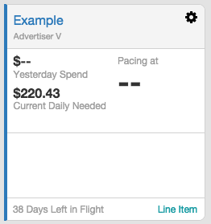

# Explore Trader Home

<b>Important:</b> Trader Home is currently
available to a limited set of clients.

**Trader Home** displays a card for every insertion order that you have
added to your **Trader Home**
page, showing you essential metrics about the insertion order. The cards
also provide quick access to insertion order details, as well as its
child line items.

Getting to Trader Home

**Trader Home** displays when you log in. To reach the
**Trader Home** page after you've
navigated to other locations, click the logo in the top left corner.

Viewing Your Trader Home Totals

**Trader Home** provides totals that offer quick insights into your
overall impact.

These statistics include:

- Total Budget: Sum of your insertion
  order lifetime budgets in **Trader Home**.
- Yesterday Spend: Total amount of
  money you spent yesterday (between 00:00:00 to 23:59:59 UTC).

<b>Important:</b> Totals display in the
member's default currency.

Viewing Insertion Order Details

To view advanced details about an insertion order, click the insertion
order's name. See
<a href="view-insertion-order-details.md" class="xref"
title="The Insertion Order Details screen displays settings for a specific insertion order, essential metrics, and performance visualizations.">View
Insertion Order Details</a> for more information.

Viewing Insertion Order Metrics

Each card displays metrics to help you assess the status of your
insertion orders. The insertion order card provides easy access to the
pacing health of your insertion order and what is needed to successfully
deliver.

There are three important metrics presented on each card:

- Yesterday Spend - Amount of your
  budget you spent yesterday (between 00:00:00 to 23:59:59 UTC).
- Current Daily Needed - Amount of
  spend needed daily (including today) for the rest of the flight in
  order to stay on pace.
- Pacing at - Percentage determined by
  comparing Yesterday's Spend to how
  much daily spend is needed for the rest of the flight
  (Current Daily Needed).

<b>Important:</b> These metrics display in the
insertion order's currency or in impressions, depending on how the
insertion order's budget was configured.

Viewing the Performance Chart

Each card displays a performance chart that tracks the insertion order's
Average CPA/CPC and
Daily CPA/CPC as of yesterday.

<b>Tip:</b> You can view specific details down
to the day by hovering over the graph to show the exact CPA or CPC for
that date.

Viewing Flight Dates

The card displays the number of Days Left in
Flight for the insertion order. The units of time remaining in
the flight will switch to hours when there are 48 hours or less left.

<b>Warning:</b> The flight must be added to
the insertion order for the card to display all of the metrics. For
information on how to add a flight, see
<a href="create-an-insertion-order.md" class="xref">Create an
Insertion Order</a>.

Viewing Card States

The color of each card will change according to the status of the
insertion order:

- **Red** - <b>Warning:</b> Pacing at value
  is less than 90% or greater than 150%.
- **Black** - Normal: Pacing at value
  is between 90% and 150%.
- **Blue** - <b>Note:</b> More insertion order information is needed to display
  full pacing data.

Each card falls into one of the nine states outlined in the table below.

<table class="table">
<thead class="thead">
<tr class="header row">
<th id="ID-000059f1__entry__1" class="entry">Card</th>
<th id="ID-000059f1__entry__2" class="entry">State</th>
<th id="ID-000059f1__entry__3" class="entry">Description</th>
</tr>
</thead>
<tbody class="tbody">
<tr class="odd row">
<td class="entry" headers="ID-000059f1__entry__1">

id="ID-000059f1__image_fcf_1ny_lkb" class="image" /></td>
<td class="entry" headers="ID-000059f1__entry__2">Normal</td>
<td class="entry" headers="ID-000059f1__entry__3">A card in the "Normal"
state displays all of the metrics. No additional insertion order
information is needed.</td>
</tr>
<tr class="even row">
<td class="entry" headers="ID-000059f1__entry__1"><

</td>
<td class="entry" headers="ID-000059f1__entry__2">First Day</td>
<td class="entry" headers="ID-000059f1__entry__3">A card in the "First
Day" state only shows a value for Current
Daily Needed. No additional insertion order information is
needed.</td>
</tr>
<tr class="odd row">
<td class="entry" headers="ID-000059f1__entry__1">

</td>
<td class="entry" headers="ID-000059f1__entry__2">Pre-flight</td>
<td class="entry" headers="ID-000059f1__entry__3">A card in the
"Pre-flight" state does not show any metrics and displays the "Flight
Not Started" note. No additional insertion order information is
needed.</td>
</tr>
<tr class="even row">
<td class="entry" headers="ID-000059f1__entry__1">

</td>
<td class="entry" headers="ID-000059f1__entry__2">Post-flight</td>
<td class="entry" headers="ID-000059f1__entry__3">A card in the
"Post-flight" state does not show any metrics and displays the "Flight
Ended" note. Click the Create New IO
button to create a new insertion order.</td>
</tr>
<tr class="odd row">
<td class="entry" headers="ID-000059f1__entry__1"><

</td>
<td class="entry" headers="ID-000059f1__entry__2">No Flight Dates</td>
<td class="entry" headers="ID-000059f1__entry__3">A card in the "No
Flight Dates" state only shows a value for Yesterday Spend and displays the "Add Flight
Dates to Display ... [Pacing]" note. Click the Add Flight Dates button to add the necessary
insertion order information.</td>
</tr>
<tr class="even row">
<td class="entry" headers="ID-000059f1__entry__1">

</td>
<td class="entry" headers="ID-000059f1__entry__2">Large Percentage</td>
<td class="entry" headers="ID-000059f1__entry__3">A card in the "Large
Percentage" state has a Pacing at
percentage greater than 500% and instead shows how much is Left in Budget for the insertion order (in
the insertion order's currency). No additional insertion order
information is needed.</td>
</tr>
<tr class="odd row">
<td class="entry" headers="ID-000059f1__entry__1">

</td>
<td class="entry" headers="ID-000059f1__entry__2">Infinite
Percentage</td>
<td class="entry" headers="ID-000059f1__entry__3">A card in the
"Infinite Percentage" state has a Current
Daily Needed value of 0 because the budget is met; therefore, the
Pacing at percentage can increase
infinitely. The card instead shows how much is Over Budget for the insertion order (in the
insertion order's currency). The card color is red. No additional
insertion order information is needed.</td>
</tr>
<tr class="even row">
<td class="entry" headers="ID-000059f1__entry__1">

</td>
<td class="entry" headers="ID-000059f1__entry__2">Warning</td>
<td class="entry" headers="ID-000059f1__entry__3">A card in the
"Warning" state displays all of the metrics but the Pacing at value is less than 90% or greater
than 150%. No additional insertion order information is needed, but it
is recommended that you review your settings.</td>
</tr>
</tbody>
</table>

Viewing Child Line Items

Each insertion order card has an Line
Item link. Click this link to navigate to the complete list of
line items under the insertion order.

Related Topics

- <a href="update-trader-home.md" class="xref">Update Trader Home</a>

