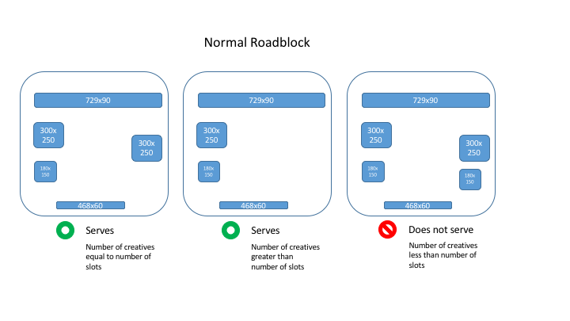

# Target Your Inventory with Roadblocking

Roadblocks allow you to serve multiple creatives together on the same
page. Roadblocks are only available on managed inventory, where you can
control the settings on both the buy side and the sell side.

About Roadblocking

Roadblocking is only available when the following criteria are met:

- You are buying direct inventory
- Booked revenue is set to CPM or vCPM
- Roadblocking can be set on either the line item or the campaign, not
  both

Important things to note about roadblocking campaigns and tag setup
include:

- Xandr will always attempt to "fill up" a tag
  with roadblocking campaigns, but each placement will become a separate
  auction if that's not possible.
- It is the publisher's responsibility to correctly place code snippets
  on the page for all components of the tag.
- In the auction, there are as many auctions (and as many associated
  auction fees) as there are components in the tag. For example, if the
  tag contains four components, every time the page loads there will be
  four auctions, four impressions shown, etc. Note that if the publisher
  only places code snippets on the page in two places for a tag with
  four total components, there will still be four auctions, four
  impressions, and so on. The ad server has no way of knowing that the
  last two code snippets weren't placed correctly.

Roadblock Categories

There are two categories of roadblock: creative level and page level.

Creative Level

Creative-level roadblocks can be set on either the line item or the
campaign (not both). Each impression is treated separately from the
standpoint of impression budget and frequency capping. For example,
suppose you have a budget of 100 impressions and a frequency cap of 5
impressions per day. You set up a Creative-level roadblock that serves
three creatives to the page. The remaining budget for that roadblock
would be 97 impressions, and the remaining frequency cap for that user
would be 2 impressions for the rest of that day.

Page Level

Page-level roadblocks can be set only on the line item. For a page-level
roadblock line item, a single impression is counted when the roadblock
serves, no matter how many creatives are delivered to the page. For
example, suppose you have a budget of 100 impressions and a frequency
cap of 5 impressions per day. You set up a page-level roadblock that
serves three creatives to the page. The remaining budget for that
roadblock would be 99 impressions, and the remaining frequency cap for
that user would be 4 impressions for the rest of that day.

Master Creative Determination

When setting up a page-level roadblock, you will declare a master size.
For the line item to participate in the auction, at least one of its
creatives matching the master size must be eligible. If the master
creative serves, then one impression is counted for the line item.

It’s possible that you could have more than one eligible creative
matching the specified master size. You could also have multiple tags in
the ad request that match that size. In either of these cases, the
creative that will be designated as the master is the one that serves to
the highest tag in the ad call that matches the master size.

vCPM Guarantees

If a vCPM guaranteed line item (which budgets against views, not
impressions) is set up as a page-level roadblock, then the view count of
the master creative will be used for budgeting, pacing, and frequency
caps. For example, suppose you have a budget of 100 views and a
frequency cap of 5 views per day. You set up a page-level vCPM
guaranteed roadblock that serves three creatives to the page, two of
which are measured as viewed (including the master creative). The
remaining budget for the roadblock would be 99 views, and the remaining
frequency cap for that user would be four views for the rest of that
day.

Roadblock Types

There are three types of roadblock: normal, partial, and exact. For the
following examples, the line item or campaign
has the following creatives:

- 729 x 90

- 300 x 250

- 300 x 250

- 180 x 150

- 468 x 60

  The diagrams below show the available impressions and whether a
  roadblock of the given type would serve with these creatives.

Normal

For a normal roadblock to serve, the number of creatives must be greater
than or equal to the number of ad slots.

Partial

To serve a partial roadblock, one creative for each size must be
eligible to serve on the page.

All creatives will serve if ad slots are available. If more than one
creative per size exists, creative will rotate through a single slot.
There can be more ad slots available than there are creatives to fill
them.

Exact

To serve an exact roadblock, the number of creatives must be exactly
equal to the number of ad slots.

Setting Up Roadblocks

Since multi-tag requests are required for roadblocking, you will need to
set up <a
href="seller-tag/seller-tag/seller-tag.md"
class="xref" target="_blank">Xandr's seller
tag</a> (AST) on your publisher's inventory.

In order to run roadblock campaigns, you need to target the tag(s) you
just created. For instructions on targeting a specific placement, see
the **Target specific slices of direct inventory** section of
<a href="create-a-campaign.md" class="xref">Create a Campaign</a>.
Then, enable roadblocking as follows:

- For campaign-level roadblocking, follow the instructions in the
  **Enable Roadblocking** section of
  <a href="create-a-campaign.md" class="xref">Create a Campaign</a>.
- For line item-level roadblocking, follow the instructions in
  <a href="create-a-standard-line-item.md" class="xref">Create a
  Standard Line Item</a>.
- If you are a publisher client with access to
  <a href="guaranteed-delivery.md" class="xref">Guaranteed Delivery</a>,
  turn on roadblocking when you
  <a href="create-a-guaranteed-delivery-line-item.md"
  class="xref">Create a Guaranteed Delivery Line Item</a>.

**Related Topics**

- <a href="buying-guide.md" class="xref">Buying Guide</a>
- <a href="selling-guide.md" class="xref">Selling Guide</a>
- <a href="guaranteed-delivery.md" class="xref">Guaranteed Delivery</a>
- <a href="create-a-guaranteed-delivery-line-item.md"
  class="xref">Create a Guaranteed Delivery Line Item</a>

