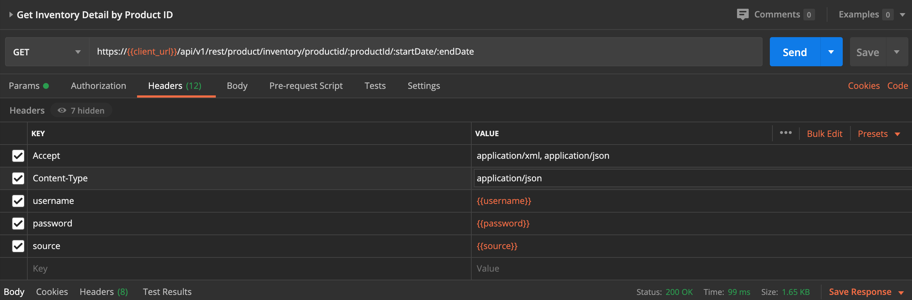

# Insertion Order Service


## Overview

The Yield Analytics API and services are exposed via a REST based
interface. It is intended to make development of custom functionality
comfortable to developers experienced with Web 2.0, AJAX, REST, and
service oriented development platforms. Developers should have
familiarity with web based application paradigms including AJAX, XML,
JSON, and the HTTP(S) protocol prior to attempting development with the
Yield Analytics API and services.

The Insertion Order Service currently exposes interfaces related to:

- Guaranteed Delivery and Capacity of Line Items at the Order Level

- Historical Delivery of Line Items at the Order Level


## Content Types


The Service REST API is currently designed to support the following
content-type:

- JSON - using content-type; application-json

Selecting the desired content-type is a choice the API developer should
make on a case by case basis. API functionality is symmetrical across
content-type. API developers may specify the desired content-type in the
HTTP GET or POST method parameters or via their AJAX or HTTP client
library.


## Error Checking and Status Codes

API developers should check the HTTP response codes returned from the
service REST API to detect errors propagated from API calls. Successful
calls to the service will result in 200 range response codes. 400 and
500 range http responses denote errors. The specific response codes and
text will likely undergo change during BETA development of the API,
however, the ranges will not.


## Security

The service API exposes application data in a secure manner. Use of API
functionality is restricted to authenticated users and is exposed over
secure transport protocols. Access to the API must take place within the
following context:

- **Example CURL Authentication**

  Authentication occurs by passing credentials via http headers on each
  request.

  

  ``` pre
            - username: curl -H "username:username"
            - password: curl -H "password:password"
            - source: curl -H "source:client_id"
          
  ```

  

- **Example HTTPS Authentication**

  

  ``` pre
            GET /api/v1/rest/
            HTTPS/1.1
            Host: yieldanalytics.xandr.com
            Accept: application/xml, application/json
            Content-Type: application/json
            username: {{username}}
            password: {{password}}
            source: {{client_id}}
          
  ```

  

- **Example POSTMAN Authentication**

  Example of header settings in Postman. (<b>Note:</b> 'Authorization' is set
  to "No Auth", the settings below are to be placed in the 'Headers'
  tab.

  

  

  <b>Note:</b> For a more in depth tutorial of
  using Postman see the tutorial <a
  href="../snippets/../topics/using-postman-with-the-yield-analytics-api.md"
  class="xref" title="How to use Postman with Yield Analytics APIs">Using
  Postman with the Yield Analytics API</a>

  

  
 
  


## Confidentiality

Confidentiality is maintained by using Secure Socket Layer based
communication to interact with the Yield Analytics API. API developers
should prefer use of HTTPS over HTTP insecure communication whenever
possible. Consult your HTTP Client library on how to enable HTTP over
SSL when developing outside of a web browser context.


## Paths

Get Guaranteed Capacity for Single Order


``` pre
GET /api/v1/rest/order/capacity/future/{externalId}/{nbDays}
```


- **Description**

  Get guaranteed delivery dynamic capacity as CSV for a particular
  timezone

- **Parameters**

  

  <table id="ID-00001483__d16e17" class="table frame-all">
  <caption><span class="table--title-label">Table 1. <span
  class="title"></caption>
  <colgroup>
  <col style="width: 20%" />
  <col style="width: 20%" />
  <col style="width: 20%" />
  <col style="width: 20%" />
  <col style="width: 20%" />
  </colgroup>
  <thead class="thead">
  <tr class="header row">
  <th id="ID-00001483__d16e17__entry__1"
  class="entry align-center colsep-1 rowsep-1"><strong>Type</strong></th>
  <th id="ID-00001483__d16e17__entry__2"
  class="entry align-center colsep-1 rowsep-1"><strong>Name</strong></th>
  <th id="ID-00001483__d16e17__entry__3"
  class="entry align-center colsep-1 rowsep-1"><strong>Description</strong></th>
  <th id="ID-00001483__d16e17__entry__4"
  class="entry align-center colsep-1 rowsep-1"><strong>Required</strong></th>
  <th id="ID-00001483__d16e17__entry__5"
  class="entry align-center colsep-1 rowsep-1"><strong>Schema</strong></th>
  </tr>
  </thead>
  <tbody class="tbody">
  <tr class="odd row">
  <td class="entry align-center colsep-1 rowsep-1"
  headers="ID-00001483__d16e17__entry__1">PathParameter</td>
  <td class="entry align-center colsep-1 rowsep-1"
  headers="ID-00001483__d16e17__entry__2">timeZone</td>
  <td class="entry align-center colsep-1 rowsep-1"
  headers="ID-00001483__d16e17__entry__3">timeZone</td>
  <td class="entry align-center colsep-1 rowsep-1"
  headers="ID-00001483__d16e17__entry__4">true</td>
  <td class="entry align-center colsep-1 rowsep-1"
  headers="ID-00001483__d16e17__entry__5">string</td>
  </tr>
  <tr class="even row">
  <td class="entry align-center colsep-1 rowsep-1"
  headers="ID-00001483__d16e17__entry__1">PathParameter</td>
  <td class="entry align-center colsep-1 rowsep-1"
  headers="ID-00001483__d16e17__entry__2">nbDays</td>
  <td class="entry align-center colsep-1 rowsep-1"
  headers="ID-00001483__d16e17__entry__3">nbDays</td>
  <td class="entry align-center colsep-1 rowsep-1"
  headers="ID-00001483__d16e17__entry__4">true</td>
  <td class="entry align-center colsep-1 rowsep-1"
  headers="ID-00001483__d16e17__entry__5">integer (int32)</td>
  </tr>
  <tr class="odd row">
  <td class="entry align-center colsep-1 rowsep-1"
  headers="ID-00001483__d16e17__entry__1">HeaderParameter</td>
  <td class="entry align-center colsep-1 rowsep-1"
  headers="ID-00001483__d16e17__entry__2">username</td>
  <td class="entry align-left colsep-1 rowsep-1"
  headers="ID-00001483__d16e17__entry__3">Your username for accessing the
  Yield Analytics API</td>
  <td class="entry align-center colsep-1 rowsep-1"
  headers="ID-00001483__d16e17__entry__4">true</td>
  <td class="entry align-center colsep-1 rowsep-1"
  headers="ID-00001483__d16e17__entry__5">string</td>
  </tr>
  <tr class="even row">
  <td class="entry align-center colsep-1 rowsep-1"
  headers="ID-00001483__d16e17__entry__1">HeaderParameter</td>
  <td class="entry align-center colsep-1 rowsep-1"
  headers="ID-00001483__d16e17__entry__2">password</td>
  <td class="entry align-left colsep-1 rowsep-1"
  headers="ID-00001483__d16e17__entry__3">Your password for accessing the
  Yield Analytics API</td>
  <td class="entry align-center colsep-1 rowsep-1"
  headers="ID-00001483__d16e17__entry__4">true</td>
  <td class="entry align-center colsep-1 rowsep-1"
  headers="ID-00001483__d16e17__entry__5">string</td>
  </tr>
  <tr class="odd row">
  <td class="entry align-center colsep-1 rowsep-1"
  headers="ID-00001483__d16e17__entry__1">HeaderParameter</td>
  <td class="entry align-center colsep-1 rowsep-1"
  headers="ID-00001483__d16e17__entry__2">source</td>
  <td class="entry align-left colsep-1 rowsep-1"
  headers="ID-00001483__d16e17__entry__3">Your client source for accessing
  the Yield Analytics API</td>
  <td class="entry align-center colsep-1 rowsep-1"
  headers="ID-00001483__d16e17__entry__4">true</td>
  <td class="entry align-center colsep-1 rowsep-1"
  headers="ID-00001483__d16e17__entry__5">string</td>
  </tr>
  </tbody>
  </table>

  <span class="table--title-label">Table 1.
  <span class="title">

  

- **Responses**

  

  <table id="ID-00001483__d17e16" class="table frame-all"
  style="width:100%;">
  <caption><span class="table--title-label">Table 2. <span
  class="title"></caption>
  <colgroup>
  <col style="width: 33%" />
  <col style="width: 33%" />
  <col style="width: 33%" />
  </colgroup>
  <thead class="thead">
  <tr class="header row">
  <th id="ID-00001483__d17e16__entry__1"
  class="entry align-center colsep-1 rowsep-1"><strong>HTTP
  Code</strong></th>
  <th id="ID-00001483__d17e16__entry__2"
  class="entry align-center colsep-1 rowsep-1"><strong>Description</strong></th>
  <th id="ID-00001483__d17e16__entry__3"
  class="entry align-center colsep-1 rowsep-1"><strong>Schema</strong></th>
  </tr>
  </thead>
  <tbody class="tbody">
  <tr class="odd row">
  <td class="entry align-center colsep-1 rowsep-1"
  headers="ID-00001483__d17e16__entry__1">200</td>
  <td class="entry align-center colsep-1 rowsep-1"
  headers="ID-00001483__d17e16__entry__2">OK</td>
  <td class="entry align-center colsep-1 rowsep-1"
  headers="ID-00001483__d17e16__entry__3"><a
  href="../snippets/../topics/insertion-order-service.md#ID-00001483__table-8993a721-3510-4bd4-a444-b58cd59a7882"
  class="xref">InsertionOrderResponse</a> array</td>
  </tr>
  </tbody>
  </table>

  <span class="table--title-label">Table 2.
  <span class="title">

  

- **Consumes**

  application/json

- **Produces**

  application/json

- **Tags**

  Insertion Order Service End Points

- **Example CURL request**

  

  ``` pre
  $ curl 'https://{{client_url}}/api/v1/rest/v1/rest/order/capacity/future/1/1' -i -H 'Content-Type: application/json' 
    -H 'Accept: application/json' -H 'username: {{username}}' -H 'password: {{password}}' -H 'source: {{source}}'
  ```

  

- **Example HTTP request**

  

  ``` pre
  GET /api/v1/rest/order/capacity/future/1/1 HTTP/1.1
            Content-Type: application/json
            Accept: application/json
            username: {{username}}
            password: {{password}}
            source: {{source}}
            Host: https://{{client_url}}/api/v1/rest
  ```

  

- **Example HTTP response**

  

  ``` pre
            HTTP/1.1 200 OK
            Content-Type: application/json;charset=UTF-8
            Content-Length: 2567
            
            [ {
            "externalId" : "1",
            "nextHours" : {
            "20200619T05:00+1000" : 1000,
            "20200619T12:00+1000" : 1000,
            "20200619T06:00+1000" : 1000,
            "20200619T13:00+1000" : 1000,
            "20200619T20:00+1000" : 1000,
            "20200619T04:00+1000" : 1000,
            "20200619T07:00+1000" : 1000,
            "20200619T21:00+1000" : 1000,
            "20200619T03:00+1000" : 1000,
            "20200619T10:00+1000" : 1000,
            "20200619T08:00+1000" : 1000,
            "20200619T11:00+1000" : 1000,
            "20200619T02:00+1000" : 1000,
            "20200619T17:00+1000" : 1000,
            "20200619T00:00+1000" : 1000,
            "20200619T09:00+1000" : 1000,
            "20200619T16:00+1000" : 1000,
            "20200619T23:00+1000" : 1000,
            "20200619T18:00+1000" : 1000,
            "20200619T15:00+1000" : 1000,
            "20200619T01:00+1000" : 1000,
            "20200619T19:00+1000" : 1000,
            "20200619T14:00+1000" : 1000,
            "20200619T22:00+1000" : 1000
            },
            "nextDays" : {
            "20200619T00:00+1000" : 240000
            },
            "targetings" : [ {
            "start" : "2020-03-19",
            "end" : "2020-06-19",
            "expression" : "country in ('australia') and size in ('160x600') and site in ('outlook au desktop') and segment-3222986 in ('true') 
             and segment-4836884 in ('true') and segment-4860903 in ('true') or country in ('australia') and size in ('160x600') and 
             site in ('outlook au desktop') and segment-3222986 in ('true') and segment-4836884 in ('true') and segment-4860908 in ('true') 
             or country in ('australia') and size in ('160x600') and site in ('outlook au desktop') and segment-3222986 in ('true') and 
             segment-4860903 in ('true') and segment-4860941 in ('true') or country in ('australia') and size in ('160x600') and 
             site in ('outlook au desktop') and segment-3222986 in ('true') and segment-4860908 in ('true') and 
             segment-4860941 in ('true') or country in ('australia') and size in ('160x600') and site in ('outlook au desktop') and 
             segment-3222990 in ('true') and segment-4836884 in ('true') and segment-4860903 in ('true') or country in ('australia') and 
             size in ('160x600') and site in ('outlook au desktop') and segment-3222990 in ('true') and segment-4836884 in ('true') and 
             segment-4860908 in ('true') or country in ('australia') and size in ('160x600') and site in ('outlook au desktop') and 
             segment-3222990 in ('true') and segment-4860903 in ('true') and segment-4860941 in ('true') or country in ('australia') and 
             size in ('160x600') and site in ('outlook au desktop') and segment-3222990 in ('true') and segment-4860908 in ('true') and 
             segment-4860941 in ('true')",
            "impressionCap" : 5,
            "impressionCapPeriod" : 77,
            "dynamic" : false
            } ]
            } ]
          
  ```

  

Get Guaranteed Delivery Dynamic Capacity as CSV for single timezone


``` pre
GET /api/v1/rest/order/capacity/guaranteed/future/csv/{nbDays}/{timeZone}
```


- **Description**

  Get guaranteed delivery dynamic capacity as CSV for a particular
  timezonee

- **Parameters**

  

  <table id="ID-00001483__d16e17" class="table frame-all">
  <caption><span class="table--title-label">Table 3. <span
  class="title"></caption>
  <colgroup>
  <col style="width: 20%" />
  <col style="width: 20%" />
  <col style="width: 20%" />
  <col style="width: 20%" />
  <col style="width: 20%" />
  </colgroup>
  <thead class="thead">
  <tr class="header row">
  <th id="ID-00001483__d16e17__entry__1"
  class="entry align-center colsep-1 rowsep-1"><strong>Type</strong></th>
  <th id="ID-00001483__d16e17__entry__2"
  class="entry align-center colsep-1 rowsep-1"><strong>Name</strong></th>
  <th id="ID-00001483__d16e17__entry__3"
  class="entry align-center colsep-1 rowsep-1"><strong>Description</strong></th>
  <th id="ID-00001483__d16e17__entry__4"
  class="entry align-center colsep-1 rowsep-1"><strong>Required</strong></th>
  <th id="ID-00001483__d16e17__entry__5"
  class="entry align-center colsep-1 rowsep-1"><strong>Schema</strong></th>
  </tr>
  </thead>
  <tbody class="tbody">
  <tr class="odd row">
  <td class="entry align-center colsep-1 rowsep-1"
  headers="ID-00001483__d16e17__entry__1">PathParameter</td>
  <td class="entry align-center colsep-1 rowsep-1"
  headers="ID-00001483__d16e17__entry__2">timeZone</td>
  <td class="entry align-center colsep-1 rowsep-1"
  headers="ID-00001483__d16e17__entry__3">timeZone</td>
  <td class="entry align-center colsep-1 rowsep-1"
  headers="ID-00001483__d16e17__entry__4">true</td>
  <td class="entry align-center colsep-1 rowsep-1"
  headers="ID-00001483__d16e17__entry__5">string</td>
  </tr>
  <tr class="even row">
  <td class="entry align-center colsep-1 rowsep-1"
  headers="ID-00001483__d16e17__entry__1">PathParameter</td>
  <td class="entry align-center colsep-1 rowsep-1"
  headers="ID-00001483__d16e17__entry__2">nbDays</td>
  <td class="entry align-center colsep-1 rowsep-1"
  headers="ID-00001483__d16e17__entry__3">nbDays</td>
  <td class="entry align-center colsep-1 rowsep-1"
  headers="ID-00001483__d16e17__entry__4">true</td>
  <td class="entry align-center colsep-1 rowsep-1"
  headers="ID-00001483__d16e17__entry__5">integer (int32)</td>
  </tr>
  <tr class="odd row">
  <td class="entry align-center colsep-1 rowsep-1"
  headers="ID-00001483__d16e17__entry__1">HeaderParameter</td>
  <td class="entry align-center colsep-1 rowsep-1"
  headers="ID-00001483__d16e17__entry__2">username</td>
  <td class="entry align-left colsep-1 rowsep-1"
  headers="ID-00001483__d16e17__entry__3">Your username for accessing the
  Yield Analytics API</td>
  <td class="entry align-center colsep-1 rowsep-1"
  headers="ID-00001483__d16e17__entry__4">true</td>
  <td class="entry align-center colsep-1 rowsep-1"
  headers="ID-00001483__d16e17__entry__5">string</td>
  </tr>
  <tr class="even row">
  <td class="entry align-center colsep-1 rowsep-1"
  headers="ID-00001483__d16e17__entry__1">HeaderParameter</td>
  <td class="entry align-center colsep-1 rowsep-1"
  headers="ID-00001483__d16e17__entry__2">password</td>
  <td class="entry align-left colsep-1 rowsep-1"
  headers="ID-00001483__d16e17__entry__3">Your password for accessing the
  Yield Analytics API</td>
  <td class="entry align-center colsep-1 rowsep-1"
  headers="ID-00001483__d16e17__entry__4">true</td>
  <td class="entry align-center colsep-1 rowsep-1"
  headers="ID-00001483__d16e17__entry__5">string</td>
  </tr>
  <tr class="odd row">
  <td class="entry align-center colsep-1 rowsep-1"
  headers="ID-00001483__d16e17__entry__1">HeaderParameter</td>
  <td class="entry align-center colsep-1 rowsep-1"
  headers="ID-00001483__d16e17__entry__2">source</td>
  <td class="entry align-left colsep-1 rowsep-1"
  headers="ID-00001483__d16e17__entry__3">Your client source for accessing
  the Yield Analytics API</td>
  <td class="entry align-center colsep-1 rowsep-1"
  headers="ID-00001483__d16e17__entry__4">true</td>
  <td class="entry align-center colsep-1 rowsep-1"
  headers="ID-00001483__d16e17__entry__5">string</td>
  </tr>
  </tbody>
  </table>

  <span class="table--title-label">Table 3.
  <span class="title">

  

- **Responses**

  

  <table id="ID-00001483__d18e17" class="table">
  <thead class="thead">
  <tr class="header row">
  <th id="ID-00001483__d18e17__entry__1"
  class="entry colsep-1 rowsep-1"><strong>HTTP Code</strong></th>
  <th id="ID-00001483__d18e17__entry__2"
  class="entry colsep-1 rowsep-1"><strong>Description</strong></th>
  <th id="ID-00001483__d18e17__entry__3"
  class="entry colsep-1 rowsep-1"><strong>Schema</strong></th>
  </tr>
  </thead>
  <tbody class="tbody">
  <tr class="odd row">
  <td class="entry colsep-1 rowsep-1"
  headers="ID-00001483__d18e17__entry__1">200</td>
  <td class="entry colsep-1 rowsep-1"
  headers="ID-00001483__d18e17__entry__2">OK</td>
  <td class="entry colsep-1 rowsep-1"
  headers="ID-00001483__d18e17__entry__3">string</td>
  </tr>
  </tbody>
  </table>

  

- **Consumes**

  test/csv

- **Produces**

  test/csv

- **Tags**

  Insertion Order Service End Points

Get Guaranteed Delivery Dynamic Capacity as CSV by group of order id for
double timezone


``` pre
POST /api/v1/rest/order/capacity/guaranteed/future/orderids/csv/{nbDays}/{timeZone}/{timeZoneSecond}
```


- **Description**

  Get guaranteed delivery dynamic capacity as CSV for a group of orders
  within a timezone

- **Parameters**
  

  <table id="ID-00001483__d19e17" class="table frame-all">
  <caption><span class="table--title-label">Table 4. <span
  class="title"></caption>
  <colgroup>
  <col style="width: 20%" />
  <col style="width: 20%" />
  <col style="width: 20%" />
  <col style="width: 20%" />
  <col style="width: 20%" />
  </colgroup>
  <thead class="thead">
  <tr class="header row">
  <th id="ID-00001483__d19e17__entry__1"
  class="entry align-center colsep-1 rowsep-1"><strong>Type</strong></th>
  <th id="ID-00001483__d19e17__entry__2"
  class="entry align-center colsep-1 rowsep-1"><strong>Name</strong></th>
  <th id="ID-00001483__d19e17__entry__3"
  class="entry align-center colsep-1 rowsep-1"><strong>Description</strong></th>
  <th id="ID-00001483__d19e17__entry__4"
  class="entry align-center colsep-1 rowsep-1"><strong>Required</strong></th>
  <th id="ID-00001483__d19e17__entry__5"
  class="entry align-center colsep-1 rowsep-1"><strong>Schema</strong></th>
  </tr>
  </thead>
  <tbody class="tbody">
  <tr class="odd row">
  <td class="entry align-center colsep-1 rowsep-1"
  headers="ID-00001483__d19e17__entry__1">PathParameter</td>
  <td class="entry align-center colsep-1 rowsep-1"
  headers="ID-00001483__d19e17__entry__2">timeZone</td>
  <td class="entry align-center colsep-1 rowsep-1"
  headers="ID-00001483__d19e17__entry__3">timeZone</td>
  <td class="entry align-center colsep-1 rowsep-1"
  headers="ID-00001483__d19e17__entry__4">true</td>
  <td class="entry align-center colsep-1 rowsep-1"
  headers="ID-00001483__d19e17__entry__5">string</td>
  </tr>
  <tr class="even row">
  <td class="entry align-center colsep-1 rowsep-1"
  headers="ID-00001483__d19e17__entry__1">PathParameter</td>
  <td class="entry align-center colsep-1 rowsep-1"
  headers="ID-00001483__d19e17__entry__2">timeZoneSecond</td>
  <td class="entry align-center colsep-1 rowsep-1"
  headers="ID-00001483__d19e17__entry__3">timeZoneSecond</td>
  <td class="entry align-center colsep-1 rowsep-1"
  headers="ID-00001483__d19e17__entry__4">true</td>
  <td class="entry align-center colsep-1 rowsep-1"
  headers="ID-00001483__d19e17__entry__5">string</td>
  </tr>
  <tr class="odd row">
  <td class="entry align-center colsep-1 rowsep-1"
  headers="ID-00001483__d19e17__entry__1">PathParameter</td>
  <td class="entry align-center colsep-1 rowsep-1"
  headers="ID-00001483__d19e17__entry__2">nbDays</td>
  <td class="entry align-center colsep-1 rowsep-1"
  headers="ID-00001483__d19e17__entry__3">nbDays</td>
  <td class="entry align-center colsep-1 rowsep-1"
  headers="ID-00001483__d19e17__entry__4">true</td>
  <td class="entry align-center colsep-1 rowsep-1"
  headers="ID-00001483__d19e17__entry__5">integer (int32)</td>
  </tr>
  <tr class="even row">
  <td class="entry align-center colsep-1 rowsep-1"
  headers="ID-00001483__d19e17__entry__1">BodyParameter</td>
  <td class="entry align-center colsep-1 rowsep-1"
  headers="ID-00001483__d19e17__entry__2">externalOrderIdPool</td>
  <td class="entry align-center colsep-1 rowsep-1"
  headers="ID-00001483__d19e17__entry__3">externalOrderIdPool</td>
  <td class="entry align-center colsep-1 rowsep-1"
  headers="ID-00001483__d19e17__entry__4">true</td>
  <td class="entry align-center colsep-1 rowsep-1"
  headers="ID-00001483__d19e17__entry__5"><a
  href="../snippets/../topics/insertion-order-service.md#ID-00001483__table-3682aed3-9fec-4653-b6e4-a5e8fa5ac39c"
  class="xref">ExternalOrderIdPool</a></td>
  </tr>
  <tr class="odd row">
  <td class="entry align-center colsep-1 rowsep-1"
  headers="ID-00001483__d19e17__entry__1">HeaderParameter</td>
  <td class="entry align-center colsep-1 rowsep-1"
  headers="ID-00001483__d19e17__entry__2">username</td>
  <td class="entry align-left colsep-1 rowsep-1"
  headers="ID-00001483__d19e17__entry__3">Your username for accessing the
  Yield Analytics API</td>
  <td class="entry align-center colsep-1 rowsep-1"
  headers="ID-00001483__d19e17__entry__4">true</td>
  <td class="entry align-center colsep-1 rowsep-1"
  headers="ID-00001483__d19e17__entry__5">string</td>
  </tr>
  <tr class="even row">
  <td class="entry align-center colsep-1 rowsep-1"
  headers="ID-00001483__d19e17__entry__1">HeaderParameter</td>
  <td class="entry align-center colsep-1 rowsep-1"
  headers="ID-00001483__d19e17__entry__2">password</td>
  <td class="entry align-left colsep-1 rowsep-1"
  headers="ID-00001483__d19e17__entry__3">Your password for accessing the
  Yield Analytics API</td>
  <td class="entry align-center colsep-1 rowsep-1"
  headers="ID-00001483__d19e17__entry__4">true</td>
  <td class="entry align-center colsep-1 rowsep-1"
  headers="ID-00001483__d19e17__entry__5">string</td>
  </tr>
  <tr class="odd row">
  <td class="entry align-center colsep-1 rowsep-1"
  headers="ID-00001483__d19e17__entry__1">HeaderParameter</td>
  <td class="entry align-center colsep-1 rowsep-1"
  headers="ID-00001483__d19e17__entry__2">source</td>
  <td class="entry align-left colsep-1 rowsep-1"
  headers="ID-00001483__d19e17__entry__3">Your client source for accessing
  the Yield Analytics API</td>
  <td class="entry align-center colsep-1 rowsep-1"
  headers="ID-00001483__d19e17__entry__4">true</td>
  <td class="entry align-center colsep-1 rowsep-1"
  headers="ID-00001483__d19e17__entry__5">string</td>
  </tr>
  </tbody>
  </table>

  <span class="table--title-label">Table 4.
  <span class="title">

  

- **Responses**

  

  <table id="ID-00001483__d18e17" class="table">
  <thead class="thead">
  <tr class="header row">
  <th id="ID-00001483__d18e17__entry__1"
  class="entry colsep-1 rowsep-1"><strong>HTTP Code</strong></th>
  <th id="ID-00001483__d18e17__entry__2"
  class="entry colsep-1 rowsep-1"><strong>Description</strong></th>
  <th id="ID-00001483__d18e17__entry__3"
  class="entry colsep-1 rowsep-1"><strong>Schema</strong></th>
  </tr>
  </thead>
  <tbody class="tbody">
  <tr class="odd row">
  <td class="entry colsep-1 rowsep-1"
  headers="ID-00001483__d18e17__entry__1">200</td>
  <td class="entry colsep-1 rowsep-1"
  headers="ID-00001483__d18e17__entry__2">OK</td>
  <td class="entry colsep-1 rowsep-1"
  headers="ID-00001483__d18e17__entry__3">string</td>
  </tr>
  </tbody>
  </table>

  

<!-- -->

- **Consumes**

  test/csv

- **Produces**

  test/csv

- **Tags**

  Insertion Order Service End Points

Get Guaranteed Delivery Dynamic Capacity as CSV by group of order id for
single timezone


``` pre
POST /api/v1/rest/order/capacity/guaranteed/future/orderids/csv/{nbDays}/{timeZone}
```


- **Description**

  Get guaranteed delivery dynamic capacity as CSV for a group of orders
  within a timezone

- 

  **Parameters**
  <table id="ID-00001483__d20e16" class="table frame-all">
  <caption><span class="table--title-label">Table 5. <span
  class="title"></caption>
  <colgroup>
  <col style="width: 20%" />
  <col style="width: 20%" />
  <col style="width: 20%" />
  <col style="width: 20%" />
  <col style="width: 20%" />
  </colgroup>
  <thead class="thead">
  <tr class="header row">
  <th id="ID-00001483__d20e16__entry__1"
  class="entry align-center colsep-1 rowsep-1"><strong>Type</strong></th>
  <th id="ID-00001483__d20e16__entry__2"
  class="entry align-center colsep-1 rowsep-1"><strong>Name</strong></th>
  <th id="ID-00001483__d20e16__entry__3"
  class="entry align-center colsep-1 rowsep-1"><strong>Description</strong></th>
  <th id="ID-00001483__d20e16__entry__4"
  class="entry align-center colsep-1 rowsep-1"><strong>Required</strong></th>
  <th id="ID-00001483__d20e16__entry__5"
  class="entry align-center colsep-1 rowsep-1"><strong>Schema</strong></th>
  </tr>
  </thead>
  <tbody class="tbody">
  <tr class="odd row">
  <td class="entry align-center colsep-1 rowsep-1"
  headers="ID-00001483__d20e16__entry__1">PathParameter</td>
  <td class="entry align-center colsep-1 rowsep-1"
  headers="ID-00001483__d20e16__entry__2">timeZone</td>
  <td class="entry align-center colsep-1 rowsep-1"
  headers="ID-00001483__d20e16__entry__3">timeZone</td>
  <td class="entry align-center colsep-1 rowsep-1"
  headers="ID-00001483__d20e16__entry__4">true</td>
  <td class="entry align-center colsep-1 rowsep-1"
  headers="ID-00001483__d20e16__entry__5">string</td>
  </tr>
  <tr class="even row">
  <td class="entry align-center colsep-1 rowsep-1"
  headers="ID-00001483__d20e16__entry__1">PathParameter</td>
  <td class="entry align-center colsep-1 rowsep-1"
  headers="ID-00001483__d20e16__entry__2">nbDays</td>
  <td class="entry align-center colsep-1 rowsep-1"
  headers="ID-00001483__d20e16__entry__3">nbDays</td>
  <td class="entry align-center colsep-1 rowsep-1"
  headers="ID-00001483__d20e16__entry__4">true</td>
  <td class="entry align-center colsep-1 rowsep-1"
  headers="ID-00001483__d20e16__entry__5">integer (int32)</td>
  </tr>
  <tr class="odd row">
  <td class="entry align-center colsep-1 rowsep-1"
  headers="ID-00001483__d20e16__entry__1">BodyParameter</td>
  <td class="entry align-center colsep-1 rowsep-1"
  headers="ID-00001483__d20e16__entry__2">externalOrderIdPool</td>
  <td class="entry align-center colsep-1 rowsep-1"
  headers="ID-00001483__d20e16__entry__3">externalOrderIdPool</td>
  <td class="entry align-center colsep-1 rowsep-1"
  headers="ID-00001483__d20e16__entry__4">true</td>
  <td class="entry align-center colsep-1 rowsep-1"
  headers="ID-00001483__d20e16__entry__5"><a
  href="../snippets/../topics/insertion-order-service.md#ID-00001483__table-3682aed3-9fec-4653-b6e4-a5e8fa5ac39c"
  class="xref">ExternalOrderIdPool</a></td>
  </tr>
  <tr class="even row">
  <td class="entry align-center colsep-1 rowsep-1"
  headers="ID-00001483__d20e16__entry__1">HeaderParameter</td>
  <td class="entry align-center colsep-1 rowsep-1"
  headers="ID-00001483__d20e16__entry__2">username</td>
  <td class="entry align-center colsep-1 rowsep-1"
  headers="ID-00001483__d20e16__entry__3">Your username for accessing the
  Yield Analytics API</td>
  <td class="entry align-center colsep-1 rowsep-1"
  headers="ID-00001483__d20e16__entry__4">true</td>
  <td class="entry align-center colsep-1 rowsep-1"
  headers="ID-00001483__d20e16__entry__5">string</td>
  </tr>
  <tr class="odd row">
  <td class="entry align-center colsep-1 rowsep-1"
  headers="ID-00001483__d20e16__entry__1">HeaderParameter</td>
  <td class="entry align-center colsep-1 rowsep-1"
  headers="ID-00001483__d20e16__entry__2">password</td>
  <td class="entry align-center colsep-1 rowsep-1"
  headers="ID-00001483__d20e16__entry__3">Your password for accessing the
  Yield Analytics API</td>
  <td class="entry align-center colsep-1 rowsep-1"
  headers="ID-00001483__d20e16__entry__4">true</td>
  <td class="entry align-center colsep-1 rowsep-1"
  headers="ID-00001483__d20e16__entry__5">string</td>
  </tr>
  <tr class="even row">
  <td class="entry align-center colsep-1 rowsep-1"
  headers="ID-00001483__d20e16__entry__1">HeaderParameter</td>
  <td class="entry align-center colsep-1 rowsep-1"
  headers="ID-00001483__d20e16__entry__2">source</td>
  <td class="entry align-center colsep-1 rowsep-1"
  headers="ID-00001483__d20e16__entry__3">Your client source for accessing
  the Yield Analytics API</td>
  <td class="entry align-center colsep-1 rowsep-1"
  headers="ID-00001483__d20e16__entry__4">true</td>
  <td class="entry align-center colsep-1 rowsep-1"
  headers="ID-00001483__d20e16__entry__5">string</td>
  </tr>
  </tbody>
  </table>

  <span class="table--title-label">Table 5.
  <span class="title">

  

- **Responses**

  

  <table id="ID-00001483__d18e17" class="table">
  <thead class="thead">
  <tr class="header row">
  <th id="ID-00001483__d18e17__entry__1"
  class="entry colsep-1 rowsep-1"><strong>HTTP Code</strong></th>
  <th id="ID-00001483__d18e17__entry__2"
  class="entry colsep-1 rowsep-1"><strong>Description</strong></th>
  <th id="ID-00001483__d18e17__entry__3"
  class="entry colsep-1 rowsep-1"><strong>Schema</strong></th>
  </tr>
  </thead>
  <tbody class="tbody">
  <tr class="odd row">
  <td class="entry colsep-1 rowsep-1"
  headers="ID-00001483__d18e17__entry__1">200</td>
  <td class="entry colsep-1 rowsep-1"
  headers="ID-00001483__d18e17__entry__2">OK</td>
  <td class="entry colsep-1 rowsep-1"
  headers="ID-00001483__d18e17__entry__3">string</td>
  </tr>
  </tbody>
  </table>

  

- **Consumes**

  application/json

- **Produces**

  test/csv

- **Tags**

  Insertion Order Service End Points

Get Guaranteed Delivery Dynamic Capacity as CSV by group of order id for
double timezone


``` pre
POST /api/v1/rest/order/capacity/guaranteed/future/orderids/csv/{nbDays}/{timeZone}/{timeZoneSecond}
```


- **Description**

  Get guaranteed delivery dynamic capacity as CSV for a group of orders
  for double timezone


  **Parameters**
  <table id="ID-00001483__d21e16" class="table frame-all">
  <caption><span class="table--title-label">Table 6. <span
  class="title"></caption>
  <colgroup>
  <col style="width: 20%" />
  <col style="width: 20%" />
  <col style="width: 20%" />
  <col style="width: 20%" />
  <col style="width: 20%" />
  </colgroup>
  <thead class="thead">
  <tr class="header row">
  <th id="ID-00001483__d21e16__entry__1"
  class="entry align-center colsep-1 rowsep-1"><strong>Type</strong></th>
  <th id="ID-00001483__d21e16__entry__2"
  class="entry align-center colsep-1 rowsep-1"><strong>Name</strong></th>
  <th id="ID-00001483__d21e16__entry__3"
  class="entry align-center colsep-1 rowsep-1"><strong>Description</strong></th>
  <th id="ID-00001483__d21e16__entry__4"
  class="entry align-center colsep-1 rowsep-1"><strong>Required</strong></th>
  <th id="ID-00001483__d21e16__entry__5"
  class="entry align-center colsep-1 rowsep-1"><strong>Schema</strong></th>
  </tr>
  </thead>
  <tbody class="tbody">
  <tr class="odd row">
  <td class="entry align-center colsep-1 rowsep-1"
  headers="ID-00001483__d21e16__entry__1">PathParameter</td>
  <td class="entry align-center colsep-1 rowsep-1"
  headers="ID-00001483__d21e16__entry__2">timeZone</td>
  <td class="entry align-center colsep-1 rowsep-1"
  headers="ID-00001483__d21e16__entry__3">timeZone</td>
  <td class="entry align-center colsep-1 rowsep-1"
  headers="ID-00001483__d21e16__entry__4">true</td>
  <td class="entry align-center colsep-1 rowsep-1"
  headers="ID-00001483__d21e16__entry__5">string</td>
  </tr>
  <tr class="even row">
  <td class="entry align-center colsep-1 rowsep-1"
  headers="ID-00001483__d21e16__entry__1">PathParameter</td>
  <td class="entry align-center colsep-1 rowsep-1"
  headers="ID-00001483__d21e16__entry__2">timeZoneSecond</td>
  <td class="entry align-center colsep-1 rowsep-1"
  headers="ID-00001483__d21e16__entry__3">timeZoneSecond</td>
  <td class="entry align-center colsep-1 rowsep-1"
  headers="ID-00001483__d21e16__entry__4">true</td>
  <td class="entry align-center colsep-1 rowsep-1"
  headers="ID-00001483__d21e16__entry__5">string</td>
  </tr>
  <tr class="odd row">
  <td class="entry align-center colsep-1 rowsep-1"
  headers="ID-00001483__d21e16__entry__1">PathParameter</td>
  <td class="entry align-center colsep-1 rowsep-1"
  headers="ID-00001483__d21e16__entry__2">nbDays</td>
  <td class="entry align-center colsep-1 rowsep-1"
  headers="ID-00001483__d21e16__entry__3">nbDays</td>
  <td class="entry align-center colsep-1 rowsep-1"
  headers="ID-00001483__d21e16__entry__4">true</td>
  <td class="entry align-center colsep-1 rowsep-1"
  headers="ID-00001483__d21e16__entry__5">integer (int32)</td>
  </tr>
  <tr class="even row">
  <td class="entry align-center colsep-1 rowsep-1"
  headers="ID-00001483__d21e16__entry__1">BodyParameter</td>
  <td class="entry align-center colsep-1 rowsep-1"
  headers="ID-00001483__d21e16__entry__2">externalOrderIdPool</td>
  <td class="entry align-center colsep-1 rowsep-1"
  headers="ID-00001483__d21e16__entry__3">externalOrderIdPool</td>
  <td class="entry align-center colsep-1 rowsep-1"
  headers="ID-00001483__d21e16__entry__4">true</td>
  <td class="entry align-center colsep-1 rowsep-1"
  headers="ID-00001483__d21e16__entry__5"><a
  href="../snippets/../topics/insertion-order-service.md#ID-00001483__table-3682aed3-9fec-4653-b6e4-a5e8fa5ac39c"
  class="xref">ExternalOrderIdPool</a></td>
  </tr>
  <tr class="odd row">
  <td class="entry align-center colsep-1 rowsep-1"
  headers="ID-00001483__d21e16__entry__1">HeaderParameter</td>
  <td class="entry align-center colsep-1 rowsep-1"
  headers="ID-00001483__d21e16__entry__2">username</td>
  <td class="entry align-center colsep-1 rowsep-1"
  headers="ID-00001483__d21e16__entry__3">Your username for accessing the
  Yield Analytics API</td>
  <td class="entry align-center colsep-1 rowsep-1"
  headers="ID-00001483__d21e16__entry__4">true</td>
  <td class="entry align-center colsep-1 rowsep-1"
  headers="ID-00001483__d21e16__entry__5">string</td>
  </tr>
  <tr class="even row">
  <td class="entry align-center colsep-1 rowsep-1"
  headers="ID-00001483__d21e16__entry__1">HeaderParameter</td>
  <td class="entry align-center colsep-1 rowsep-1"
  headers="ID-00001483__d21e16__entry__2">password</td>
  <td class="entry align-center colsep-1 rowsep-1"
  headers="ID-00001483__d21e16__entry__3">Your password for accessing the
  Yield Analytics API</td>
  <td class="entry align-center colsep-1 rowsep-1"
  headers="ID-00001483__d21e16__entry__4">true</td>
  <td class="entry align-center colsep-1 rowsep-1"
  headers="ID-00001483__d21e16__entry__5">string</td>
  </tr>
  <tr class="odd row">
  <td class="entry align-center colsep-1 rowsep-1"
  headers="ID-00001483__d21e16__entry__1">HeaderParameter</td>
  <td class="entry align-center colsep-1 rowsep-1"
  headers="ID-00001483__d21e16__entry__2">source</td>
  <td class="entry align-center colsep-1 rowsep-1"
  headers="ID-00001483__d21e16__entry__3">Your client source for accessing
  the Yield Analytics API</td>
  <td class="entry align-center colsep-1 rowsep-1"
  headers="ID-00001483__d21e16__entry__4">true</td>
  <td class="entry align-center colsep-1 rowsep-1"
  headers="ID-00001483__d21e16__entry__5">string</td>
  </tr>
  </tbody>
  </table>

  <span class="table--title-label">Table 6.
  <span class="title">

  

- **Responses**

  

  <table id="ID-00001483__d18e17" class="table">
  <thead class="thead">
  <tr class="header row">
  <th id="ID-00001483__d18e17__entry__1"
  class="entry colsep-1 rowsep-1"><strong>HTTP Code</strong></th>
  <th id="ID-00001483__d18e17__entry__2"
  class="entry colsep-1 rowsep-1"><strong>Description</strong></th>
  <th id="ID-00001483__d18e17__entry__3"
  class="entry colsep-1 rowsep-1"><strong>Schema</strong></th>
  </tr>
  </thead>
  <tbody class="tbody">
  <tr class="odd row">
  <td class="entry colsep-1 rowsep-1"
  headers="ID-00001483__d18e17__entry__1">200</td>
  <td class="entry colsep-1 rowsep-1"
  headers="ID-00001483__d18e17__entry__2">OK</td>
  <td class="entry colsep-1 rowsep-1"
  headers="ID-00001483__d18e17__entry__3">string</td>
  </tr>
  </tbody>
  </table>

  

- **Consumes**

  application/json

- **Produces**

  test/csv

- **Tags**

  Insertion Order Service End Points

Get Guaranteed Delivery Dynamic Capacity as CSV by group of order id for
single timezone


``` pre
POST /api/v1/rest/order/capacity/guaranteed/future/orderids/{nbDays}/{timeZone}
```


- **Description**

  Get guaranteed capacity for a group of orders within a timezone.

- 

  **Parameters**
  <table id="ID-00001483__d20e16" class="table frame-all">
  <caption><span class="table--title-label">Table 7. <span
  class="title"></caption>
  <colgroup>
  <col style="width: 20%" />
  <col style="width: 20%" />
  <col style="width: 20%" />
  <col style="width: 20%" />
  <col style="width: 20%" />
  </colgroup>
  <thead class="thead">
  <tr class="header row">
  <th id="ID-00001483__d20e16__entry__1"
  class="entry align-center colsep-1 rowsep-1"><strong>Type</strong></th>
  <th id="ID-00001483__d20e16__entry__2"
  class="entry align-center colsep-1 rowsep-1"><strong>Name</strong></th>
  <th id="ID-00001483__d20e16__entry__3"
  class="entry align-center colsep-1 rowsep-1"><strong>Description</strong></th>
  <th id="ID-00001483__d20e16__entry__4"
  class="entry align-center colsep-1 rowsep-1"><strong>Required</strong></th>
  <th id="ID-00001483__d20e16__entry__5"
  class="entry align-center colsep-1 rowsep-1"><strong>Schema</strong></th>
  </tr>
  </thead>
  <tbody class="tbody">
  <tr class="odd row">
  <td class="entry align-center colsep-1 rowsep-1"
  headers="ID-00001483__d20e16__entry__1">PathParameter</td>
  <td class="entry align-center colsep-1 rowsep-1"
  headers="ID-00001483__d20e16__entry__2">timeZone</td>
  <td class="entry align-center colsep-1 rowsep-1"
  headers="ID-00001483__d20e16__entry__3">timeZone</td>
  <td class="entry align-center colsep-1 rowsep-1"
  headers="ID-00001483__d20e16__entry__4">true</td>
  <td class="entry align-center colsep-1 rowsep-1"
  headers="ID-00001483__d20e16__entry__5">string</td>
  </tr>
  <tr class="even row">
  <td class="entry align-center colsep-1 rowsep-1"
  headers="ID-00001483__d20e16__entry__1">PathParameter</td>
  <td class="entry align-center colsep-1 rowsep-1"
  headers="ID-00001483__d20e16__entry__2">nbDays</td>
  <td class="entry align-center colsep-1 rowsep-1"
  headers="ID-00001483__d20e16__entry__3">nbDays</td>
  <td class="entry align-center colsep-1 rowsep-1"
  headers="ID-00001483__d20e16__entry__4">true</td>
  <td class="entry align-center colsep-1 rowsep-1"
  headers="ID-00001483__d20e16__entry__5">integer (int32)</td>
  </tr>
  <tr class="odd row">
  <td class="entry align-center colsep-1 rowsep-1"
  headers="ID-00001483__d20e16__entry__1">BodyParameter</td>
  <td class="entry align-center colsep-1 rowsep-1"
  headers="ID-00001483__d20e16__entry__2">externalOrderIdPool</td>
  <td class="entry align-center colsep-1 rowsep-1"
  headers="ID-00001483__d20e16__entry__3">externalOrderIdPool</td>
  <td class="entry align-center colsep-1 rowsep-1"
  headers="ID-00001483__d20e16__entry__4">true</td>
  <td class="entry align-center colsep-1 rowsep-1"
  headers="ID-00001483__d20e16__entry__5"><a
  href="../snippets/../topics/insertion-order-service.md#ID-00001483__table-3682aed3-9fec-4653-b6e4-a5e8fa5ac39c"
  class="xref">ExternalOrderIdPool</a></td>
  </tr>
  <tr class="even row">
  <td class="entry align-center colsep-1 rowsep-1"
  headers="ID-00001483__d20e16__entry__1">HeaderParameter</td>
  <td class="entry align-center colsep-1 rowsep-1"
  headers="ID-00001483__d20e16__entry__2">username</td>
  <td class="entry align-center colsep-1 rowsep-1"
  headers="ID-00001483__d20e16__entry__3">Your username for accessing the
  Yield Analytics API</td>
  <td class="entry align-center colsep-1 rowsep-1"
  headers="ID-00001483__d20e16__entry__4">true</td>
  <td class="entry align-center colsep-1 rowsep-1"
  headers="ID-00001483__d20e16__entry__5">string</td>
  </tr>
  <tr class="odd row">
  <td class="entry align-center colsep-1 rowsep-1"
  headers="ID-00001483__d20e16__entry__1">HeaderParameter</td>
  <td class="entry align-center colsep-1 rowsep-1"
  headers="ID-00001483__d20e16__entry__2">password</td>
  <td class="entry align-center colsep-1 rowsep-1"
  headers="ID-00001483__d20e16__entry__3">Your password for accessing the
  Yield Analytics API</td>
  <td class="entry align-center colsep-1 rowsep-1"
  headers="ID-00001483__d20e16__entry__4">true</td>
  <td class="entry align-center colsep-1 rowsep-1"
  headers="ID-00001483__d20e16__entry__5">string</td>
  </tr>
  <tr class="even row">
  <td class="entry align-center colsep-1 rowsep-1"
  headers="ID-00001483__d20e16__entry__1">HeaderParameter</td>
  <td class="entry align-center colsep-1 rowsep-1"
  headers="ID-00001483__d20e16__entry__2">source</td>
  <td class="entry align-center colsep-1 rowsep-1"
  headers="ID-00001483__d20e16__entry__3">Your client source for accessing
  the Yield Analytics API</td>
  <td class="entry align-center colsep-1 rowsep-1"
  headers="ID-00001483__d20e16__entry__4">true</td>
  <td class="entry align-center colsep-1 rowsep-1"
  headers="ID-00001483__d20e16__entry__5">string</td>
  </tr>
  </tbody>
  </table>

  <span class="table--title-label">Table 7.
  <span class="title">

  

- **Responses**

  

  <table id="ID-00001483__d17e16" class="table frame-all"
  style="width:100%;">
  <caption><span class="table--title-label">Table 8. <span
  class="title"></caption>
  <colgroup>
  <col style="width: 33%" />
  <col style="width: 33%" />
  <col style="width: 33%" />
  </colgroup>
  <thead class="thead">
  <tr class="header row">
  <th id="ID-00001483__d17e16__entry__1"
  class="entry align-center colsep-1 rowsep-1"><strong>HTTP
  Code</strong></th>
  <th id="ID-00001483__d17e16__entry__2"
  class="entry align-center colsep-1 rowsep-1"><strong>Description</strong></th>
  <th id="ID-00001483__d17e16__entry__3"
  class="entry align-center colsep-1 rowsep-1"><strong>Schema</strong></th>
  </tr>
  </thead>
  <tbody class="tbody">
  <tr class="odd row">
  <td class="entry align-center colsep-1 rowsep-1"
  headers="ID-00001483__d17e16__entry__1">200</td>
  <td class="entry align-center colsep-1 rowsep-1"
  headers="ID-00001483__d17e16__entry__2">OK</td>
  <td class="entry align-center colsep-1 rowsep-1"
  headers="ID-00001483__d17e16__entry__3"><a
  href="../snippets/../topics/insertion-order-service.md#ID-00001483__table-8993a721-3510-4bd4-a444-b58cd59a7882"
  class="xref">InsertionOrderResponse</a> array</td>
  </tr>
  </tbody>
  </table>

  <span class="table--title-label">Table 8.
  <span class="title">

  

- **Consumes**

  application/json

- **Produces**

  test/csv

- **Tags**

  Insertion Order Service End Points

- **Example CURL request**

  

  ``` pre
   $ curl 'https://{{client_url}}/api/v1/rest/v1/rest/order/capacity/guaranteed/future/orderids/1/EST' -i -X 
     POST -H 'Content-Type: application/json;charset=UTF-8' -d '{
          "externalOrderIdPool" : 
          {
          "orderIds" : [ "1" ]
          }
          }'
        
  ```

  

- **Example HTTP request**

  

  ``` pre
  POST /api/v1/rest/order/capacity/guaranteed/future/orderids/1/EST HTTP/1.1
            Content-Type: application/json;charset=UTF-8
            Host: https://{{client_url}}/api/v1/rest
            Content-Length: 60
            
            {
            "externalOrderIdPool" : {
            "orderIds" : [ "1" ]
            }
            }
  ```

  

- **Example HTTP response**

  

  ``` pre
  HTTP/1.1 200 OK
            Content-Type: application/json;charset=UTF-8
            Content-Length: 2567
            
            [ {
            "externalId" : "1",
            "nextHours" : {
            "20200619T05:00+1000" : 1000,
            "20200619T12:00+1000" : 1000,
            "20200619T06:00+1000" : 1000,
            "20200619T13:00+1000" : 1000,
            "20200619T20:00+1000" : 1000,
            "20200619T04:00+1000" : 1000,
            "20200619T07:00+1000" : 1000,
            "20200619T21:00+1000" : 1000,
            "20200619T03:00+1000" : 1000,
            "20200619T10:00+1000" : 1000,
            "20200619T08:00+1000" : 1000,
            "20200619T11:00+1000" : 1000,
            "20200619T02:00+1000" : 1000,
            "20200619T17:00+1000" : 1000,
            "20200619T00:00+1000" : 1000,
            "20200619T09:00+1000" : 1000,
            "20200619T16:00+1000" : 1000,
            "20200619T23:00+1000" : 1000,
            "20200619T18:00+1000" : 1000,
            "20200619T15:00+1000" : 1000,
            "20200619T01:00+1000" : 1000,
            "20200619T19:00+1000" : 1000,
            "20200619T14:00+1000" : 1000,
            "20200619T22:00+1000" : 1000
            },
            "nextDays" : {
            "20200619T00:00+1000" : 240000
            },
            "targetings" : [ {
            "start" : "2020-03-19",
            "end" : "2020-06-19",
            "expression" : "country in ('australia') and size in ('160x600') and site in ('outlook au desktop') and segment-3222986 in ('true') 
             and segment-4836884 in ('true') and segment-4860903 in ('true') or country in ('australia') and size in ('160x600') and 
             site in ('outlook au desktop') and segment-3222986 in ('true') and segment-4836884 in ('true') and segment-4860908 in ('true') or 
             country in ('australia') and size in ('160x600') and site in ('outlook au desktop') and segment-3222986 in ('true') and 
             segment-4860903 in ('true') and segment-4860941 in ('true') or country in ('australia') and size in ('160x600') and 
             site in ('outlook au desktop') and segment-3222986 in ('true') and segment-4860908 in ('true') and segment-4860941 in ('true') or 
             country in ('australia') and size in ('160x600') and site in ('outlook au desktop') and segment-3222990 in ('true') and 
             segment-4836884 in ('true') and segment-4860903 in ('true') or country in ('australia') and size in ('160x600') and 
             site in ('outlook au desktop') and segment-3222990 in ('true') and segment-4836884 in ('true') and segment-4860908 in ('true') or 
             country in ('australia') and size in ('160x600') and site in ('outlook au desktop') and segment-3222990 in ('true') and 
             segment-4860903 in ('true') and segment-4860941 in ('true') or country in ('australia') and size in ('160x600') and 
             site in ('outlook au desktop') and segment-3222990 in ('true') and segment-4860908 in ('true') and segment-4860941 in ('true')",
            "impressionCap" : 5,
            "impressionCapPeriod" : 77,
            "dynamic" : false
            } ]
            } ]
  ```

  

Get Guaranteed Delivery Dynamic Capacity by group of order id for double
timezone


``` pre
POST /api/v1/rest/order/capacity/guaranteed/future/orderids/{nbDays}/{timeZone}/{timeZoneSecond}
```


- **Description**

  Get guaranteed capacity for a group of orders for double timezone.


  **Parameters**
  <table id="ID-00001483__d21e16" class="table frame-all">
  <caption><span class="table--title-label">Table 9. <span
  class="title"></caption>
  <colgroup>
  <col style="width: 20%" />
  <col style="width: 20%" />
  <col style="width: 20%" />
  <col style="width: 20%" />
  <col style="width: 20%" />
  </colgroup>
  <thead class="thead">
  <tr class="header row">
  <th id="ID-00001483__d21e16__entry__1"
  class="entry align-center colsep-1 rowsep-1"><strong>Type</strong></th>
  <th id="ID-00001483__d21e16__entry__2"
  class="entry align-center colsep-1 rowsep-1"><strong>Name</strong></th>
  <th id="ID-00001483__d21e16__entry__3"
  class="entry align-center colsep-1 rowsep-1"><strong>Description</strong></th>
  <th id="ID-00001483__d21e16__entry__4"
  class="entry align-center colsep-1 rowsep-1"><strong>Required</strong></th>
  <th id="ID-00001483__d21e16__entry__5"
  class="entry align-center colsep-1 rowsep-1"><strong>Schema</strong></th>
  </tr>
  </thead>
  <tbody class="tbody">
  <tr class="odd row">
  <td class="entry align-center colsep-1 rowsep-1"
  headers="ID-00001483__d21e16__entry__1">PathParameter</td>
  <td class="entry align-center colsep-1 rowsep-1"
  headers="ID-00001483__d21e16__entry__2">timeZone</td>
  <td class="entry align-center colsep-1 rowsep-1"
  headers="ID-00001483__d21e16__entry__3">timeZone</td>
  <td class="entry align-center colsep-1 rowsep-1"
  headers="ID-00001483__d21e16__entry__4">true</td>
  <td class="entry align-center colsep-1 rowsep-1"
  headers="ID-00001483__d21e16__entry__5">string</td>
  </tr>
  <tr class="even row">
  <td class="entry align-center colsep-1 rowsep-1"
  headers="ID-00001483__d21e16__entry__1">PathParameter</td>
  <td class="entry align-center colsep-1 rowsep-1"
  headers="ID-00001483__d21e16__entry__2">timeZoneSecond</td>
  <td class="entry align-center colsep-1 rowsep-1"
  headers="ID-00001483__d21e16__entry__3">timeZoneSecond</td>
  <td class="entry align-center colsep-1 rowsep-1"
  headers="ID-00001483__d21e16__entry__4">true</td>
  <td class="entry align-center colsep-1 rowsep-1"
  headers="ID-00001483__d21e16__entry__5">string</td>
  </tr>
  <tr class="odd row">
  <td class="entry align-center colsep-1 rowsep-1"
  headers="ID-00001483__d21e16__entry__1">PathParameter</td>
  <td class="entry align-center colsep-1 rowsep-1"
  headers="ID-00001483__d21e16__entry__2">nbDays</td>
  <td class="entry align-center colsep-1 rowsep-1"
  headers="ID-00001483__d21e16__entry__3">nbDays</td>
  <td class="entry align-center colsep-1 rowsep-1"
  headers="ID-00001483__d21e16__entry__4">true</td>
  <td class="entry align-center colsep-1 rowsep-1"
  headers="ID-00001483__d21e16__entry__5">integer (int32)</td>
  </tr>
  <tr class="even row">
  <td class="entry align-center colsep-1 rowsep-1"
  headers="ID-00001483__d21e16__entry__1">BodyParameter</td>
  <td class="entry align-center colsep-1 rowsep-1"
  headers="ID-00001483__d21e16__entry__2">externalOrderIdPool</td>
  <td class="entry align-center colsep-1 rowsep-1"
  headers="ID-00001483__d21e16__entry__3">externalOrderIdPool</td>
  <td class="entry align-center colsep-1 rowsep-1"
  headers="ID-00001483__d21e16__entry__4">true</td>
  <td class="entry align-center colsep-1 rowsep-1"
  headers="ID-00001483__d21e16__entry__5"><a
  href="../snippets/../topics/insertion-order-service.md#ID-00001483__table-3682aed3-9fec-4653-b6e4-a5e8fa5ac39c"
  class="xref">ExternalOrderIdPool</a></td>
  </tr>
  <tr class="odd row">
  <td class="entry align-center colsep-1 rowsep-1"
  headers="ID-00001483__d21e16__entry__1">HeaderParameter</td>
  <td class="entry align-center colsep-1 rowsep-1"
  headers="ID-00001483__d21e16__entry__2">username</td>
  <td class="entry align-center colsep-1 rowsep-1"
  headers="ID-00001483__d21e16__entry__3">Your username for accessing the
  Yield Analytics API</td>
  <td class="entry align-center colsep-1 rowsep-1"
  headers="ID-00001483__d21e16__entry__4">true</td>
  <td class="entry align-center colsep-1 rowsep-1"
  headers="ID-00001483__d21e16__entry__5">string</td>
  </tr>
  <tr class="even row">
  <td class="entry align-center colsep-1 rowsep-1"
  headers="ID-00001483__d21e16__entry__1">HeaderParameter</td>
  <td class="entry align-center colsep-1 rowsep-1"
  headers="ID-00001483__d21e16__entry__2">password</td>
  <td class="entry align-center colsep-1 rowsep-1"
  headers="ID-00001483__d21e16__entry__3">Your password for accessing the
  Yield Analytics API</td>
  <td class="entry align-center colsep-1 rowsep-1"
  headers="ID-00001483__d21e16__entry__4">true</td>
  <td class="entry align-center colsep-1 rowsep-1"
  headers="ID-00001483__d21e16__entry__5">string</td>
  </tr>
  <tr class="odd row">
  <td class="entry align-center colsep-1 rowsep-1"
  headers="ID-00001483__d21e16__entry__1">HeaderParameter</td>
  <td class="entry align-center colsep-1 rowsep-1"
  headers="ID-00001483__d21e16__entry__2">source</td>
  <td class="entry align-center colsep-1 rowsep-1"
  headers="ID-00001483__d21e16__entry__3">Your client source for accessing
  the Yield Analytics API</td>
  <td class="entry align-center colsep-1 rowsep-1"
  headers="ID-00001483__d21e16__entry__4">true</td>
  <td class="entry align-center colsep-1 rowsep-1"
  headers="ID-00001483__d21e16__entry__5">string</td>
  </tr>
  </tbody>
  </table>

  <span class="table--title-label">Table 9.
  <span class="title">

  

- **Responses**

  

  <table id="ID-00001483__d17e16" class="table frame-all"
  style="width:100%;">
  <caption><span class="table--title-label">Table 10. <span
  class="title"></caption>
  <colgroup>
  <col style="width: 33%" />
  <col style="width: 33%" />
  <col style="width: 33%" />
  </colgroup>
  <thead class="thead">
  <tr class="header row">
  <th id="ID-00001483__d17e16__entry__1"
  class="entry align-center colsep-1 rowsep-1"><strong>HTTP
  Code</strong></th>
  <th id="ID-00001483__d17e16__entry__2"
  class="entry align-center colsep-1 rowsep-1"><strong>Description</strong></th>
  <th id="ID-00001483__d17e16__entry__3"
  class="entry align-center colsep-1 rowsep-1"><strong>Schema</strong></th>
  </tr>
  </thead>
  <tbody class="tbody">
  <tr class="odd row">
  <td class="entry align-center colsep-1 rowsep-1"
  headers="ID-00001483__d17e16__entry__1">200</td>
  <td class="entry align-center colsep-1 rowsep-1"
  headers="ID-00001483__d17e16__entry__2">OK</td>
  <td class="entry align-center colsep-1 rowsep-1"
  headers="ID-00001483__d17e16__entry__3"><a
  href="../snippets/../topics/insertion-order-service.md#ID-00001483__table-8993a721-3510-4bd4-a444-b58cd59a7882"
  class="xref">InsertionOrderResponse</a> array</td>
  </tr>
  </tbody>
  </table>

  <span class="table--title-label">Table 10.
  <span class="title">

  

- **Consumes**

  application/json

- **Produces**

  application/json

- **Tags**

  Insertion Order Service End Points

- **Example CURL request**

  >

  ``` pre
  $ curl 'https://{{client_url}}/api/v1/rest/v1/rest/order/capacity/guaranteed/future/orderids/1/Australia/Sydney' -i -X 
    POST -H 'Content-Type: application/json;charset=UTF-8' -d '{
    "externalOrderIdPool" : 
    {
      "orderIds" : [ "1" ]
    }
  }'
        
  ```

  

- **Example HTTP request**

  >

  ``` pre
  POST /api/v1/rest/order/capacity/guaranteed/future/orderids/1/Australia/Sydney HTTP/1.1
  Content-Type: application/json;charset=UTF-8
  Host: https://{{client_url}}/api/v1/rest
  Content-Length: 60

  {
    "externalOrderIdPool" : {
      "orderIds" : [ "1" ]
    }
  }
  ```

  

- **Example HTTP response**

  >

  ``` pre
  HTTP/1.1 200 OK
  Content-Type: application/json;charset=UTF-8
  Content-Length: 2567

  [ {
    "externalId" : "1",
    "nextHours" : {
      "20200619T05:00+1000" : 1000,
      "20200619T12:00+1000" : 1000,
      "20200619T06:00+1000" : 1000,
      "20200619T13:00+1000" : 1000,
      "20200619T20:00+1000" : 1000,
      "20200619T04:00+1000" : 1000,
      "20200619T07:00+1000" : 1000,
      "20200619T21:00+1000" : 1000,
      "20200619T03:00+1000" : 1000,
      "20200619T10:00+1000" : 1000,
      "20200619T08:00+1000" : 1000,
      "20200619T11:00+1000" : 1000,
      "20200619T02:00+1000" : 1000,
      "20200619T17:00+1000" : 1000,
      "20200619T00:00+1000" : 1000,
      "20200619T09:00+1000" : 1000,
      "20200619T16:00+1000" : 1000,
      "20200619T23:00+1000" : 1000,
      "20200619T18:00+1000" : 1000,
      "20200619T15:00+1000" : 1000,
      "20200619T01:00+1000" : 1000,
      "20200619T19:00+1000" : 1000,
      "20200619T14:00+1000" : 1000,
      "20200619T22:00+1000" : 1000
    },
    "nextDays" : {
      "20200619T00:00+1000" : 240000
    },
    "targetings" : [ {
      "start" : "2020-03-19",
      "end" : "2020-06-19",
      "expression" : "country in ('australia') and size in ('160x600') and site in ('outlook au desktop') and segment-3222986 in ('true') and 
       segment-4836884 in ('true') and segment-4860903 in ('true') or country in ('australia') and size in ('160x600') and 
       site in ('outlook au desktop') and segment-3222986 in ('true') and segment-4836884 in ('true') and segment-4860908 in ('true') or 
       country in ('australia') and size in ('160x600') and site in ('outlook au desktop') and segment-3222986 in ('true') and 
       segment-4860903 in ('true') and segment-4860941 in ('true') or country in ('australia') and size in ('160x600') and 
       site in ('outlook au desktop') and segment-3222986 in ('true') and segment-4860908 in ('true') and 
       segment-4860941 in ('true') or country in ('australia') and size in ('160x600') and site in ('outlook au desktop') and 
       segment-3222990 in ('true') and segment-4836884 in ('true') and segment-4860903 in ('true') or country in ('australia') and 
       size in ('160x600') and site in ('outlook au desktop') and segment-3222990 in ('true') and segment-4836884 in ('true') and 
       segment-4860908 in ('true') or country in ('australia') and size in ('160x600') and site in ('outlook au desktop') and 
       segment-3222990 in ('true') and segment-4860903 in ('true') and segment-4860941 in ('true') or country in ('australia') and 
       size in ('160x600') and site in ('outlook au desktop') and segment-3222990 in ('true') and segment-4860908 in ('true') and 
       segment-4860941 in ('true')",
      "impressionCap" : 5,
      "impressionCapPeriod" : 77,
      "dynamic" : false
    } ]
  } ]
  ```

  

Get Guaranteed Delivery Dynamic Capacity by group of order id for single
timezone


``` pre
GET /api/v1/rest/order/capacity/guaranteed/future/{nbDays}/{timeZone}
```


- **Description**

  Get guaranteed capacity for a group of orders within a timezone.

- 

  **Parameters**
  <table id="ID-00001483__d20e16" class="table frame-all">
  <caption><span class="table--title-label">Table 11. <span
  class="title"></caption>
  <colgroup>
  <col style="width: 20%" />
  <col style="width: 20%" />
  <col style="width: 20%" />
  <col style="width: 20%" />
  <col style="width: 20%" />
  </colgroup>
  <thead class="thead">
  <tr class="header row">
  <th id="ID-00001483__d20e16__entry__1"
  class="entry align-center colsep-1 rowsep-1"><strong>Type</strong></th>
  <th id="ID-00001483__d20e16__entry__2"
  class="entry align-center colsep-1 rowsep-1"><strong>Name</strong></th>
  <th id="ID-00001483__d20e16__entry__3"
  class="entry align-center colsep-1 rowsep-1"><strong>Description</strong></th>
  <th id="ID-00001483__d20e16__entry__4"
  class="entry align-center colsep-1 rowsep-1"><strong>Required</strong></th>
  <th id="ID-00001483__d20e16__entry__5"
  class="entry align-center colsep-1 rowsep-1"><strong>Schema</strong></th>
  </tr>
  </thead>
  <tbody class="tbody">
  <tr class="odd row">
  <td class="entry align-center colsep-1 rowsep-1"
  headers="ID-00001483__d20e16__entry__1">PathParameter</td>
  <td class="entry align-center colsep-1 rowsep-1"
  headers="ID-00001483__d20e16__entry__2">timeZone</td>
  <td class="entry align-center colsep-1 rowsep-1"
  headers="ID-00001483__d20e16__entry__3">timeZone</td>
  <td class="entry align-center colsep-1 rowsep-1"
  headers="ID-00001483__d20e16__entry__4">true</td>
  <td class="entry align-center colsep-1 rowsep-1"
  headers="ID-00001483__d20e16__entry__5">string</td>
  </tr>
  <tr class="even row">
  <td class="entry align-center colsep-1 rowsep-1"
  headers="ID-00001483__d20e16__entry__1">PathParameter</td>
  <td class="entry align-center colsep-1 rowsep-1"
  headers="ID-00001483__d20e16__entry__2">nbDays</td>
  <td class="entry align-center colsep-1 rowsep-1"
  headers="ID-00001483__d20e16__entry__3">nbDays</td>
  <td class="entry align-center colsep-1 rowsep-1"
  headers="ID-00001483__d20e16__entry__4">true</td>
  <td class="entry align-center colsep-1 rowsep-1"
  headers="ID-00001483__d20e16__entry__5">integer (int32)</td>
  </tr>
  <tr class="odd row">
  <td class="entry align-center colsep-1 rowsep-1"
  headers="ID-00001483__d20e16__entry__1">BodyParameter</td>
  <td class="entry align-center colsep-1 rowsep-1"
  headers="ID-00001483__d20e16__entry__2">externalOrderIdPool</td>
  <td class="entry align-center colsep-1 rowsep-1"
  headers="ID-00001483__d20e16__entry__3">externalOrderIdPool</td>
  <td class="entry align-center colsep-1 rowsep-1"
  headers="ID-00001483__d20e16__entry__4">true</td>
  <td class="entry align-center colsep-1 rowsep-1"
  headers="ID-00001483__d20e16__entry__5"><a
  href="../snippets/../topics/insertion-order-service.md#ID-00001483__table-3682aed3-9fec-4653-b6e4-a5e8fa5ac39c"
  class="xref">ExternalOrderIdPool</a></td>
  </tr>
  <tr class="even row">
  <td class="entry align-center colsep-1 rowsep-1"
  headers="ID-00001483__d20e16__entry__1">HeaderParameter</td>
  <td class="entry align-center colsep-1 rowsep-1"
  headers="ID-00001483__d20e16__entry__2">username</td>
  <td class="entry align-center colsep-1 rowsep-1"
  headers="ID-00001483__d20e16__entry__3">Your username for accessing the
  Yield Analytics API</td>
  <td class="entry align-center colsep-1 rowsep-1"
  headers="ID-00001483__d20e16__entry__4">true</td>
  <td class="entry align-center colsep-1 rowsep-1"
  headers="ID-00001483__d20e16__entry__5">string</td>
  </tr>
  <tr class="odd row">
  <td class="entry align-center colsep-1 rowsep-1"
  headers="ID-00001483__d20e16__entry__1">HeaderParameter</td>
  <td class="entry align-center colsep-1 rowsep-1"
  headers="ID-00001483__d20e16__entry__2">password</td>
  <td class="entry align-center colsep-1 rowsep-1"
  headers="ID-00001483__d20e16__entry__3">Your password for accessing the
  Yield Analytics API</td>
  <td class="entry align-center colsep-1 rowsep-1"
  headers="ID-00001483__d20e16__entry__4">true</td>
  <td class="entry align-center colsep-1 rowsep-1"
  headers="ID-00001483__d20e16__entry__5">string</td>
  </tr>
  <tr class="even row">
  <td class="entry align-center colsep-1 rowsep-1"
  headers="ID-00001483__d20e16__entry__1">HeaderParameter</td>
  <td class="entry align-center colsep-1 rowsep-1"
  headers="ID-00001483__d20e16__entry__2">source</td>
  <td class="entry align-center colsep-1 rowsep-1"
  headers="ID-00001483__d20e16__entry__3">Your client source for accessing
  the Yield Analytics API</td>
  <td class="entry align-center colsep-1 rowsep-1"
  headers="ID-00001483__d20e16__entry__4">true</td>
  <td class="entry align-center colsep-1 rowsep-1"
  headers="ID-00001483__d20e16__entry__5">string</td>
  </tr>
  </tbody>
  </table>

  <span class="table--title-label">Table 11.
  <span class="title">

  

- **Responses**

  

  <table id="ID-00001483__d17e16" class="table frame-all"
  style="width:100%;">
  <caption><span class="table--title-label">Table 12. <span
  class="title"></caption>
  <colgroup>
  <col style="width: 33%" />
  <col style="width: 33%" />
  <col style="width: 33%" />
  </colgroup>
  <thead class="thead">
  <tr class="header row">
  <th id="ID-00001483__d17e16__entry__1"
  class="entry align-center colsep-1 rowsep-1"><strong>HTTP
  Code</strong></th>
  <th id="ID-00001483__d17e16__entry__2"
  class="entry align-center colsep-1 rowsep-1"><strong>Description</strong></th>
  <th id="ID-00001483__d17e16__entry__3"
  class="entry align-center colsep-1 rowsep-1"><strong>Schema</strong></th>
  </tr>
  </thead>
  <tbody class="tbody">
  <tr class="odd row">
  <td class="entry align-center colsep-1 rowsep-1"
  headers="ID-00001483__d17e16__entry__1">200</td>
  <td class="entry align-center colsep-1 rowsep-1"
  headers="ID-00001483__d17e16__entry__2">OK</td>
  <td class="entry align-center colsep-1 rowsep-1"
  headers="ID-00001483__d17e16__entry__3"><a
  href="../snippets/../topics/insertion-order-service.md#ID-00001483__table-8993a721-3510-4bd4-a444-b58cd59a7882"
  class="xref">InsertionOrderResponse</a> array</td>
  </tr>
  </tbody>
  </table>

  <span class="table--title-label">Table 12.
  <span class="title">

  

- **Consumes**

  application/json

- **Produces**

  application/json

- **Tags**

  Insertion Order Service End Points

- **Example CURL request**

  >

  ``` pre
   $ curl 'https://{{client_url}}/api/v1/rest/v1/rest/order/capacity/guaranteed/future/orderids/1/EST' -i -X POST 
     -H 'Content-Type: application/json;charset=UTF-8' -d '{
     "externalOrderIdPool" : 
    {
      "orderIds" : [ "1" ]
    }
  }'  
  ```

  

- **Example HTTP request**

  >

  ``` pre
  POST /api/v1/rest/order/capacity/guaranteed/future/orderids/1/EST HTTP/1.1
  Content-Type: application/json;charset=UTF-8
  Host: https://{{client_url}}/api/v1/rest
  Content-Length: 60

  {
    "externalOrderIdPool" : {
      "orderIds" : [ "1" ]
    }
  }
  ```

  

- **Example HTTP response**

  >

  ``` pre
  HTTP/1.1 200 OK
  Content-Type: application/json;charset=UTF-8
  Content-Length: 2567

  [ {
    "externalId" : "1",
    "nextHours" : {
      "20200619T05:00+1000" : 1000,
      "20200619T12:00+1000" : 1000,
      "20200619T06:00+1000" : 1000,
      "20200619T13:00+1000" : 1000,
      "20200619T20:00+1000" : 1000,
      "20200619T04:00+1000" : 1000,
      "20200619T07:00+1000" : 1000,
      "20200619T21:00+1000" : 1000,
      "20200619T03:00+1000" : 1000,
      "20200619T10:00+1000" : 1000,
      "20200619T08:00+1000" : 1000,
      "20200619T11:00+1000" : 1000,
      "20200619T02:00+1000" : 1000,
      "20200619T17:00+1000" : 1000,
      "20200619T00:00+1000" : 1000,
      "20200619T09:00+1000" : 1000,
      "20200619T16:00+1000" : 1000,
      "20200619T23:00+1000" : 1000,
      "20200619T18:00+1000" : 1000,
      "20200619T15:00+1000" : 1000,
      "20200619T01:00+1000" : 1000,
      "20200619T19:00+1000" : 1000,
      "20200619T14:00+1000" : 1000,
      "20200619T22:00+1000" : 1000
    },
    "nextDays" : {
      "20200619T00:00+1000" : 240000
    },
    "targetings" : [ {
      "start" : "2020-03-19",
      "end" : "2020-06-19",
      "expression" : "country in ('australia') and size in ('160x600') and site in ('outlook au desktop') and segment-3222986 in ('true') 
       and segment-4836884 in ('true') and segment-4860903 in ('true') or country in ('australia') and size in ('160x600') and 
       site in ('outlook au desktop') and segment-3222986 in ('true') and segment-4836884 in ('true') and segment-4860908 in ('true') or 
       country in ('australia') and size in ('160x600') and site in ('outlook au desktop') and segment-3222986 in ('true') and 
       segment-4860903 in ('true') and segment-4860941 in ('true') or country in ('australia') and size in ('160x600') and 
       site in ('outlook au desktop') and segment-3222986 in ('true') and segment-4860908 in ('true') and segment-4860941 in ('true') or 
       country in ('australia') and size in ('160x600') and site in ('outlook au desktop') and segment-3222990 in ('true') and 
       segment-4836884 in ('true') and segment-4860903 in ('true') or country in ('australia') and size in ('160x600') and 
       site in ('outlook au desktop') and segment-3222990 in ('true') and segment-4836884 in ('true') and segment-4860908 in ('true') or 
       country in ('australia') and size in ('160x600') and site in ('outlook au desktop') and segment-3222990 in ('true') and 
       segment-4860903 in ('true') and segment-4860941 in ('true') or country in ('australia') and size in ('160x600') and 
       site in ('outlook au desktop') and segment-3222990 in ('true') and segment-4860908 in ('true') and segment-4860941 in ('true')",
      "impressionCap" : 5,
      "impressionCapPeriod" : 77,
      "dynamic" : false
    } ]
  } ]
  ```

  

Get Guaranteed Delivery Dynamic Capacity for double timezone


``` pre
GET /api/v1/rest/order/capacity/guaranteed/future/{nbDays}/{timeZone}/{timeZoneSecond}
```


- **Description**

  Get guaranteed capacity for a group of orders for double timezone.


  **Parameters**
  <table id="ID-00001483__d21e16" class="table frame-all">
  <caption><span class="table--title-label">Table 13. <span
  class="title"></caption>
  <colgroup>
  <col style="width: 20%" />
  <col style="width: 20%" />
  <col style="width: 20%" />
  <col style="width: 20%" />
  <col style="width: 20%" />
  </colgroup>
  <thead class="thead">
  <tr class="header row">
  <th id="ID-00001483__d21e16__entry__1"
  class="entry align-center colsep-1 rowsep-1"><strong>Type</strong></th>
  <th id="ID-00001483__d21e16__entry__2"
  class="entry align-center colsep-1 rowsep-1"><strong>Name</strong></th>
  <th id="ID-00001483__d21e16__entry__3"
  class="entry align-center colsep-1 rowsep-1"><strong>Description</strong></th>
  <th id="ID-00001483__d21e16__entry__4"
  class="entry align-center colsep-1 rowsep-1"><strong>Required</strong></th>
  <th id="ID-00001483__d21e16__entry__5"
  class="entry align-center colsep-1 rowsep-1"><strong>Schema</strong></th>
  </tr>
  </thead>
  <tbody class="tbody">
  <tr class="odd row">
  <td class="entry align-center colsep-1 rowsep-1"
  headers="ID-00001483__d21e16__entry__1">PathParameter</td>
  <td class="entry align-center colsep-1 rowsep-1"
  headers="ID-00001483__d21e16__entry__2">timeZone</td>
  <td class="entry align-center colsep-1 rowsep-1"
  headers="ID-00001483__d21e16__entry__3">timeZone</td>
  <td class="entry align-center colsep-1 rowsep-1"
  headers="ID-00001483__d21e16__entry__4">true</td>
  <td class="entry align-center colsep-1 rowsep-1"
  headers="ID-00001483__d21e16__entry__5">string</td>
  </tr>
  <tr class="even row">
  <td class="entry align-center colsep-1 rowsep-1"
  headers="ID-00001483__d21e16__entry__1">PathParameter</td>
  <td class="entry align-center colsep-1 rowsep-1"
  headers="ID-00001483__d21e16__entry__2">timeZoneSecond</td>
  <td class="entry align-center colsep-1 rowsep-1"
  headers="ID-00001483__d21e16__entry__3">timeZoneSecond</td>
  <td class="entry align-center colsep-1 rowsep-1"
  headers="ID-00001483__d21e16__entry__4">true</td>
  <td class="entry align-center colsep-1 rowsep-1"
  headers="ID-00001483__d21e16__entry__5">string</td>
  </tr>
  <tr class="odd row">
  <td class="entry align-center colsep-1 rowsep-1"
  headers="ID-00001483__d21e16__entry__1">PathParameter</td>
  <td class="entry align-center colsep-1 rowsep-1"
  headers="ID-00001483__d21e16__entry__2">nbDays</td>
  <td class="entry align-center colsep-1 rowsep-1"
  headers="ID-00001483__d21e16__entry__3">nbDays</td>
  <td class="entry align-center colsep-1 rowsep-1"
  headers="ID-00001483__d21e16__entry__4">true</td>
  <td class="entry align-center colsep-1 rowsep-1"
  headers="ID-00001483__d21e16__entry__5">integer (int32)</td>
  </tr>
  <tr class="even row">
  <td class="entry align-center colsep-1 rowsep-1"
  headers="ID-00001483__d21e16__entry__1">BodyParameter</td>
  <td class="entry align-center colsep-1 rowsep-1"
  headers="ID-00001483__d21e16__entry__2">externalOrderIdPool</td>
  <td class="entry align-center colsep-1 rowsep-1"
  headers="ID-00001483__d21e16__entry__3">externalOrderIdPool</td>
  <td class="entry align-center colsep-1 rowsep-1"
  headers="ID-00001483__d21e16__entry__4">true</td>
  <td class="entry align-center colsep-1 rowsep-1"
  headers="ID-00001483__d21e16__entry__5"><a
  href="../snippets/../topics/insertion-order-service.md#ID-00001483__table-3682aed3-9fec-4653-b6e4-a5e8fa5ac39c"
  class="xref">ExternalOrderIdPool</a></td>
  </tr>
  <tr class="odd row">
  <td class="entry align-center colsep-1 rowsep-1"
  headers="ID-00001483__d21e16__entry__1">HeaderParameter</td>
  <td class="entry align-center colsep-1 rowsep-1"
  headers="ID-00001483__d21e16__entry__2">username</td>
  <td class="entry align-center colsep-1 rowsep-1"
  headers="ID-00001483__d21e16__entry__3">Your username for accessing the
  Yield Analytics API</td>
  <td class="entry align-center colsep-1 rowsep-1"
  headers="ID-00001483__d21e16__entry__4">true</td>
  <td class="entry align-center colsep-1 rowsep-1"
  headers="ID-00001483__d21e16__entry__5">string</td>
  </tr>
  <tr class="even row">
  <td class="entry align-center colsep-1 rowsep-1"
  headers="ID-00001483__d21e16__entry__1">HeaderParameter</td>
  <td class="entry align-center colsep-1 rowsep-1"
  headers="ID-00001483__d21e16__entry__2">password</td>
  <td class="entry align-center colsep-1 rowsep-1"
  headers="ID-00001483__d21e16__entry__3">Your password for accessing the
  Yield Analytics API</td>
  <td class="entry align-center colsep-1 rowsep-1"
  headers="ID-00001483__d21e16__entry__4">true</td>
  <td class="entry align-center colsep-1 rowsep-1"
  headers="ID-00001483__d21e16__entry__5">string</td>
  </tr>
  <tr class="odd row">
  <td class="entry align-center colsep-1 rowsep-1"
  headers="ID-00001483__d21e16__entry__1">HeaderParameter</td>
  <td class="entry align-center colsep-1 rowsep-1"
  headers="ID-00001483__d21e16__entry__2">source</td>
  <td class="entry align-center colsep-1 rowsep-1"
  headers="ID-00001483__d21e16__entry__3">Your client source for accessing
  the Yield Analytics API</td>
  <td class="entry align-center colsep-1 rowsep-1"
  headers="ID-00001483__d21e16__entry__4">true</td>
  <td class="entry align-center colsep-1 rowsep-1"
  headers="ID-00001483__d21e16__entry__5">string</td>
  </tr>
  </tbody>
  </table>

  <span class="table--title-label">Table 13.
  <span class="title">

  

- **Responses**

  

  <table id="ID-00001483__d17e16" class="table frame-all"
  style="width:100%;">
  <caption><span class="table--title-label">Table 14. <span
  class="title"></caption>
  <colgroup>
  <col style="width: 33%" />
  <col style="width: 33%" />
  <col style="width: 33%" />
  </colgroup>
  <thead class="thead">
  <tr class="header row">
  <th id="ID-00001483__d17e16__entry__1"
  class="entry align-center colsep-1 rowsep-1"><strong>HTTP
  Code</strong></th>
  <th id="ID-00001483__d17e16__entry__2"
  class="entry align-center colsep-1 rowsep-1"><strong>Description</strong></th>
  <th id="ID-00001483__d17e16__entry__3"
  class="entry align-center colsep-1 rowsep-1"><strong>Schema</strong></th>
  </tr>
  </thead>
  <tbody class="tbody">
  <tr class="odd row">
  <td class="entry align-center colsep-1 rowsep-1"
  headers="ID-00001483__d17e16__entry__1">200</td>
  <td class="entry align-center colsep-1 rowsep-1"
  headers="ID-00001483__d17e16__entry__2">OK</td>
  <td class="entry align-center colsep-1 rowsep-1"
  headers="ID-00001483__d17e16__entry__3"><a
  href="../snippets/../topics/insertion-order-service.md#ID-00001483__table-8993a721-3510-4bd4-a444-b58cd59a7882"
  class="xref">InsertionOrderResponse</a> array</td>
  </tr>
  </tbody>
  </table>

  <span class="table--title-label">Table 14.
  <span class="title">

  

- **Consumes**

  application/json

- **Produces**

  application/json

- **Tags**

  Insertion Order Service End Points

- **Example CURL request**

  >

  ``` pre
  $ curl 'https://{{client_url}}/api/v1/rest/v1/rest/order/capacity/guaranteed/future/1/Australia/Sydney' 
  -i -H 'Content-Type: application/json' -H 'Accept: application/json' 
  -H 'username: {{username}}' -H 'password: {{password}}' -H 'source: {{source}}'    
  ```

  

- **Example HTTP request**

  >

  ``` pre
  GET /api/v1/rest/order/capacity/guaranteed/future/1/Australia/Sydney HTTP/1.1
  Content-Type: application/json
  Accept: application/json
  username: {{username}}
  password: {{password}}
  source: {{source}}
  Host: https://{{client_url}}/api/v1/rest
  ```

  

- **Example HTTP response**

  >

  ``` pre
  HTTP/1.1 200 OK
  Content-Type: application/json;charset=UTF-8
  Content-Length: 2567

  [ {
    "externalId" : "1",
    "nextHours" : {
      "20200619T05:00+1000" : 1000,
      "20200619T12:00+1000" : 1000,
      "20200619T06:00+1000" : 1000,
      "20200619T13:00+1000" : 1000,
      "20200619T20:00+1000" : 1000,
      "20200619T04:00+1000" : 1000,
      "20200619T07:00+1000" : 1000,
      "20200619T21:00+1000" : 1000,
      "20200619T03:00+1000" : 1000,
      "20200619T10:00+1000" : 1000,
      "20200619T08:00+1000" : 1000,
      "20200619T11:00+1000" : 1000,
      "20200619T02:00+1000" : 1000,
      "20200619T17:00+1000" : 1000,
      "20200619T00:00+1000" : 1000,
      "20200619T09:00+1000" : 1000,
      "20200619T16:00+1000" : 1000,
      "20200619T23:00+1000" : 1000,
      "20200619T18:00+1000" : 1000,
      "20200619T15:00+1000" : 1000,
      "20200619T01:00+1000" : 1000,
      "20200619T19:00+1000" : 1000,
      "20200619T14:00+1000" : 1000,
      "20200619T22:00+1000" : 1000
    },
    "nextDays" : {
      "20200619T00:00+1000" : 240000
    },
    "targetings" : [ {
      "start" : "2020-03-19",
      "end" : "2020-06-19",
      "expression" : "country in ('australia') and size in ('160x600') and site in ('outlook au desktop') and segment-3222986 in ('true') 
       and segment-4836884 in ('true') and segment-4860903 in ('true') or country in ('australia') and size in ('160x600') and 
       site in ('outlook au desktop') and segment-3222986 in ('true') and segment-4836884 in ('true') and segment-4860908 in ('true') or 
       country in ('australia') and size in ('160x600') and site in ('outlook au desktop') and segment-3222986 in ('true') and 
       segment-4860903 in ('true') and segment-4860941 in ('true') or country in ('australia') and size in ('160x600') and 
       site in ('outlook au desktop') and segment-3222986 in ('true') and segment-4860908 in ('true') and segment-4860941 in ('true') or 
       country in ('australia') and size in ('160x600') and site in ('outlook au desktop') and segment-3222990 in ('true') and 
       segment-4836884 in ('true') and segment-4860903 in ('true') or country in ('australia') and size in ('160x600') and 
       site in ('outlook au desktop') and segment-3222990 in ('true') and segment-4836884 in ('true') and 
       segment-4860908 in ('true') or country in ('australia') and size in ('160x600') and site in ('outlook au desktop') and 
       segment-3222990 in ('true') and segment-4860903 in ('true') and segment-4860941 in ('true') or country in ('australia') and 
       size in ('160x600') and site in ('outlook au desktop') and segment-3222990 in ('true') and segment-4860908 in ('true') 
       and segment-4860941 in ('true')",
      "impressionCap" : 5,
      "impressionCapPeriod" : 77,
      "dynamic" : false
    } ]
  } ]
  ```

  

Get Guaranteed Delivery Historical Capacity as JSON

Get guaranteed delivery historical capacity as JSON

- **Parameters**
  <table id="ID-00001483__table-640c44cd-f21e-4d7f-800d-c387d2f0d56e"
  class="table frame-all">
  <caption><span class="table--title-label">Table 15. <span
  class="title"></caption>
  <colgroup>
  <col style="width: 20%" />
  <col style="width: 20%" />
  <col style="width: 20%" />
  <col style="width: 20%" />
  <col style="width: 20%" />
  </colgroup>
  <thead class="thead">
  <tr class="header row">
  <th
  id="ID-00001483__table-640c44cd-f21e-4d7f-800d-c387d2f0d56e__entry__1"
  class="entry align-center colsep-1 rowsep-1"><strong>Type</strong></th>
  <th
  id="ID-00001483__table-640c44cd-f21e-4d7f-800d-c387d2f0d56e__entry__2"
  class="entry align-center colsep-1 rowsep-1"><strong>Name</strong></th>
  <th
  id="ID-00001483__table-640c44cd-f21e-4d7f-800d-c387d2f0d56e__entry__3"
  class="entry align-center colsep-1 rowsep-1"><strong>Description</strong></th>
  <th
  id="ID-00001483__table-640c44cd-f21e-4d7f-800d-c387d2f0d56e__entry__4"
  class="entry align-center colsep-1 rowsep-1"><strong>Required</strong></th>
  <th
  id="ID-00001483__table-640c44cd-f21e-4d7f-800d-c387d2f0d56e__entry__5"
  class="entry align-center colsep-1 rowsep-1"><strong>Schema</strong></th>
  </tr>
  </thead>
  <tbody class="tbody">
  <tr class="odd row">
  <td class="entry align-center colsep-1 rowsep-1"
  headers="ID-00001483__table-640c44cd-f21e-4d7f-800d-c387d2f0d56e__entry__1">PathParameter</td>
  <td class="entry align-center colsep-1 rowsep-1"
  headers="ID-00001483__table-640c44cd-f21e-4d7f-800d-c387d2f0d56e__entry__2">externalId</td>
  <td class="entry align-center colsep-1 rowsep-1"
  headers="ID-00001483__table-640c44cd-f21e-4d7f-800d-c387d2f0d56e__entry__3">externalId</td>
  <td class="entry align-center colsep-1 rowsep-1"
  headers="ID-00001483__table-640c44cd-f21e-4d7f-800d-c387d2f0d56e__entry__4">true</td>
  <td class="entry align-center colsep-1 rowsep-1"
  headers="ID-00001483__table-640c44cd-f21e-4d7f-800d-c387d2f0d56e__entry__5">string</td>
  </tr>
  <tr class="even row">
  <td class="entry align-center colsep-1 rowsep-1"
  headers="ID-00001483__table-640c44cd-f21e-4d7f-800d-c387d2f0d56e__entry__1">PathParameter</td>
  <td class="entry align-center colsep-1 rowsep-1"
  headers="ID-00001483__table-640c44cd-f21e-4d7f-800d-c387d2f0d56e__entry__2">startDate</td>
  <td class="entry align-center colsep-1 rowsep-1"
  headers="ID-00001483__table-640c44cd-f21e-4d7f-800d-c387d2f0d56e__entry__3">startDate</td>
  <td class="entry align-center colsep-1 rowsep-1"
  headers="ID-00001483__table-640c44cd-f21e-4d7f-800d-c387d2f0d56e__entry__4">true</td>
  <td class="entry align-center colsep-1 rowsep-1"
  headers="ID-00001483__table-640c44cd-f21e-4d7f-800d-c387d2f0d56e__entry__5">string</td>
  </tr>
  <tr class="odd row">
  <td class="entry align-center colsep-1 rowsep-1"
  headers="ID-00001483__table-640c44cd-f21e-4d7f-800d-c387d2f0d56e__entry__1">PathParameter</td>
  <td class="entry align-center colsep-1 rowsep-1"
  headers="ID-00001483__table-640c44cd-f21e-4d7f-800d-c387d2f0d56e__entry__2">endDate</td>
  <td class="entry align-center colsep-1 rowsep-1"
  headers="ID-00001483__table-640c44cd-f21e-4d7f-800d-c387d2f0d56e__entry__3">endDate</td>
  <td class="entry align-center colsep-1 rowsep-1"
  headers="ID-00001483__table-640c44cd-f21e-4d7f-800d-c387d2f0d56e__entry__4">true</td>
  <td class="entry align-center colsep-1 rowsep-1"
  headers="ID-00001483__table-640c44cd-f21e-4d7f-800d-c387d2f0d56e__entry__5">string</td>
  </tr>
  <tr class="even row">
  <td class="entry align-center colsep-1 rowsep-1"
  headers="ID-00001483__table-640c44cd-f21e-4d7f-800d-c387d2f0d56e__entry__1">HeaderParameter</td>
  <td class="entry align-center colsep-1 rowsep-1"
  headers="ID-00001483__table-640c44cd-f21e-4d7f-800d-c387d2f0d56e__entry__2">username</td>
  <td class="entry align-left colsep-1 rowsep-1"
  headers="ID-00001483__table-640c44cd-f21e-4d7f-800d-c387d2f0d56e__entry__3">Your
  username for accessing the Yield Analytics API</td>
  <td class="entry align-center colsep-1 rowsep-1"
  headers="ID-00001483__table-640c44cd-f21e-4d7f-800d-c387d2f0d56e__entry__4">true</td>
  <td class="entry align-center colsep-1 rowsep-1"
  headers="ID-00001483__table-640c44cd-f21e-4d7f-800d-c387d2f0d56e__entry__5">string</td>
  </tr>
  <tr class="odd row">
  <td class="entry align-center colsep-1 rowsep-1"
  headers="ID-00001483__table-640c44cd-f21e-4d7f-800d-c387d2f0d56e__entry__1">HeaderParameter</td>
  <td class="entry align-center colsep-1 rowsep-1"
  headers="ID-00001483__table-640c44cd-f21e-4d7f-800d-c387d2f0d56e__entry__2">password</td>
  <td class="entry align-left colsep-1 rowsep-1"
  headers="ID-00001483__table-640c44cd-f21e-4d7f-800d-c387d2f0d56e__entry__3">Your
  password for accessing the Yield Analytics API</td>
  <td class="entry align-center colsep-1 rowsep-1"
  headers="ID-00001483__table-640c44cd-f21e-4d7f-800d-c387d2f0d56e__entry__4">true</td>
  <td class="entry align-center colsep-1 rowsep-1"
  headers="ID-00001483__table-640c44cd-f21e-4d7f-800d-c387d2f0d56e__entry__5">string</td>
  </tr>
  <tr class="even row">
  <td class="entry align-center colsep-1 rowsep-1"
  headers="ID-00001483__table-640c44cd-f21e-4d7f-800d-c387d2f0d56e__entry__1">HeaderParameter</td>
  <td class="entry align-center colsep-1 rowsep-1"
  headers="ID-00001483__table-640c44cd-f21e-4d7f-800d-c387d2f0d56e__entry__2">source</td>
  <td class="entry align-left colsep-1 rowsep-1"
  headers="ID-00001483__table-640c44cd-f21e-4d7f-800d-c387d2f0d56e__entry__3">Your
  client source for accessing the Yield Analytics API</td>
  <td class="entry align-center colsep-1 rowsep-1"
  headers="ID-00001483__table-640c44cd-f21e-4d7f-800d-c387d2f0d56e__entry__4">true</td>
  <td class="entry align-center colsep-1 rowsep-1"
  headers="ID-00001483__table-640c44cd-f21e-4d7f-800d-c387d2f0d56e__entry__5">string</td>
  </tr>
  </tbody>
  </table>

  <span class="table--title-label">Table 15.
  <span class="title">

- 

  **Responses**
  <table id="ID-00001483__table-c6eb2c13-72a4-43bb-8aa6-a537f9698d3f"
  class="table frame-all" style="width:100%;">
  <caption><span class="table--title-label">Table 16. <span
  class="title"></caption>
  <colgroup>
  <col style="width: 33%" />
  <col style="width: 33%" />
  <col style="width: 33%" />
  </colgroup>
  <thead class="thead">
  <tr class="header row">
  <th
  id="ID-00001483__table-c6eb2c13-72a4-43bb-8aa6-a537f9698d3f__entry__1"
  class="entry align-center colsep-1 rowsep-1"><strong>HTTP
  Code</strong></th>
  <th
  id="ID-00001483__table-c6eb2c13-72a4-43bb-8aa6-a537f9698d3f__entry__2"
  class="entry align-center colsep-1 rowsep-1"><strong>Description</strong></th>
  <th
  id="ID-00001483__table-c6eb2c13-72a4-43bb-8aa6-a537f9698d3f__entry__3"
  class="entry align-center colsep-1 rowsep-1"><strong>Schema</strong></th>
  </tr>
  </thead>
  <tbody class="tbody">
  <tr class="odd row">
  <td class="entry align-center colsep-1 rowsep-1"
  headers="ID-00001483__table-c6eb2c13-72a4-43bb-8aa6-a537f9698d3f__entry__1">200</td>
  <td class="entry align-center colsep-1 rowsep-1"
  headers="ID-00001483__table-c6eb2c13-72a4-43bb-8aa6-a537f9698d3f__entry__2">OK</td>
  <td class="entry align-center colsep-1 rowsep-1"
  headers="ID-00001483__table-c6eb2c13-72a4-43bb-8aa6-a537f9698d3f__entry__3"><a
  href="insertion-order-service.md#ID-00001483__table-eb163f35-829c-488e-ba63-89863ea2a8a2"
  class="xref">OrderDeliveryInfo</a></td>
  </tr>
  </tbody>
  </table>

  <span class="table--title-label">Table 16.
  <span class="title">

  

- **Consumes**

  application/json

- **Produces**

  application/json

- **Tags**

  Insertion Order Service End Points

- **Example CURL request**

  >

  ``` pre
  $ curl 'https://{{client_url}}/api/v1/rest/v1/rest/order/delivery/1/2016-06-01/2016-07-01' -i -H 
  'Content-Type: application/json' -H 'Accept: application/json' 
  -H 'username: {{username}}' -H 'password: {{password}}' -H 'source: {{source}}'    
  ```

  

- **Example HTTP request**

  >

  ``` pre
  GET /api/v1/rest/order/delivery/1/2016-06-01/2016-07-01 HTTP/1.1
  Content-Type: application/json
  Accept: application/json
  username: {{username}}
  password: {{password}}
  source: {{source}}
  Host: https://{{client_url}}/api/v1/rest
  ```

  

- **Example HTTP response**

  >

  ``` pre
  HTTP/1.1 200 OK
  Content-Type: application/json;charset=UTF-8
  Content-Length: 241

  {
    "externalOrderId" : "1",
    "impressions" : 20,
    "orderLineDeliveryDetail" : {
      "1" : [ {
        "impressions" : 10,
        "date" : "05/19/2020"
      } ],
      "2" : [ {
        "impressions" : 10,
        "date" : "06/19/2020"
      } ]
    }
  }
  ```

  

Get Insertion Order Inventory with JSON


``` pre
POST /api/v1/rest/order/inventory/apas/{startDate}/{endDate}/{consumptionFilter}
```


- **Description**

  Get insertion order inventory with JSON.

- 

  **Parameters**
  <table id="ID-00001483__d22e15" class="table frame-all">
  <caption><span class="table--title-label">Table 17. <span
  class="title"></caption>
  <colgroup>
  <col style="width: 20%" />
  <col style="width: 20%" />
  <col style="width: 20%" />
  <col style="width: 20%" />
  <col style="width: 20%" />
  </colgroup>
  <thead class="thead">
  <tr class="header row">
  <th id="ID-00001483__d22e15__entry__1"
  class="entry align-center colsep-1 rowsep-1"><strong>Type</strong></th>
  <th id="ID-00001483__d22e15__entry__2"
  class="entry align-center colsep-1 rowsep-1"><strong>Name</strong></th>
  <th id="ID-00001483__d22e15__entry__3"
  class="entry align-center colsep-1 rowsep-1"><strong>Description</strong></th>
  <th id="ID-00001483__d22e15__entry__4"
  class="entry align-center colsep-1 rowsep-1"><strong>Required</strong></th>
  <th id="ID-00001483__d22e15__entry__5"
  class="entry align-center colsep-1 rowsep-1"><strong>Schema</strong></th>
  </tr>
  </thead>
  <tbody class="tbody">
  <tr class="odd row">
  <td class="entry align-center colsep-1 rowsep-1"
  headers="ID-00001483__d22e15__entry__1">PathParameter</td>
  <td class="entry align-center colsep-1 rowsep-1"
  headers="ID-00001483__d22e15__entry__2">startDate</td>
  <td class="entry align-center colsep-1 rowsep-1"
  headers="ID-00001483__d22e15__entry__3">startDate</td>
  <td class="entry align-center colsep-1 rowsep-1"
  headers="ID-00001483__d22e15__entry__4">true</td>
  <td class="entry align-center colsep-1 rowsep-1"
  headers="ID-00001483__d22e15__entry__5">string</td>
  </tr>
  <tr class="even row">
  <td class="entry align-center colsep-1 rowsep-1"
  headers="ID-00001483__d22e15__entry__1">PathParameter</td>
  <td class="entry align-center colsep-1 rowsep-1"
  headers="ID-00001483__d22e15__entry__2">endDate</td>
  <td class="entry align-center colsep-1 rowsep-1"
  headers="ID-00001483__d22e15__entry__3">endDate</td>
  <td class="entry align-center colsep-1 rowsep-1"
  headers="ID-00001483__d22e15__entry__4">true</td>
  <td class="entry align-center colsep-1 rowsep-1"
  headers="ID-00001483__d22e15__entry__5">string</td>
  </tr>
  <tr class="odd row">
  <td class="entry align-center colsep-1 rowsep-1"
  headers="ID-00001483__d22e15__entry__1">PathParameter</td>
  <td class="entry align-center colsep-1 rowsep-1"
  headers="ID-00001483__d22e15__entry__2">consumptionFilter</td>
  <td class="entry align-center colsep-1 rowsep-1"
  headers="ID-00001483__d22e15__entry__3">consumptionFilter</td>
  <td class="entry align-center colsep-1 rowsep-1"
  headers="ID-00001483__d22e15__entry__4">true</td>
  <td class="entry align-center colsep-1 rowsep-1"
  headers="ID-00001483__d22e15__entry__5">string</td>
  </tr>
  <tr class="even row">
  <td class="entry align-center colsep-1 rowsep-1"
  headers="ID-00001483__d22e15__entry__1">PathParameter</td>
  <td class="entry align-center colsep-1 rowsep-1"
  headers="ID-00001483__d22e15__entry__2">matrixVars</td>
  <td class="entry align-center colsep-1 rowsep-1"
  headers="ID-00001483__d22e15__entry__3">matrixVars</td>
  <td class="entry align-center colsep-1 rowsep-1"
  headers="ID-00001483__d22e15__entry__4">false</td>
  <td class="entry align-center colsep-1 rowsep-1"
  headers="ID-00001483__d22e15__entry__5">object</td>
  </tr>
  <tr class="odd row">
  <td class="entry align-center colsep-1 rowsep-1"
  headers="ID-00001483__d22e15__entry__1">BodyParameter</td>
  <td class="entry align-center colsep-1 rowsep-1"
  headers="ID-00001483__d22e15__entry__2">body</td>
  <td class="entry align-center colsep-1 rowsep-1"
  headers="ID-00001483__d22e15__entry__3">body</td>
  <td class="entry align-center colsep-1 rowsep-1"
  headers="ID-00001483__d22e15__entry__4">true</td>
  <td class="entry align-center colsep-1 rowsep-1"
  headers="ID-00001483__d22e15__entry__5">string</td>
  </tr>
  <tr class="even row">
  <td class="entry align-center colsep-1 rowsep-1"
  headers="ID-00001483__d22e15__entry__1">HeaderParameter</td>
  <td class="entry align-center colsep-1 rowsep-1"
  headers="ID-00001483__d22e15__entry__2">username</td>
  <td class="entry align-left colsep-1 rowsep-1"
  headers="ID-00001483__d22e15__entry__3">Your username for accessing the
  Yield Analytics API</td>
  <td class="entry align-center colsep-1 rowsep-1"
  headers="ID-00001483__d22e15__entry__4">true</td>
  <td class="entry align-center colsep-1 rowsep-1"
  headers="ID-00001483__d22e15__entry__5">string</td>
  </tr>
  <tr class="odd row">
  <td class="entry align-center colsep-1 rowsep-1"
  headers="ID-00001483__d22e15__entry__1">HeaderParameter</td>
  <td class="entry align-center colsep-1 rowsep-1"
  headers="ID-00001483__d22e15__entry__2">password</td>
  <td class="entry align-left colsep-1 rowsep-1"
  headers="ID-00001483__d22e15__entry__3">Your password for accessing the
  Yield Analytics API</td>
  <td class="entry align-center colsep-1 rowsep-1"
  headers="ID-00001483__d22e15__entry__4">true</td>
  <td class="entry align-center colsep-1 rowsep-1"
  headers="ID-00001483__d22e15__entry__5">string</td>
  </tr>
  <tr class="even row">
  <td class="entry align-center colsep-1 rowsep-1"
  headers="ID-00001483__d22e15__entry__1">HeaderParameter</td>
  <td class="entry align-center colsep-1 rowsep-1"
  headers="ID-00001483__d22e15__entry__2">source</td>
  <td class="entry align-left colsep-1 rowsep-1"
  headers="ID-00001483__d22e15__entry__3">Your client source for accessing
  the Yield Analytics API</td>
  <td class="entry align-center colsep-1 rowsep-1"
  headers="ID-00001483__d22e15__entry__4">true</td>
  <td class="entry align-center colsep-1 rowsep-1"
  headers="ID-00001483__d22e15__entry__5">string</td>
  </tr>
  </tbody>
  </table>

  <span class="table--title-label">Table 17.
  <span class="title">

  

- **Responses**

  

  <table id="ID-00001483__d17e16" class="table frame-all"
  style="width:100%;">
  <caption><span class="table--title-label">Table 18. <span
  class="title"></caption>
  <colgroup>
  <col style="width: 33%" />
  <col style="width: 33%" />
  <col style="width: 33%" />
  </colgroup>
  <thead class="thead">
  <tr class="header row">
  <th id="ID-00001483__d17e16__entry__1"
  class="entry align-center colsep-1 rowsep-1"><strong>HTTP
  Code</strong></th>
  <th id="ID-00001483__d17e16__entry__2"
  class="entry align-center colsep-1 rowsep-1"><strong>Description</strong></th>
  <th id="ID-00001483__d17e16__entry__3"
  class="entry align-center colsep-1 rowsep-1"><strong>Schema</strong></th>
  </tr>
  </thead>
  <tbody class="tbody">
  <tr class="odd row">
  <td class="entry align-center colsep-1 rowsep-1"
  headers="ID-00001483__d17e16__entry__1">200</td>
  <td class="entry align-center colsep-1 rowsep-1"
  headers="ID-00001483__d17e16__entry__2">OK</td>
  <td class="entry align-center colsep-1 rowsep-1"
  headers="ID-00001483__d17e16__entry__3"><a
  href="../snippets/../topics/insertion-order-service.md#ID-00001483__table-8993a721-3510-4bd4-a444-b58cd59a7882"
  class="xref">InsertionOrderResponse</a> array</td>
  </tr>
  </tbody>
  </table>

  <span class="table--title-label">Table 18.
  <span class="title">

  

- **Consumes**

  application/json

- **Produces**

  application/json

- **Tags**

  Insertion Order Service End Points

Get Insertion Order Inventory and Contention with JSON


``` pre
POST /api/v1/rest/order/inventoryandcontention/apas/{startDate}/{endDate}/{consumptionFilter}
```


- **Description**

  Get insertion order inventory and contention with JSON

- 

  **Parameters**
  <table id="ID-00001483__d22e15" class="table frame-all">
  <caption><span class="table--title-label">Table 19. <span
  class="title"></caption>
  <colgroup>
  <col style="width: 20%" />
  <col style="width: 20%" />
  <col style="width: 20%" />
  <col style="width: 20%" />
  <col style="width: 20%" />
  </colgroup>
  <thead class="thead">
  <tr class="header row">
  <th id="ID-00001483__d22e15__entry__1"
  class="entry align-center colsep-1 rowsep-1"><strong>Type</strong></th>
  <th id="ID-00001483__d22e15__entry__2"
  class="entry align-center colsep-1 rowsep-1"><strong>Name</strong></th>
  <th id="ID-00001483__d22e15__entry__3"
  class="entry align-center colsep-1 rowsep-1"><strong>Description</strong></th>
  <th id="ID-00001483__d22e15__entry__4"
  class="entry align-center colsep-1 rowsep-1"><strong>Required</strong></th>
  <th id="ID-00001483__d22e15__entry__5"
  class="entry align-center colsep-1 rowsep-1"><strong>Schema</strong></th>
  </tr>
  </thead>
  <tbody class="tbody">
  <tr class="odd row">
  <td class="entry align-center colsep-1 rowsep-1"
  headers="ID-00001483__d22e15__entry__1">PathParameter</td>
  <td class="entry align-center colsep-1 rowsep-1"
  headers="ID-00001483__d22e15__entry__2">startDate</td>
  <td class="entry align-center colsep-1 rowsep-1"
  headers="ID-00001483__d22e15__entry__3">startDate</td>
  <td class="entry align-center colsep-1 rowsep-1"
  headers="ID-00001483__d22e15__entry__4">true</td>
  <td class="entry align-center colsep-1 rowsep-1"
  headers="ID-00001483__d22e15__entry__5">string</td>
  </tr>
  <tr class="even row">
  <td class="entry align-center colsep-1 rowsep-1"
  headers="ID-00001483__d22e15__entry__1">PathParameter</td>
  <td class="entry align-center colsep-1 rowsep-1"
  headers="ID-00001483__d22e15__entry__2">endDate</td>
  <td class="entry align-center colsep-1 rowsep-1"
  headers="ID-00001483__d22e15__entry__3">endDate</td>
  <td class="entry align-center colsep-1 rowsep-1"
  headers="ID-00001483__d22e15__entry__4">true</td>
  <td class="entry align-center colsep-1 rowsep-1"
  headers="ID-00001483__d22e15__entry__5">string</td>
  </tr>
  <tr class="odd row">
  <td class="entry align-center colsep-1 rowsep-1"
  headers="ID-00001483__d22e15__entry__1">PathParameter</td>
  <td class="entry align-center colsep-1 rowsep-1"
  headers="ID-00001483__d22e15__entry__2">consumptionFilter</td>
  <td class="entry align-center colsep-1 rowsep-1"
  headers="ID-00001483__d22e15__entry__3">consumptionFilter</td>
  <td class="entry align-center colsep-1 rowsep-1"
  headers="ID-00001483__d22e15__entry__4">true</td>
  <td class="entry align-center colsep-1 rowsep-1"
  headers="ID-00001483__d22e15__entry__5">string</td>
  </tr>
  <tr class="even row">
  <td class="entry align-center colsep-1 rowsep-1"
  headers="ID-00001483__d22e15__entry__1">PathParameter</td>
  <td class="entry align-center colsep-1 rowsep-1"
  headers="ID-00001483__d22e15__entry__2">matrixVars</td>
  <td class="entry align-center colsep-1 rowsep-1"
  headers="ID-00001483__d22e15__entry__3">matrixVars</td>
  <td class="entry align-center colsep-1 rowsep-1"
  headers="ID-00001483__d22e15__entry__4">false</td>
  <td class="entry align-center colsep-1 rowsep-1"
  headers="ID-00001483__d22e15__entry__5">object</td>
  </tr>
  <tr class="odd row">
  <td class="entry align-center colsep-1 rowsep-1"
  headers="ID-00001483__d22e15__entry__1">BodyParameter</td>
  <td class="entry align-center colsep-1 rowsep-1"
  headers="ID-00001483__d22e15__entry__2">body</td>
  <td class="entry align-center colsep-1 rowsep-1"
  headers="ID-00001483__d22e15__entry__3">body</td>
  <td class="entry align-center colsep-1 rowsep-1"
  headers="ID-00001483__d22e15__entry__4">true</td>
  <td class="entry align-center colsep-1 rowsep-1"
  headers="ID-00001483__d22e15__entry__5">string</td>
  </tr>
  <tr class="even row">
  <td class="entry align-center colsep-1 rowsep-1"
  headers="ID-00001483__d22e15__entry__1">HeaderParameter</td>
  <td class="entry align-center colsep-1 rowsep-1"
  headers="ID-00001483__d22e15__entry__2">username</td>
  <td class="entry align-left colsep-1 rowsep-1"
  headers="ID-00001483__d22e15__entry__3">Your username for accessing the
  Yield Analytics API</td>
  <td class="entry align-center colsep-1 rowsep-1"
  headers="ID-00001483__d22e15__entry__4">true</td>
  <td class="entry align-center colsep-1 rowsep-1"
  headers="ID-00001483__d22e15__entry__5">string</td>
  </tr>
  <tr class="odd row">
  <td class="entry align-center colsep-1 rowsep-1"
  headers="ID-00001483__d22e15__entry__1">HeaderParameter</td>
  <td class="entry align-center colsep-1 rowsep-1"
  headers="ID-00001483__d22e15__entry__2">password</td>
  <td class="entry align-left colsep-1 rowsep-1"
  headers="ID-00001483__d22e15__entry__3">Your password for accessing the
  Yield Analytics API</td>
  <td class="entry align-center colsep-1 rowsep-1"
  headers="ID-00001483__d22e15__entry__4">true</td>
  <td class="entry align-center colsep-1 rowsep-1"
  headers="ID-00001483__d22e15__entry__5">string</td>
  </tr>
  <tr class="even row">
  <td class="entry align-center colsep-1 rowsep-1"
  headers="ID-00001483__d22e15__entry__1">HeaderParameter</td>
  <td class="entry align-center colsep-1 rowsep-1"
  headers="ID-00001483__d22e15__entry__2">source</td>
  <td class="entry align-left colsep-1 rowsep-1"
  headers="ID-00001483__d22e15__entry__3">Your client source for accessing
  the Yield Analytics API</td>
  <td class="entry align-center colsep-1 rowsep-1"
  headers="ID-00001483__d22e15__entry__4">true</td>
  <td class="entry align-center colsep-1 rowsep-1"
  headers="ID-00001483__d22e15__entry__5">string</td>
  </tr>
  </tbody>
  </table>

  <span class="table--title-label">Table 19.
  <span class="title">

  

- **Responses**

  

  <table id="ID-00001483__d17e16" class="table frame-all"
  style="width:100%;">
  <caption><span class="table--title-label">Table 20. <span
  class="title"></caption>
  <colgroup>
  <col style="width: 33%" />
  <col style="width: 33%" />
  <col style="width: 33%" />
  </colgroup>
  <thead class="thead">
  <tr class="header row">
  <th id="ID-00001483__d17e16__entry__1"
  class="entry align-center colsep-1 rowsep-1"><strong>HTTP
  Code</strong></th>
  <th id="ID-00001483__d17e16__entry__2"
  class="entry align-center colsep-1 rowsep-1"><strong>Description</strong></th>
  <th id="ID-00001483__d17e16__entry__3"
  class="entry align-center colsep-1 rowsep-1"><strong>Schema</strong></th>
  </tr>
  </thead>
  <tbody class="tbody">
  <tr class="odd row">
  <td class="entry align-center colsep-1 rowsep-1"
  headers="ID-00001483__d17e16__entry__1">200</td>
  <td class="entry align-center colsep-1 rowsep-1"
  headers="ID-00001483__d17e16__entry__2">OK</td>
  <td class="entry align-center colsep-1 rowsep-1"
  headers="ID-00001483__d17e16__entry__3"><a
  href="../snippets/../topics/insertion-order-service.md#ID-00001483__table-8993a721-3510-4bd4-a444-b58cd59a7882"
  class="xref">InsertionOrderResponse</a> array</td>
  </tr>
  </tbody>
  </table>

  <span class="table--title-label">Table 20.
  <span class="title">

  

- **Consumes**

  application/json

- **Produces**

  application/json

- **Tags**

  Insertion Order Service End Points

- **Example CURL request**

  

  ``` pre
  $ curl 'https://{{client_url}}/api/v1/rest/v1/rest/order/inventoryandcontention/apas/2017-03-01/2017-03-31/consumptionFilter;
  INVENTORY_CLASS=GUARANTEED;CONSUMPTION_TYPE=DIRECT;CONSUMPTION_TYPE=CONTAINED;PRIORITY%3E=5' -i -X POST -H 
  'Content-Type: application/json;charset=UTF-8' -d 
  '{
    "expression" : "ad_server in ('TEST')"
  }'
  ```

  

- **Example HTTP request**

  

  ``` pre
  POST /api/v1/rest/order/inventoryandcontention/apas/2017-03-01/2017-03-31/consumptionFilter;
  INVENTORY_CLASS=GUARANTEED;CONSUMPTION_TYPE=DIRECT;CONSUMPTION_TYPE=CONTAINED;PRIORITY%3E=5 HTTP/1.1
  Content-Type: application/json;charset=UTF-8
  Host: https://{{client_url}}/api/v1/rest
  Content-Length: 44

  {
    "expression" : "ad_server in ('TEST')"
  }
  ```

  

- **Example HTTP response**

  

  ``` pre
  HTTP/1.1 200 OK
  Content-Type: application/json;charset=UTF-8
  Content-Length: 2567

  [ {
    "externalId" : "1",
    "nextHours" : {
      "20200619T05:00+1000" : 1000,
      "20200619T12:00+1000" : 1000,
      "20200619T06:00+1000" : 1000,
      "20200619T13:00+1000" : 1000,
      "20200619T20:00+1000" : 1000,
      "20200619T04:00+1000" : 1000,
      "20200619T07:00+1000" : 1000,
      "20200619T21:00+1000" : 1000,
      "20200619T03:00+1000" : 1000,
      "20200619T10:00+1000" : 1000,
      "20200619T08:00+1000" : 1000,
      "20200619T11:00+1000" : 1000,
      "20200619T02:00+1000" : 1000,
      "20200619T17:00+1000" : 1000,
      "20200619T00:00+1000" : 1000,
      "20200619T09:00+1000" : 1000,
      "20200619T16:00+1000" : 1000,
      "20200619T23:00+1000" : 1000,
      "20200619T18:00+1000" : 1000,
      "20200619T15:00+1000" : 1000,
      "20200619T01:00+1000" : 1000,
      "20200619T19:00+1000" : 1000,
      "20200619T14:00+1000" : 1000,
      "20200619T22:00+1000" : 1000
    },
    "nextDays" : {
      "20200619T00:00+1000" : 240000
    },
    "targetings" : [ {
      "start" : "2020-03-19",
      "end" : "2020-06-19",
      "expression" : "country in ('australia') and size in ('160x600') and site in ('outlook au desktop') and segment-3222986 in ('true') 
       and segment-4836884 in ('true') and segment-4860903 in ('true') or country in ('australia') and size in ('160x600') and 
       site in ('outlook au desktop') and segment-3222986 in ('true') and segment-4836884 in ('true') and segment-4860908 in ('true') or 
       country in ('australia') and size in ('160x600') and site in ('outlook au desktop') and segment-3222986 in ('true') and 
       segment-4860903 in ('true') and segment-4860941 in ('true') or country in ('australia') and size in ('160x600') and 
       site in ('outlook au desktop') and segment-3222986 in ('true') and segment-4860908 in ('true') and segment-4860941 in ('true') or 
       country in ('australia') and size in ('160x600') and site in ('outlook au desktop') and segment-3222990 in ('true') and 
       segment-4836884 in ('true') and segment-4860903 in ('true') or country in ('australia') and size in ('160x600') and    
       site in ('outlook au desktop') and segment-3222990 in ('true') and segment-4836884 in ('true') and segment-4860908 in ('true') or 
       country in ('australia') and size in ('160x600') and site in ('outlook au desktop') and segment-3222990 in ('true') and 
       segment-4860903 in ('true') and segment-4860941 in ('true') or country in ('australia') and size in ('160x600') and 
       site in ('outlook au desktop') and segment-3222990 in ('true') and segment-4860908 in ('true') and segment-4860941 in ('true')",
      "impressionCap" : 5,
      "impressionCapPeriod" : 77,
      "dynamic" : false
    } ]
  } ]
  ```

  


## Definitions

**ExternalOrderIdPool**


<table id="ID-00001483__table-3682aed3-9fec-4653-b6e4-a5e8fa5ac39c"
class="table frame-all">
<caption><span class="table--title-label">Table 21. <span
class="title"></caption>
<colgroup>
<col style="width: 25%" />
<col style="width: 25%" />
<col style="width: 25%" />
<col style="width: 25%" />
</colgroup>
<thead class="thead">
<tr class="header row">
<th
id="ID-00001483__table-3682aed3-9fec-4653-b6e4-a5e8fa5ac39c__entry__1"
class="entry align-center colsep-1 rowsep-1"><strong>Name</strong></th>
<th
id="ID-00001483__table-3682aed3-9fec-4653-b6e4-a5e8fa5ac39c__entry__2"
class="entry align-center colsep-1 rowsep-1"><strong>Description</strong></th>
<th
id="ID-00001483__table-3682aed3-9fec-4653-b6e4-a5e8fa5ac39c__entry__3"
class="entry align-center colsep-1 rowsep-1"><strong>Required</strong></th>
<th
id="ID-00001483__table-3682aed3-9fec-4653-b6e4-a5e8fa5ac39c__entry__4"
class="entry align-center colsep-1 rowsep-1"><strong>Schema</strong></th>
</tr>
</thead>
<tbody class="tbody">
<tr class="odd row">
<td class="entry align-center colsep-1 rowsep-1"
headers="ID-00001483__table-3682aed3-9fec-4653-b6e4-a5e8fa5ac39c__entry__1">externalOrderIdPool</td>
<td class="entry align-center colsep-1 rowsep-1"
headers="ID-00001483__table-3682aed3-9fec-4653-b6e4-a5e8fa5ac39c__entry__2"></td>
<td class="entry align-center colsep-1 rowsep-1"
headers="ID-00001483__table-3682aed3-9fec-4653-b6e4-a5e8fa5ac39c__entry__3">false</td>
<td class="entry align-center colsep-1 rowsep-1"
headers="ID-00001483__table-3682aed3-9fec-4653-b6e4-a5e8fa5ac39c__entry__4">ExternalOrderIdPool</td>
</tr>
<tr class="even row">
<td class="entry align-center colsep-1 rowsep-1"
headers="ID-00001483__table-3682aed3-9fec-4653-b6e4-a5e8fa5ac39c__entry__1">orderIds</td>
<td class="entry align-center colsep-1 rowsep-1"
headers="ID-00001483__table-3682aed3-9fec-4653-b6e4-a5e8fa5ac39c__entry__2">A
collection of order IDs</td>
<td class="entry align-center colsep-1 rowsep-1"
headers="ID-00001483__table-3682aed3-9fec-4653-b6e4-a5e8fa5ac39c__entry__3">true</td>
<td class="entry align-center colsep-1 rowsep-1"
headers="ID-00001483__table-3682aed3-9fec-4653-b6e4-a5e8fa5ac39c__entry__4">string
array</td>
</tr>
</tbody>
</table>

<span class="table--title-label">Table 21.
<span class="title">


**InsertionOrderResponse**


A JSON object to hold the results of insertion order execution.

<table id="ID-00001483__table-8993a721-3510-4bd4-a444-b58cd59a7882"
class="table frame-all">
<caption><span class="table--title-label">Table 22. <span
class="title"></caption>
<colgroup>
<col style="width: 25%" />
<col style="width: 25%" />
<col style="width: 25%" />
<col style="width: 25%" />
</colgroup>
<thead class="thead">
<tr class="header row">
<th
id="ID-00001483__table-8993a721-3510-4bd4-a444-b58cd59a7882__entry__1"
class="entry align-center colsep-1 rowsep-1"><strong>Name</strong></th>
<th
id="ID-00001483__table-8993a721-3510-4bd4-a444-b58cd59a7882__entry__2"
class="entry align-center colsep-1 rowsep-1"><strong>Description</strong></th>
<th
id="ID-00001483__table-8993a721-3510-4bd4-a444-b58cd59a7882__entry__3"
class="entry align-center colsep-1 rowsep-1"><strong>Required</strong></th>
<th
id="ID-00001483__table-8993a721-3510-4bd4-a444-b58cd59a7882__entry__4"
class="entry align-center colsep-1 rowsep-1"><strong>Schema</strong></th>
</tr>
</thead>
<tbody class="tbody">
<tr class="odd row">
<td class="entry align-center colsep-1 rowsep-1"
headers="ID-00001483__table-8993a721-3510-4bd4-a444-b58cd59a7882__entry__1">externalId</td>
<td class="entry align-left colsep-1 rowsep-1"
headers="ID-00001483__table-8993a721-3510-4bd4-a444-b58cd59a7882__entry__2">The
external ID of the insertion order response</td>
<td class="entry align-center colsep-1 rowsep-1"
headers="ID-00001483__table-8993a721-3510-4bd4-a444-b58cd59a7882__entry__3">true</td>
<td class="entry align-center colsep-1 rowsep-1"
headers="ID-00001483__table-8993a721-3510-4bd4-a444-b58cd59a7882__entry__4">string</td>
</tr>
<tr class="even row">
<td class="entry align-center colsep-1 rowsep-1"
headers="ID-00001483__table-8993a721-3510-4bd4-a444-b58cd59a7882__entry__1">nextDays</td>
<td class="entry align-left colsep-1 rowsep-1"
headers="ID-00001483__table-8993a721-3510-4bd4-a444-b58cd59a7882__entry__2">A
map of key to next days</td>
<td class="entry align-center colsep-1 rowsep-1"
headers="ID-00001483__table-8993a721-3510-4bd4-a444-b58cd59a7882__entry__3">true</td>
<td class="entry align-center colsep-1 rowsep-1"
headers="ID-00001483__table-8993a721-3510-4bd4-a444-b58cd59a7882__entry__4">object</td>
</tr>
<tr class="odd row">
<td class="entry align-center colsep-1 rowsep-1"
headers="ID-00001483__table-8993a721-3510-4bd4-a444-b58cd59a7882__entry__1">nextHours</td>
<td class="entry align-left colsep-1 rowsep-1"
headers="ID-00001483__table-8993a721-3510-4bd4-a444-b58cd59a7882__entry__2">A
map of key to next hours</td>
<td class="entry align-center colsep-1 rowsep-1"
headers="ID-00001483__table-8993a721-3510-4bd4-a444-b58cd59a7882__entry__3">true</td>
<td class="entry align-center colsep-1 rowsep-1"
headers="ID-00001483__table-8993a721-3510-4bd4-a444-b58cd59a7882__entry__4">object</td>
</tr>
<tr class="even row">
<td class="entry align-center colsep-1 rowsep-1"
headers="ID-00001483__table-8993a721-3510-4bd4-a444-b58cd59a7882__entry__1">targetings</td>
<td class="entry align-left colsep-1 rowsep-1"
headers="ID-00001483__table-8993a721-3510-4bd4-a444-b58cd59a7882__entry__2">A
collection of insertion order targeting response</td>
<td class="entry align-center colsep-1 rowsep-1"
headers="ID-00001483__table-8993a721-3510-4bd4-a444-b58cd59a7882__entry__3">true</td>
<td class="entry align-center colsep-1 rowsep-1"
headers="ID-00001483__table-8993a721-3510-4bd4-a444-b58cd59a7882__entry__4"><a
href="insertion-order-service.md#ID-00001483__table-92a0e920-b9c7-420b-a70a-a72dbd78f7ba"
class="xref">InsertionOrderTargetingResponse</a> array</td>
</tr>
</tbody>
</table>

<span class="table--title-label">Table 22.
<span class="title">


**InsertionOrderTargetingResponse**


A JSON object to hold the results of a targeting in Insertion Order
Response.

<table id="ID-00001483__table-92a0e920-b9c7-420b-a70a-a72dbd78f7ba"
class="table frame-all">
<caption><span class="table--title-label">Table 23. <span
class="title"></caption>
<colgroup>
<col style="width: 25%" />
<col style="width: 25%" />
<col style="width: 25%" />
<col style="width: 25%" />
</colgroup>
<thead class="thead">
<tr class="header row">
<th
id="ID-00001483__table-92a0e920-b9c7-420b-a70a-a72dbd78f7ba__entry__1"
class="entry align-center colsep-1 rowsep-1"><strong>Name</strong></th>
<th
id="ID-00001483__table-92a0e920-b9c7-420b-a70a-a72dbd78f7ba__entry__2"
class="entry align-center colsep-1 rowsep-1"><strong>Description</strong></th>
<th
id="ID-00001483__table-92a0e920-b9c7-420b-a70a-a72dbd78f7ba__entry__3"
class="entry align-center colsep-1 rowsep-1"><strong>Required</strong></th>
<th
id="ID-00001483__table-92a0e920-b9c7-420b-a70a-a72dbd78f7ba__entry__4"
class="entry align-center colsep-1 rowsep-1"><strong>Schema</strong></th>
</tr>
</thead>
<tbody class="tbody">
<tr class="odd row">
<td class="entry align-center colsep-1 rowsep-1"
headers="ID-00001483__table-92a0e920-b9c7-420b-a70a-a72dbd78f7ba__entry__1">dynamic</td>
<td class="entry align-left colsep-1 rowsep-1"
headers="ID-00001483__table-92a0e920-b9c7-420b-a70a-a72dbd78f7ba__entry__2">The
dynamic of the insertion order targeting response</td>
<td class="entry align-center colsep-1 rowsep-1"
headers="ID-00001483__table-92a0e920-b9c7-420b-a70a-a72dbd78f7ba__entry__3">true</td>
<td class="entry align-center colsep-1 rowsep-1"
headers="ID-00001483__table-92a0e920-b9c7-420b-a70a-a72dbd78f7ba__entry__4">boolean</td>
</tr>
<tr class="even row">
<td class="entry align-center colsep-1 rowsep-1"
headers="ID-00001483__table-92a0e920-b9c7-420b-a70a-a72dbd78f7ba__entry__1">end</td>
<td class="entry align-left colsep-1 rowsep-1"
headers="ID-00001483__table-92a0e920-b9c7-420b-a70a-a72dbd78f7ba__entry__2">The
end of the insertion order targeting response</td>
<td class="entry align-center colsep-1 rowsep-1"
headers="ID-00001483__table-92a0e920-b9c7-420b-a70a-a72dbd78f7ba__entry__3">true</td>
<td class="entry align-center colsep-1 rowsep-1"
headers="ID-00001483__table-92a0e920-b9c7-420b-a70a-a72dbd78f7ba__entry__4">string</td>
</tr>
<tr class="odd row">
<td class="entry align-center colsep-1 rowsep-1"
headers="ID-00001483__table-92a0e920-b9c7-420b-a70a-a72dbd78f7ba__entry__1">expression</td>
<td class="entry align-left colsep-1 rowsep-1"
headers="ID-00001483__table-92a0e920-b9c7-420b-a70a-a72dbd78f7ba__entry__2">The
expression of the insertion order targeting response</td>
<td class="entry align-center colsep-1 rowsep-1"
headers="ID-00001483__table-92a0e920-b9c7-420b-a70a-a72dbd78f7ba__entry__3">true</td>
<td class="entry align-center colsep-1 rowsep-1"
headers="ID-00001483__table-92a0e920-b9c7-420b-a70a-a72dbd78f7ba__entry__4">string</td>
</tr>
<tr class="even row">
<td class="entry align-center colsep-1 rowsep-1"
headers="ID-00001483__table-92a0e920-b9c7-420b-a70a-a72dbd78f7ba__entry__1">impressionCap</td>
<td class="entry align-left colsep-1 rowsep-1"
headers="ID-00001483__table-92a0e920-b9c7-420b-a70a-a72dbd78f7ba__entry__2">The
impression cap of the insertion order targeting response</td>
<td class="entry align-center colsep-1 rowsep-1"
headers="ID-00001483__table-92a0e920-b9c7-420b-a70a-a72dbd78f7ba__entry__3">false</td>
<td class="entry align-center colsep-1 rowsep-1"
headers="ID-00001483__table-92a0e920-b9c7-420b-a70a-a72dbd78f7ba__entry__4">integer
(int64)</td>
</tr>
<tr class="odd row">
<td class="entry align-center colsep-1 rowsep-1"
headers="ID-00001483__table-92a0e920-b9c7-420b-a70a-a72dbd78f7ba__entry__1">impressionCapPeriod</td>
<td class="entry align-left colsep-1 rowsep-1"
headers="ID-00001483__table-92a0e920-b9c7-420b-a70a-a72dbd78f7ba__entry__2">The
impression cap period of the insertion order targeting response</td>
<td class="entry align-center colsep-1 rowsep-1"
headers="ID-00001483__table-92a0e920-b9c7-420b-a70a-a72dbd78f7ba__entry__3">false</td>
<td class="entry align-center colsep-1 rowsep-1"
headers="ID-00001483__table-92a0e920-b9c7-420b-a70a-a72dbd78f7ba__entry__4">integer
(int64)</td>
</tr>
<tr class="even row">
<td class="entry align-center colsep-1 rowsep-1"
headers="ID-00001483__table-92a0e920-b9c7-420b-a70a-a72dbd78f7ba__entry__1">start</td>
<td class="entry align-left colsep-1 rowsep-1"
headers="ID-00001483__table-92a0e920-b9c7-420b-a70a-a72dbd78f7ba__entry__2">The
start of the insertion order targeting response</td>
<td class="entry align-center colsep-1 rowsep-1"
headers="ID-00001483__table-92a0e920-b9c7-420b-a70a-a72dbd78f7ba__entry__3">true</td>
<td class="entry align-center colsep-1 rowsep-1"
headers="ID-00001483__table-92a0e920-b9c7-420b-a70a-a72dbd78f7ba__entry__4">string</td>
</tr>
</tbody>
</table>

<span class="table--title-label">Table 23.
<span class="title">


**OrderDeliveryInfo**


A JSON object to hold the order delivery info.

<table id="ID-00001483__table-eb163f35-829c-488e-ba63-89863ea2a8a2"
class="table frame-all">
<caption><span class="table--title-label">Table 24. <span
class="title"></caption>
<colgroup>
<col style="width: 25%" />
<col style="width: 25%" />
<col style="width: 25%" />
<col style="width: 25%" />
</colgroup>
<thead class="thead">
<tr class="header row">
<th
id="ID-00001483__table-eb163f35-829c-488e-ba63-89863ea2a8a2__entry__1"
class="entry align-center colsep-1 rowsep-1"><strong>Name</strong></th>
<th
id="ID-00001483__table-eb163f35-829c-488e-ba63-89863ea2a8a2__entry__2"
class="entry align-center colsep-1 rowsep-1"><strong>Description</strong></th>
<th
id="ID-00001483__table-eb163f35-829c-488e-ba63-89863ea2a8a2__entry__3"
class="entry align-center colsep-1 rowsep-1"><strong>Required</strong></th>
<th
id="ID-00001483__table-eb163f35-829c-488e-ba63-89863ea2a8a2__entry__4"
class="entry align-center colsep-1 rowsep-1"><strong>Schema</strong></th>
</tr>
</thead>
<tbody class="tbody">
<tr class="odd row">
<td class="entry align-center colsep-1 rowsep-1"
headers="ID-00001483__table-eb163f35-829c-488e-ba63-89863ea2a8a2__entry__1">externalOrderId</td>
<td class="entry align-left colsep-1 rowsep-1"
headers="ID-00001483__table-eb163f35-829c-488e-ba63-89863ea2a8a2__entry__2">The
external order ID of the order delivery info</td>
<td class="entry align-center colsep-1 rowsep-1"
headers="ID-00001483__table-eb163f35-829c-488e-ba63-89863ea2a8a2__entry__3">true</td>
<td class="entry align-center colsep-1 rowsep-1"
headers="ID-00001483__table-eb163f35-829c-488e-ba63-89863ea2a8a2__entry__4">string</td>
</tr>
<tr class="even row">
<td class="entry align-center colsep-1 rowsep-1"
headers="ID-00001483__table-eb163f35-829c-488e-ba63-89863ea2a8a2__entry__1">impressions</td>
<td class="entry align-left colsep-1 rowsep-1"
headers="ID-00001483__table-eb163f35-829c-488e-ba63-89863ea2a8a2__entry__2">The
impressions of the order delivery info</td>
<td class="entry align-center colsep-1 rowsep-1"
headers="ID-00001483__table-eb163f35-829c-488e-ba63-89863ea2a8a2__entry__3">true</td>
<td class="entry align-center colsep-1 rowsep-1"
headers="ID-00001483__table-eb163f35-829c-488e-ba63-89863ea2a8a2__entry__4">integer
(int64)</td>
</tr>
<tr class="odd row">
<td class="entry align-center colsep-1 rowsep-1"
headers="ID-00001483__table-eb163f35-829c-488e-ba63-89863ea2a8a2__entry__1">orderLineDeliveryDetail</td>
<td class="entry align-left colsep-1 rowsep-1"
headers="ID-00001483__table-eb163f35-829c-488e-ba63-89863ea2a8a2__entry__2">A
map of key to a set of order line delivery details</td>
<td class="entry align-center colsep-1 rowsep-1"
headers="ID-00001483__table-eb163f35-829c-488e-ba63-89863ea2a8a2__entry__3">false</td>
<td class="entry align-center colsep-1 rowsep-1"
headers="ID-00001483__table-eb163f35-829c-488e-ba63-89863ea2a8a2__entry__4">object</td>
</tr>
</tbody>
</table>

<span class="table--title-label">Table 24.
<span class="title">


**OrderLineDeliveryDetail**

A JSON object to hold the orderline delivery detail info.


<table id="ID-00001483__table-18ee25c9-5af1-4905-97f2-e116fd9c394d"
class="table frame-all">
<caption><span class="table--title-label">Table 25. <span
class="title"></caption>
<colgroup>
<col style="width: 25%" />
<col style="width: 25%" />
<col style="width: 25%" />
<col style="width: 25%" />
</colgroup>
<thead class="thead">
<tr class="header row">
<th
id="ID-00001483__table-18ee25c9-5af1-4905-97f2-e116fd9c394d__entry__1"
class="entry align-center colsep-1 rowsep-1"><strong>Name</strong></th>
<th
id="ID-00001483__table-18ee25c9-5af1-4905-97f2-e116fd9c394d__entry__2"
class="entry align-center colsep-1 rowsep-1"><strong>Description</strong></th>
<th
id="ID-00001483__table-18ee25c9-5af1-4905-97f2-e116fd9c394d__entry__3"
class="entry align-center colsep-1 rowsep-1"><strong>Required</strong></th>
<th
id="ID-00001483__table-18ee25c9-5af1-4905-97f2-e116fd9c394d__entry__4"
class="entry align-center colsep-1 rowsep-1"><strong>Schema</strong></th>
</tr>
</thead>
<tbody class="tbody">
<tr class="odd row">
<td class="entry align-center colsep-1 rowsep-1"
headers="ID-00001483__table-18ee25c9-5af1-4905-97f2-e116fd9c394d__entry__1">date</td>
<td class="entry align-left colsep-1 rowsep-1"
headers="ID-00001483__table-18ee25c9-5af1-4905-97f2-e116fd9c394d__entry__2">The
date of the order line delivery detail</td>
<td class="entry align-center colsep-1 rowsep-1"
headers="ID-00001483__table-18ee25c9-5af1-4905-97f2-e116fd9c394d__entry__3">true</td>
<td class="entry align-center colsep-1 rowsep-1"
headers="ID-00001483__table-18ee25c9-5af1-4905-97f2-e116fd9c394d__entry__4">string</td>
</tr>
<tr class="even row">
<td class="entry align-center colsep-1 rowsep-1"
headers="ID-00001483__table-18ee25c9-5af1-4905-97f2-e116fd9c394d__entry__1">impressions</td>
<td class="entry align-left colsep-1 rowsep-1"
headers="ID-00001483__table-18ee25c9-5af1-4905-97f2-e116fd9c394d__entry__2">The
impression of the order line delivery detail</td>
<td class="entry align-center colsep-1 rowsep-1"
headers="ID-00001483__table-18ee25c9-5af1-4905-97f2-e116fd9c394d__entry__3">true</td>
<td class="entry align-center colsep-1 rowsep-1"
headers="ID-00001483__table-18ee25c9-5af1-4905-97f2-e116fd9c394d__entry__4">integer
(int64)</td>
</tr>
</tbody>
</table>

<span class="table--title-label">Table 25.
<span class="title">


## Related Topics


- <a href="yield-analytics-api.md" class="xref">Yield Analytics API</a>


<a href="yield-analytics-api.md" class="link">Yield
Analytics API</a>


