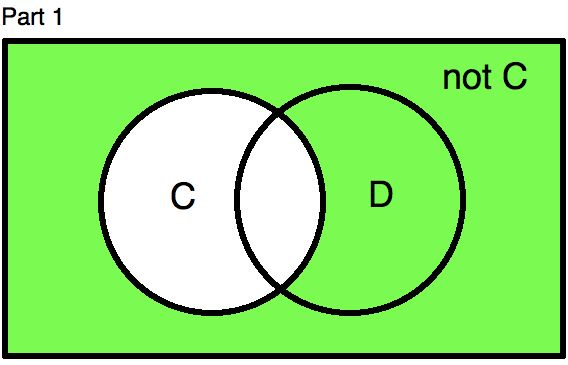
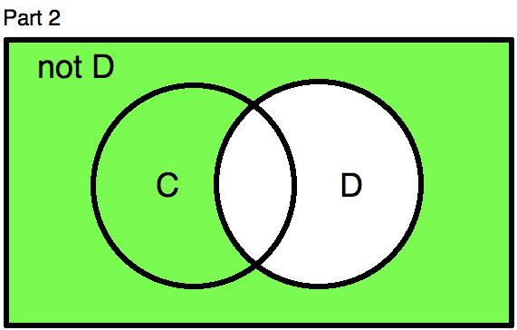
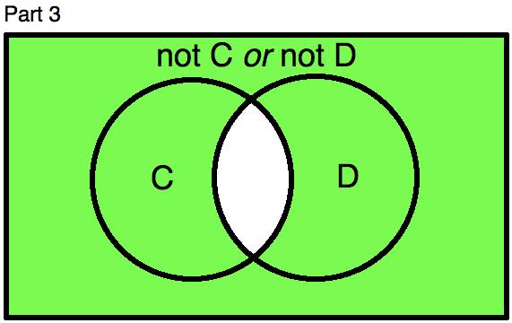
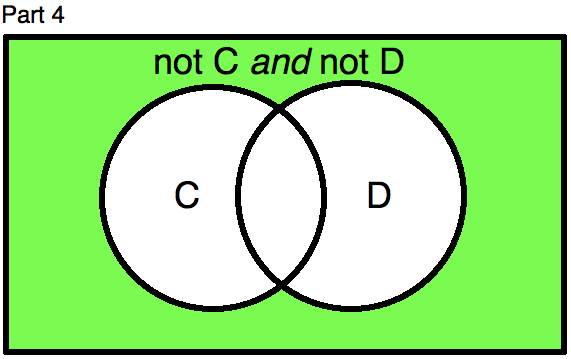
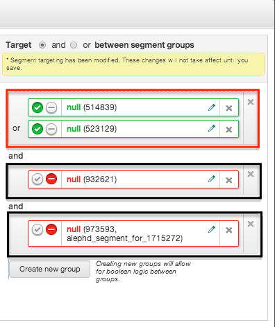

# Segment Targeting

## Viewing Segments

 users can select
Segments from the
Audiences menu to navigate to the 
Segment Manager. This will all segments along with the segment IDs and
the Data Provider names.

Note: Behavioral segments may have no
loads and Contextual segments will not have loads in the Total, Monthly
and Avg. Daily Uniques columns

Within a line item (under Advanced Targeting \> Audience & Location
Targeting \> Audience & Location Segments), you will see a list of
segments available to target. These will be both your network-wide
segments and the advertiser's segments.

## Basic Boolean Logic

If you want to target users by segment, simply drag and drop the
segments from the segments list to the target list. You can search for
segments as well. You can either target all (by selecting AND) or
any (by selecting OR) of the users in
the segments. If you target all users (ANDing), the ID must be found in
all of the segments in order for the targeting to find the user.

When selecting AND, be sure there is sufficient overlap among the users
in each of the segment. If no overlap is present, the targeting may not
succeed. If you select OR, the user ID
has to be in at least one of the segments in order for the targeting to
succeed.

## Advanced Boolean Logic

Advanced Boolean logic allows you to create sets of segments with
internal AND/OR logic and then link the sets together.

To apply advanced Boolean logic, you'll need to create segment groups.
You can create segment groups by:

- Dragging and dropping one segment at a time
- Clicking on multiple segments name or check boxes and drag all the
  segments into a group
- Clicking the Create new group button

If you apply AND logic between the sets, you will automatically apply OR
logic within the sets.

If you apply OR logic between the sets, you will auto apply AND logic
within the sets.

You can create as many sets as you like. For more information, see the
Examples below.

To remove advanced Boolean logic and return to basic targeting mode,
close the desired segments or segment groups in the
Target section. You will be prompted
to confirm the removal before any logic is removed.

Note: Removing the segments will remove
all the associated logic. Take a moment to double-check your targeted
segment settings after removing the desired segments.

## Examples

**Target users in one segment but NOT in another segment**

Let's say you want to reach travelers going to Los Angeles, but your
offer doesn't apply if they're coming from Miami so you don't want to
spend ad dollars there. A simple expression for this scenario might look
something like this:

"Destination: Los Angeles" AND NOT "Origin: Miami"

This expression contains no parentheses, which shows us that no advanced
Boolean logic is required.

**Target users in one segment grouping OR in another segment grouping**

Let's say your offer has changed somewhat: Now you want to include
Miami-based users, but the offer only applies to leisure travelers
there, whereas for people whose origin is not Miami the offer applies
only to first-class business travelers.

A Boolean expression for this scenario might look something like this:

("First class" AND "Destination: Los Angeles") OR ("Economy class" AND
"Origin: Miami")

This expression shows us that you'll need two sets separated with an OR
operator, each containing two AND-joined segments, which means you'll
need to employ advanced Boolean logic.

**Create logic between more than two segment groupings**


Let's say you have 4 segments: A, B, C, and D. A and B are "good"
segments that you want to use for remarketing. Users only have to be in
one segment, not both, to be eligible. The other two, C and D, are "bad"
segments and indicate users you are not interested in targeting. In this
case, if the user is in at least one of the segments, then you do not
want to target the user.

A Boolean expression for this scenario would look something like this:

(Require A OR Require B) AND (Exclude C) AND (Exclude D)

Users typically correctly set (require A or require B) correctly. It's
how to handle the exclusionary segments that is often the root of
confusion, so let's focus on that part of the targeting relationship.

First, let's start with a couple simple Venn diagrams. Part 1 highlights
in green users that are not in segment C. Part 2 shows users that are
not in segment D.








Now, your goal is to exclude users that are in one or both of these
segments. If you add the following targeting: (exclude C or exclude D),
then this translates to a union of the two exclusions. In other words,
to determine which users are in this group, you need to look for
anywhere in either Part 1 and Part 2 where it's shaded green. The
diagram for Part 3 shows this visually.

Notice the only users you are actually excluding are those that are in
both C and D, when in actuality you don't want users that are only in
segment C or only in segment D as well. The proper way to set this up is
to (exclude C and exclude D). This translates to the intersection of the
two segments, that is, the area in both Part 1 and Part 2 that is shaded
green. The diagram in Part 4 shows this relationship.



Therefore, to combine this with (require A or require B), the correct
setup is: (require A or require B) and (exclude C) and (exclude D).

Here is an example of what this would look like in
:


