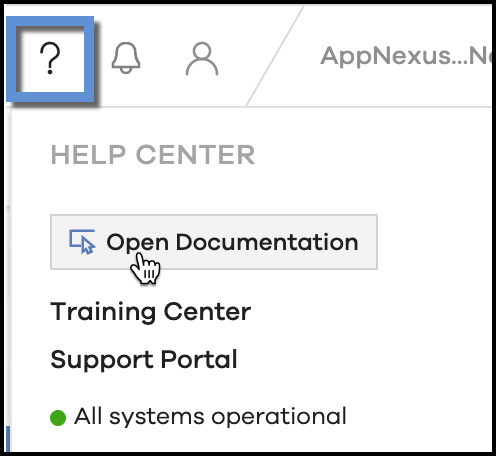

# Test Dita File 1 

This is a test DITA file to cover all defined test cases but is linked with a keydef-general ditamap.

## Test cases for attachements 

This is the test case for zip attachment. [Download](../attachments/lld-schemas-0.5.4-example-files-stable.zip) this zip file.

This is the test case for xls attachment. [Download](../attachments/Xandr_Doc_Repo.xlsx) this xlsx file.

This is the test case for pdf attachment. [Download](../attachments/log-level-data_5-23-2023.pdf) this pdf file.

## Test cases for Images 

Below is the test case for a gif image:


Below is the test case for a png image:



## Test case for Snippet 

This is the test case for a snippet.

However, all time ranges are not available for every report.

-   Custom
-   Current Hour

**Intervals**

Intervals determine how your data is grouped together into rows in the report response. The following is a complete list of intervals available for reports. However, all intervals are not available for every report.

-   Hourly: Data is grouped into rows by the hour.
-   Daily: Data is grouped into rows by the day.

## Section Test Case \(H1\) 

This is a test paragraph.

**Sample Test Case Paragraph with Bold \(H2\)**

Sample paragraph.

## Test case for Paragraph with output class 

Output class H2

Sample paragraph

Output class H3

Sample paragraph

Output class H4

Sample paragraph

## Test case for Paragraph with conditional tag 

Conditionalised Paragraph for product "Invest"

Conditionalised Paragraph for product "Monetize"

Conditionalised Paragraph for product "Curate"

## Test case for Simple Tables 

|Sample HTTP Method|Sample Endpoint|Sample Description|
|------------------|---------------|------------------|
|GET|Sample endpoint|Sample description `test paragraph`|
|POST|Sample endpoint|Sample description|
|PUT|Sample endpoint|Sample description**Default**: No<br>|

## Test case for Table with paragraph or note tag inside table cells 

|Sample HTTP Method|Sample Endpoint|Sample Description|
|------------------|---------------|------------------|
|This is sample paragraph within a table cell<br> Test id: tc-id-010<br>|Sample|Sample|
|Sample|This is sample note within a table cell|Sample|
|Sample|Sample|This is sample paragraph within a table cell**Note:** This is sample note within a table cell

<br>|

## Test case for Table with merged cells 

|Sample HTTP Method|Sample Endpoint|Sample Description|
|------------------|---------------|------------------|
|Sample merged row| |
| | |Sample merged column|
| | |

## Test case for List inside a cell of table 

|Sample HTTP Method|Sample Endpoint|Sample Description|
|------------------|---------------|------------------|
|Sample ordered list 1 Sample ordered list 2 Sample ordered list 3| | |
| |Sample unordered list 1 Sample unordered list 2 Sample unordered list 3| |
|Sample ordered list 1 Sample ordered list 2 sub ordered list 1 sub ordered list 2 Sample ordered list 3| |Sample unordered list 1 Sample unordered list 2 sub unordered list 1 sub unordered list 2 Sample unordered list 3|

## Test case for table inside cell of a table 

|Sample HTTP Method|Sample Endpoint|Sample Description|
|------------------|---------------|------------------|
||Sample Method|Sample Endpoint|Sample Description|
|-------------|---------------|------------------|
|Test case|id=013|This is a test case for table inside cell of a table|
| | | |
| | | |

 <br>| | |
| | | |
| | | |

## Test case for Keyrefs/Keydefs 

This is test case for brand Xandr.

Testing to find what will happen if I call , xandr, , AppNexus, appnexus.

## Test case for Codeblock 

```
This is a test paragraph for code block
There are multiple lines here
Each line should be migrated properly
```

## Test case for Codephase 

This is a `test paragraph` for code phase

## Test case for XREF within page 

This is a test paragraph for XREF within same page [Click](#tc-id-003)

## Test case for XREF to another page 

This is a test paragraph for XREF to another page within same folder [Another page inside topics](test-dita-file-2.md)

This is a test paragraph for XREF to another page in a different folder [Another page outside topics](../test-dita-file-3.md)

## Test case for XREF to external page 

This is a test paragraph for XREF to external link. [External Page](https://docs.xandr.com/bundle/portal-announcements/page/topics/welcome-to-the-xandr-documentation-center.html).

## Test case for formatting 

This **is a test** *paragraph* for **Bold**, *Italics*, Underlined Format.

## Test case for note types 

**Note:** This is a test paragraph for plain note

**Warning:** This is a test paragraph for note type warning

**Tip:** This is a test paragraph for note type info

**Important:** This is a test paragraph for note type info

## Test case for XREF to another element in a different page 

This is a test paragraph for XREF to another element in a different page [Click](../test-dita-file-3.md#tc-id-004)

## Test case for wintitle and menucascade 

This is a test paragraph for menucascade

-   Go to Test Screen
-   Select **Step 1** \> **Step 2** \> **Step 3**
-   Click **Ok**

-   **[Test Dita File 2](../topics/test-dita-file-2.md)**  
This is a test DITA file to cover all defined test cases but is linked with a keydef-invest ditamap.

