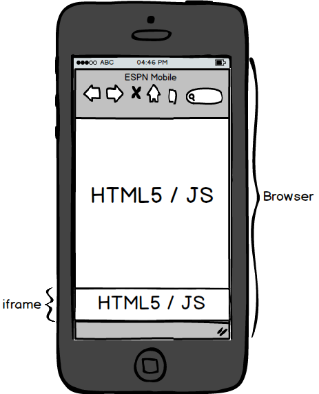

# MRAID and mobile video tutorial 

This page offers an introduction to MRAID and mobile video. It attempts
to answer questions such as:

- What is MRAID? How does it work, and how do I use it?
- What is the relationship between MRAID and mobile video?
- What are the different ways to run mobile video?
- What are the video capabilities of mobile web vs. in-app advertising?

## MRAID

In this section we'll talk about what MRAID is and what it can do in
combination with HTML and JavaScript. We will also talk about what MRAID
is not.

### MRAID definition

MRAID is often used as a buzzword to describe mobile rich media
creatives. In reality, MRAID is a technology designed for a specific use
case (in-app advertising) with some specific functionalities. This
overview will help you get a better understanding of this technology.
After reading this page you should be able to answer questions like:

- Does Xandr support MRAID?
- Do I need MRAID for this behavior?
- Can I run an MRAID creative on this inventory?

### IAB's MRAID description

MRAID, or “Mobile Rich Media Ad Interface Definitions” is the IAB Mobile
Marketing Center of Excellence’s project to define a **<u>common
API</u>** (Application Programming Interface) for **mobile rich media
ads** **that will** **run in mobile apps** . This is a standardized set
of commands, **designed to work with HTML5 and JavaScript** , that
developers creating rich media ads will use to communicate what those
ads do (expand, resize, get access to device functionalities such as
calendar events, etc) with the apps they are being served into.

Let's review the parts marked above in **bold:**

- **Common API -** MRAID is a common command set that creative
  developers may use. All apps that support MRAID support the same
  common commands so any creative that uses an MRAID feature will run
  correctly in different apps and different devices using the same
  creative code.
- **Mobile rich media ads** **that will** **run in mobile apps** - MRAID
  is only relevant for mobile rich media creatives that run in an
  **in-app** environment. MRAID is **not** relevant for mobile web
  environment.
- **Designed to work with HTML5 and JavaScript** - MRAID is not designed
  to replace HTML5 and JavaScript. It is designed to **allow** creatives
  that use JavaScript to interact with the native operating system that
  is running the app in which the creative is shown.

> [!NOTE]
> All content in this document refers to MRAID 2.0. You can download the full spec from [here](https://www.iab.com/).

## MRAID use cases

To explain the need for MRAID, we need to examine the two main use cases
in which ads are shown on mobile devices; Mobile Web and In-App. There
is a fundamental difference in the technologies involved in both cases,
and that difference creates the need for MRAID.

### Mobile web

Mobile web is practically identical to desktop web. Mobile web sites run
the same HTML5 and JavaScript code that desktop sites run, with some
mobile optimized design. This means that mobile web inventory is an ad
sized iframe (web page) running in a full sized web page:



In mobile web, the ad and the container it's running in (the browser)
both "speak" HTML5/JS, so they can communicate freely with each other.
The creative can ask the web page to perform actions on the iframe such
as change its size (expand).

### In-App

In-app inventory is fundamentally different from mobile web, because the
app in which the the creative is displayed **is not** running HTML5 and
JavaScript. Instead, it is running the native code of the devices
operating system (Objective-C for iOS, Java for Android). The creative
is displayed in a container called a WebView, which is a fully
functional, ad sized web page that **is** running HTML5 and JavaScript:

:::image type="content" source="media/in-app.png" alt-text="Screenshot of In App .":::

In this case, the creative and the container it's running in (the app)
cannot speak to each other, because the creative only speaks HTML5/JS
and the app only speaks Objective-C or Java. This is where MRAID comes
in. MRAID defines a set of commands that allows the creative to use
JavaScript to communicate with the native code of the app and ask it to
perform various actions.

The diagram below illustrates the relationship between the creative that
is using HTML5/JS, MRAID, and the app that is running in native code.

:::image type="content" source="media/mraid.png" alt-text="Screenshot of MRAID . ":::

The main thing to remember is that HTML5/JS and MRAID are **not mutually
exclusive** technologies. MRAID was designed so that creatives can use
HTML5/JS to communicate with native mobile apps.

### MRAID functionality

The main functionality of MRAID is to allow a creative that is running
on **In-App** inventory to change its size, get information about its
position on the screen and about the screen size. There are additional
functions that allow the creative to store photos in the device memory,
create a calendar event, and access the native video player.

Below is a list of all the methods available in the API defined by
MRAID, grouped by functionality:

| Methods used for size change / expansion | Other UI functionality | Non UI functionality |
|---|---|---|
| - close<br>- expand<br> - resize<br> - getCurrentPosition<br>- getDefaultPosition<br>- getMaxSize<br> - getResizeProperties<br>- getScreenSize<br>- getState<br>- setExpandProperties<br>- setResizeProperties<br>- useCustomClose | - open<br>- createCalendarEvent<br> - playVideo<br> - storePicture | - addEventListener<br> - getPlacementType<br> - getVersion<br> - isViewable<br> - removeEventListener<br> - supports |

It's easy to see that a full 50% of the methods defined by MRAID relate
to size changes. This is a direct result of the inability of the
creative to directly communicate with the app the way it does with the
browser on mobile and desktop web.

Based on the methods listed above, there are four things MRAID does that
the user can see:

- MRAID lets the creative change its size and ask for information
  regarding the screen size, its position on screen and whether it's
  currently viewable.
- MRAID lets creatives access the device's native video player.
- MRAID lets creatives store photos in the device's permanent memory.
- MRAID lets creatives access the calendar to create calendar events.

## MRAID summary
All the other fancy stuff that you may have seen mobile rich media
creatives do like drawing, games, and sounds is done in HTML5 and
JavaScript. That behavior is not the result of MRAID. The reason why
these creatives are often referred to as MRAID creatives is that MRAID
has become a synonym for "Mobile Rich Media" creative. The reason for
that is that these creatives usually need to expand to reveal this
additional functionality, and in order to expand they need to use MRAID.

- All creatives that use the MRAID API are mobile, in-app, rich media
  creatives.
- **Not** all mobile rich media creatives use the functionality provided
  by MRAID (For example, creatives running in mobile web).

## Mobile video

There are several ways to play a video on a mobile device, each with its
own capabilities and behaviors. You can see how MRAID and HTML5 videos
behave by loading placement ID 2579103, size 300x250, in the [SDK app](https://play.google.com/store/apps/details?id=com.appnexus.opensdkapp). The code for each creative is
described below.

### Advertising SDK

Before we continue, a few words about the term "Advertising SDK" used
below. A Software Development Kit (SDK) is a piece of code that makes it
easy for app developers to show ads in their apps. The two main roles
Advertising SDKs perform are:

- Handle communications with the ad server and display the ad in the
  space allocated by the app (the WebView).
- Implement the MRAID API

For more information about our mobile SDKs, see [Xandr Mobile SDKs](../mobile-sdk//xandr-mobile-sdks.md)

### MRAID video

This is actually the simplest way to auto-play a video, but it has a
significant drawback because it is impossible to define a click on the
video. That is, users cannot click the video and be redirected to the
advertiser's website. The reason for this drawback is that using MRAID
to play a video opens the video in the device's native player, which is
not a web page and therefore does not support clicks. This is why when
you click a video being played using MRAID, you see the player controls.

Below is a simple working example of an MRAID video of a dog:

``` 
<script src="mraid.js"></script>
<script type="text/javascript">
mraid.addEventListener('ready', function() { 
  mraid.playVideo("http://v.madnxs.com/p/e0/16/69/e6/e01669e619d6424f6b7e4597092764e3.m4v")
});
</script> 
```

### HTML5 video

One thing all mobile ads have in common is that they run in actual web
browsers. Both the iFrame in a mobile web page and the WebView running
in a native mobile app are fully functional web browsers, and therefore
have full HTML5 support. HTML5 supports playing video in the browser
without requiring an external player. However, iOS and Android have
different behaviors and implementations for HTML5 video. Below is sample
code of a working HTML5 video of a cat.

``` 
<body>
<video id="videoAd" width="300" height="250" autoplay controls muted webkit-playsinline poster="http://cdn.adnxs.com/p/20/0e/21/96/200e2196675e9ca10e89f5b63c127935.png" onclick="click_thru">
<source src="http://v.madnxs.com/p/23/35/06/3b/2335063b4a2d9871922f60bca7d97a66.m4v" type="video/mp4">
Your browser does not support the video tag.
<script type="text/javascript">
//code to *handle* click event on Android and iOS
function click_thru() {
  document.getElementbyId("videoAd").pause(); 
  window.open("http://www.appnexus.com"); 
}
//code to *catch* the click event on iOS
document.getElementById("videoAd").addEventListener('touchstart', click_thru);
</script>
</video>
</body>
```

### Potential complications with HTML5 video

- Devices running Android 4.4+ or iOS 6+ **do not** allow HTML5 videos
  to autoplay by default. This means developers have to add the
  `controls` attribute to the `<video>` element so that the video player
  shows the play/pause, seek bar, and mute controls so that the user can
  initiate and interact with the video. While autoplay behavior can be
  controlled by the advertising SDK that is running in the app, it will
  not solve the case for Mobile Web inventory, and does not promise
  consistent behavior for the creative across different apps running
  different advertising SDKs.
  
  > [!NOTE]
  > The Xandr SDK supports autoplay for HTML5 videos, which is the behavior you will see when using the [SDK app](https://play.google.com/store/apps/details?id=com.appnexus.opensdkapp). However, a mobile browser on the same device will not autoplay the video.
 
- Full screen **iPhone** and **iPad** videos do not support click-through
  because they run in the device's native video player and not in a web
  browser (an iFrame / WebView). Android devices **do** support clicks
  on full screen videos.
- It is possible to use click through for a creative running in an
  **in-app environment on iPhones only** by not allowing the video to go
  full screen. This requires adding the `webkit-playsinline`attribute to
  the `<video>` element, and enabling inline playback in the advertising
  SDK. This implementation is not standard and does not promise
  consistent behavior for the creative across different apps running
  different advertising SDKs.
- **Android** phones and tablets and **iPads** play HTML5 videos inline
  by default, so no change is required to use click-through
  functionality.
- It is **not possible** to autoplay HTML5 videos in mobile web
  inventory in **both Android and iOS** at the same time.

### Embedded video players

This is the most versatile option. Keep in mind that it is SDK-dependent
and not standard. If the advertising SDK that is running in the app
includes a video player, then the advertising SDK can direct the
`mraid.playVideo()` call to that player, and include a click URL in it.
However, because this API is not defined in MRAID, there is no guarantee
that the ad will run the same way across different apps.
