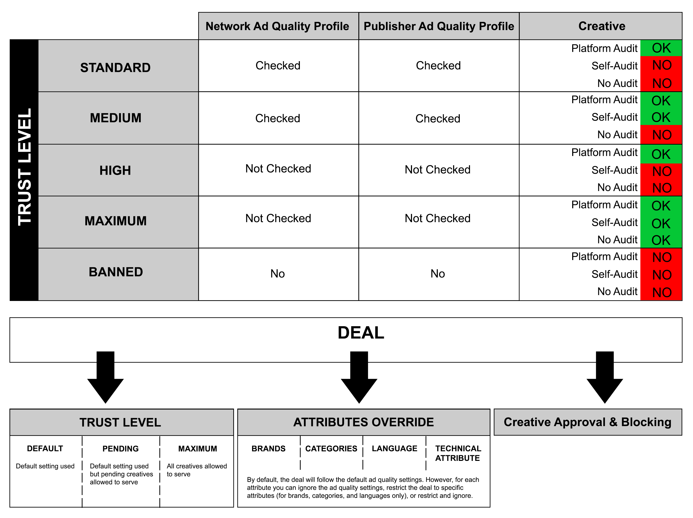

# Define Ad Quality Rules

Publishers want to ensure that advertisements served on their websites
don't take away from website content or the user's experience.
Publishers are also concerned with serving competing ads on their sites.
Since upholding your publisher's ad quality standards is vital to your
relationships with them, Xandr has made it easy
to do so. 

Ad quality profiles are set at two levels: the network level, which is
applied to all publishers, and the publisher level, which allows
different settings per publisher. There are a variety of ad quality
standards options that you can choose from. These are discussed in
greater detail in Ad Quality Standards below. 

For a list of our baseline platform-wide creative standards, please see
"Creative Standards and Auditing" in 
documentation. To change your ad quality profile through the API, see <a
href="https://docs.xandr.com/bundle/xandr-api/page/ad-profile-service.html"
class="xref" target="_blank">Ad Profile Service</a>. 

## Basic Options: Network-Level Ad Quality

Tip: Xandr
recommends that all Supply Partners set up a single Network-level Ad
Quality Profile to apply to all publishers that traffic via the network.

To update your network-level ad profile via the API, you can use the <a
href="https://docs.xandr.com/bundle/xandr-api/page/ad-profile-service.html"
class="xref" target="_blank">Ad Profile Service</a>.

Note: Your Network Ad Profile will apply
to all publishers. Any other ad profiles or rules you apply to a
publisher will have an AND relationship with your network ad profile.
You cannot override your network ad quality restrictions at the
publisher level.

 Here's an example of how it works: In your global ad
profile, you banned Network A, but in a conditional rule for
FancyCrackers.com, you set Network A to standard trust. Since Network A
is banned in the global ad profile, Network A will still be banned for
FancyCrackers.com. 

## Advanced Options: Publisher-Level Ad Quality

At the publisher level, you can apply publisher-specific ad quality
profiles. You can either create a custom ad quality profile or use a
template created at the network level.

**Base Rule**: If you choose to create a base rule, it will be your
catchall rule for that publisher in addition to the global ad quality
profile settings. This rule will always have a priority of 1. You can
create a base rule in the Publisher Manager.

**Conditional Rule**: Conditional Rules are ad quality profiles that
have targeting settings and priorities. You can target based on
geography, session frequency, sizes and placements. In order to create
conditional rules you must go to the Ad Quality tab in the Publisher
Tab.

Tip: When you work with publisher ad
quality profiles, you have the option to create a Base Rule as a
catchall rule and conditional ad quality rules that have targeting and
priority settings. Only one publisher ad quality rule will be applied at
any given time.

 Here's an example of how it works: You have a
relationship with FancyCrackers.com and they have different ad quality
standards based on the country the impression is served in. You can
create different conditional rules based on the geography of the
impression.

**Publisher Ad Quality Standards Options**

You can create ad quality profiles for your publishers based on:

- Buyers
- Brands of creative landing pages
- Creative categories
- Language of the creative
- Technical attributes of the creative

For information about read-only API services that you can use to
retrieve information for use in your ad quality profile, see:

- <a
  href="https://docs.xandr.com/bundle/xandr-api/page/platform-member-service.html"
  class="xref" target="_blank">Platform Member Service</a> 
- <a
  href="https://docs.xandr.com/bundle/xandr-api/page/brand-service.html"
  class="xref" target="_blank">Brand Service</a> 
- <a
  href="https://docs.xandr.com/bundle/xandr-api/page/category-service.html"
  class="xref" target="_blank">Category Service </a>
- <a
  href="https://docs.xandr.com/bundle/xandr-api/page/language-service.html"
  class="xref" target="_blank">Language Service</a>
- <a
  href="https://docs.xandr.com/bundle/xandr-api/page/technical-attribute-service.html"
  class="xref" target="_blank">Technical Attribute Service</a>.

Tip: Brands, Categories, Language and
Technical Attributes can also be blocked through individual bid
requests. For more information, please see <a
href="https://docs.xandr.com/bundle/supply-partners/page/bid-request.html"
class="xref" target="_blank">Bid Request</a>.

Note: If an Ad Quality (AQ) is set as
`"default_brand_status": "banned"` but the parent brand is set as
`"status": "trusted"`, the child brand overrides the setting in
`"default_brand_status"` and it will be able to serve unless it is
explicitly banned in the Ad Profile's brand override list.

**Platform Buyer Trust Levels**

For Platform buyers who purchase inventory via the
Xandr Platform, you can select from a spectrum
of Trust Levels options. Trust Level is a feature that allows sellers to
dictate which buyers they do and don’t trust to serve ads on their
inventory.

<table class="table" data-cellpadding="4" data-cellspacing="0"
data-summary="" data-frame="border" data-border="1" data-rules="all">
<thead class="thead">
<tr class="header ">
<th id="d25748e182" class="entry cellborder"
style="vertical-align: top">Trust Level</th>
<th id="d25748e185" class="entry cellborder"
style="vertical-align: top">Implications</th>
</tr>
</thead>
<tbody class="tbody">
<tr class="odd ">
<td class="entry cellborder"
headers="d25748e182 ">Standard</td>
<td class="entry cellborder"
headers="d25748e185 ">Apply ad quality standards, require Platform
audit.</td>
</tr>
<tr class="even ">
<td class="entry cellborder"
headers="d25748e182 ">Medium</td>
<td class="entry cellborder"
headers="d25748e185 ">Apply ad quality standards, trust buyer
self-classification.</td>
</tr>
<tr class="odd ">
<td class="entry cellborder"
headers="d25748e182 ">High</td>
<td class="entry cellborder"
headers="d25748e185 ">Bypass ad quality standards, require platform
audit.</td>
</tr>
<tr class="even ">
<td class="entry cellborder"
headers="d25748e182 ">Maximum</td>
<td class="entry cellborder"
headers="d25748e185 ">Bypass ad quality standards, do not require
audit.</td>
</tr>
<tr class="odd ">
<td class="entry cellborder"
headers="d25748e182 ">Banned</td>
<td class="entry cellborder"
headers="d25748e185 ">Ban all creatives.</td>
</tr>
</tbody>
</table>

Note: The difference between trusting
buyer self-classification and requiring a platform audit is that you
trust that buyer to correctly self-classify all creatives that they do
not opt into Xandr audit. When uploading their
creatives and tags, buyers with this classification are asked to confirm
that they have self-classified any creative for compliance with
Xandr's creative standards.

## Related Topics

- <a href="synchronize-your-inventory-structure.html"
  class="xref">Synchronize Your Inventory Structure</a>
- <a href="use-the-ui-to-synchronize-your-inventory-structure.html"
  class="xref">Use  to Synchronize Your
  InventoryStructure</a>
- <a href="use-the-api-to-synchronize-your-inventory-structure.html"
  class="xref">Use the API to Synchronize Your Inventory Structure</a>

**Parent topic:**
<a href="best-practices.html" class="link">Best Practices</a>

